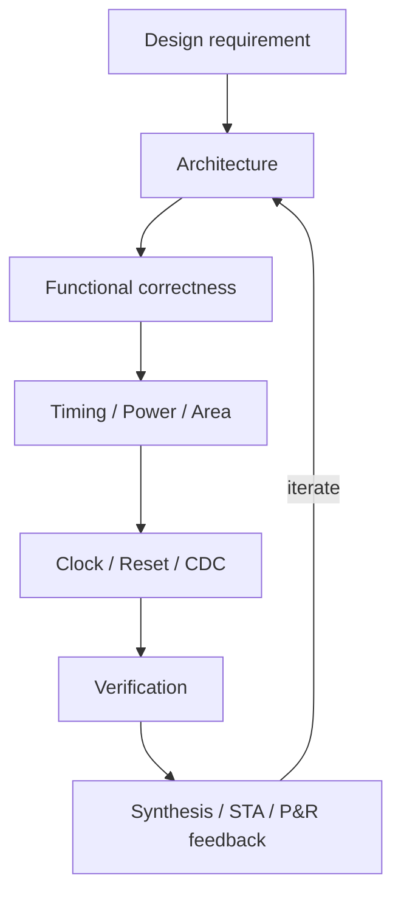

# RTL Design & Optimization Guide

> RTL은 단순히 동작하는 코드를 작성하는 것이 아니라, 원하는 Hardware Architecture를 기술하는 것이다.

**RTL Design & Optimization Guide**는 Digital RTL 설계자가 문법을 넘어 Architecture, Timing, Power, Area, Clock, CDC, Verification 관점에서 설계 결정을 내리고 리뷰할 수 있도록 돕는 실무형 지식 베이스입니다.

좋은 RTL은 simulation에서 기대한 값이 나오는 것만으로 충분하지 않습니다. 요구 기능을 만족하면서도 구현 가능한 timing, 합리적인 power와 area, clock/reset/CDC의 안전성, 검증 가능성, 그리고 변경에 견디는 maintainability를 함께 갖춰야 합니다.

## Who This Guide Is For

- SystemVerilog 기본 문법을 알고 있는 Digital RTL 설계자
- Timing, Low Power, Clock Gating, CDC를 hardware 관점에서 이해하려는 엔지니어
- RTL Design Review에서 사용할 판단 기준과 질문이 필요한 리뷰어
- Synthesis/STA/P&R 결과를 RTL과 연결해 해석하려는 개발자

## Core Design Philosophy

최적화는 특정 coding trick에서 시작하지 않습니다. 다음 순서로 문제의 본질을 좁혀 갑니다.

```text
Remove
  ↓
Disable
  ↓
Simplify
  ↓
Share / Duplicate as appropriate
  ↓
Pipeline or MCP
  ↓
Physical optimization
```

- 사용하지 않는 logic은 더 빠르게 만들기 전에 제거할 수 있는지 확인합니다.
- 필요하지 않은 값은 굳이 clear하거나 매 cycle update하지 않습니다.
- latency와 throughput 요구를 분리하고, 결과가 정말 다음 cycle에 필요한지 묻습니다.
- Multi-Cycle Path(MCP)는 timing failure를 감추는 수단이 아니라 architecture의 functional timing requirement를 STA에 표현하는 constraint입니다.
- Register Enable과 Clock Gating에는 enable logic, MUX, ICG, clock tree에 대한 비용이 있습니다.
- 읽기 좋은 RTL과 좋은 hardware는 서로 중요하지만 같은 의미는 아닙니다. 둘 다 확인해야 합니다.

## Quick Review Flow



리뷰를 시작할 때는 다음 질문부터 확인합니다.

1. 결과는 **언제** 필요하고, 새로운 input은 **얼마나 자주** 받아야 하는가?
2. 작성한 RTL은 어떤 register, MUX, arithmetic, clock 구조로 합성될 가능성이 있는가?
3. 움직이지 않아도 되는 logic과 register가 매 cycle toggle하고 있지는 않은가?
4. clock/reset/CDC assumption이 RTL, constraint, verification 환경 사이에서 일치하는가?
5. 판단을 synthesis, timing, power, CDC report와 assertion으로 확인했는가?

## V0.1 Documentation

- [Documentation Site](https://2nnovation.github.io/RTL-design-guide/)
- [Introduction — What Makes Good RTL?](docs/00_introduction/overview.md)
- Timing
  - [Timing Design & Optimization](docs/03_timing/overview.md)
  - [Multi-Cycle Path](docs/03_timing/multi_cycle_path.md)
- Low Power
  - [Low-Power RTL Design](docs/04_low_power/overview.md)
  - [Counter Optimization](docs/04_low_power/counter_optimization.md)
- Clock
  - [Clock Gating](docs/06_clock/clock_gating.md)
- CDC
  - [Clock Domain Crossing Overview](docs/08_cdc/overview.md)
  - [2FF Synchronizer](docs/08_cdc/synchronizer.md)
- [RTL Design Review Checklist](docs/15_checklist/rtl_design_review_checklist.md)

전체 문서는 [MkDocs Material](https://squidfunk.github.io/mkdocs-material/) 기반 사이트에서 탐색할 수 있습니다. `main` 브랜치의 문서 변경은 GitHub Actions를 통해 GitHub Pages에 자동 배포됩니다.

로컬 문서 사이트는 다음과 같이 확인할 수 있습니다.

```text
python -m pip install -r requirements-docs.txt
python -m mkdocs serve
```

## Read, Measure, Iterate

```text
RTL
 ↓
Synthesis
 ↓
Timing / Area / Power / CDC reports
 ↓
Netlist and physical feedback
 ↓
RTL / architecture refinement
```

RTL만 보고 실제 PPA를 단정할 수는 없습니다. Library, constraint, tool setting, placement, routing, clock tree에 따라 결과가 달라질 수 있으므로 이 가이드의 예시는 원리를 설명하는 출발점으로 사용하고, 실제 결과는 해당 설계 환경의 report로 확인해야 합니다.

## Public Repository Policy

이 저장소의 모든 내용은 공개 가능한 generic material이어야 합니다.

- 회사·고객·제품·사내 IP를 식별할 수 있는 이름, 구조, signal, 수치, 사례를 포함하지 않습니다.
- proprietary code, internal document, confidential methodology를 복사하거나 재구성하지 않습니다.
- 예제는 직접 만든 generic SystemVerilog와 가상의 조건만 사용합니다.
- tool/library/technology에 따라 달라지는 결과는 절대적으로 단정하지 않습니다.

기여 전에는 [RTL Design Review Checklist](docs/15_checklist/rtl_design_review_checklist.md)를 설계 내용뿐 아니라 문서의 assumption과 trade-off를 검토하는 데에도 활용해 주세요.

## Roadmap

V0.1 기반 문서 이후에도 Fundamentals, Architecture, Area, Reset, Control Logic, Datapath, Synthesis-Aware RTL, Physical-Aware RTL, Verification, Anti-Patterns를 계속 확장합니다. Chapter별 canonical responsibility, 우선 작성 파일과 release 기준은 [Documentation Roadmap](docs/00_introduction/roadmap.md)에서 관리합니다.

발표 자료는 상세 가이드를 복사하지 않고 핵심 메시지, Before/After, Decision Flow, Diagram, Common Mistake, Design Rule 중심의 별도 Slidev deck으로 구성할 예정입니다.
