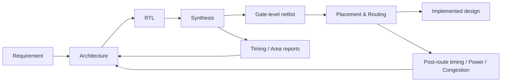
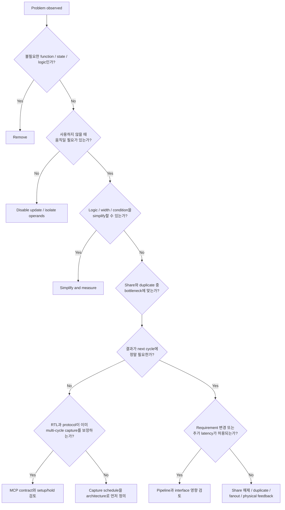

# What Makes Good RTL?

## 1. Overview

RTL(Register Transfer Level)은 clock edge 사이에서 어떤 combinational transformation이 일어나고, 어느 edge에서 어떤 state가 저장되는지를 기술합니다. 문법은 software와 비슷해 보일 수 있지만 결과물은 순서대로 실행되는 instruction이 아니라 **동시에 존재하고 동작하는 hardware**입니다.

따라서 RTL 설계의 첫 질문은 “이 코드를 어떻게 짧게 쓸까?”가 아니라 다음이어야 합니다.

> 이 requirement를 만족하려면 어떤 register, datapath, control, clock, interface가 필요한가?

좋은 RTL은 simulation에서 정답을 내는 RTL을 넘어, 목표 공정과 구현 조건에서 timing을 만족하고, 불필요한 switching과 면적을 피하며, clock/reset/CDC가 안전하고, 검증과 변경이 가능한 RTL입니다.

## 2. RTL과 Software Code의 차이

### 2.1 문장은 실행 순서가 아니라 구조를 만들 수 있다

다음 코드는 “조건을 위에서부터 검사하는 프로그램”처럼 보이지만, 일반적으로는 priority select logic과 register를 기술합니다.

```systemverilog
always_ff @(posedge clk) begin
    if (a)
        q <= x;
    else if (b)
        q <= y;
    else
        q <= z;
end
```

Hardware 관점에서는 개념적으로 다음 구조를 생각할 수 있습니다.

```text
 x ─────┐
        ├── priority select / MUX ── D  ┌─────┐
 y ─────┤                              │ FF  │── q
 z ─────┘                         CLK ─▶│     │
          select: a, then b             └─────┘
```

여기서 중요한 것은 code line 수가 아니라 다음 사항입니다.

- `a`와 `b`가 동시에 1일 때 `a`가 이기는 것이 실제 specification인가?
- `x`, `y`, `z`의 width와 signedness가 의도와 일치하는가?
- select path가 data path보다 늦게 도착해 critical path를 만들 수 있는가?
- `q`가 매 cycle 갱신되어야 하는가, 아니면 hold 가능한가?
- downstream은 `q`를 어느 cycle에 사용하는가?

### 2.2 Hardware는 concurrent하다

서로 다른 `always_ff`, `always_comb`, continuous assignment는 hardware로 동시에 존재합니다. 한 block이 끝난 뒤 다음 block이 실행되는 software model로 해석하면 latency, priority, race, CDC 판단을 잘못하기 쉽습니다.

```systemverilog
assign sum  = a + b;
assign hit  = (tag == expected_tag);
assign next = hit ? sum : fallback;
```

Adder와 comparator는 병렬로 동작할 수 있고, 그 결과가 MUX에 들어갑니다. 이 구조의 timing은 대략 “각 병렬 branch 중 늦은 것 + MUX”에 의해 결정됩니다. 반대로 condition을 따라 큰 calculation을 직렬화하면 logic depth는 더 깊어질 수 있습니다. 어느 표현이 더 좋은지는 area, timing, activity와 synthesis result로 판단해야 합니다.

## 3. RTL에서 Silicon까지



### 3.1 Synthesis가 하는 일

Synthesis tool은 RTL, library, clock와 I/O constraint, optimization setting을 바탕으로 register, MUX, gate, arithmetic cell 등의 network를 만듭니다. Constant propagation, dead logic removal, Boolean optimization, resource sharing 또는 duplication 같은 변환을 수행할 수 있습니다.

그러나 tool이 requirement를 새로 발명해 주지는 않습니다. 다음이 잘못되어 있으면 합성 결과도 요구와 어긋날 수 있습니다.

- latency/throughput contract가 불명확한 architecture
- 실제 priority와 다른 `if`/`case` 구조
- 필요 이상으로 넓은 datapath
- 잘못된 clock/false-path/MCP constraint
- pulse와 level을 혼동한 CDC
- 검증되지 않은 don't-care 또는 mutual-exclusion assumption

### 3.2 Physical implementation이 추가하는 현실

Gate count만으로 timing과 power를 완전히 알 수 없습니다. Placement와 routing 이후에는 wire delay, congestion, fanout, clock skew, buffering과 clock tree power가 중요해집니다. RTL에서 가까워 보이는 두 block도 floorplan에서는 멀리 배치될 수 있습니다.

따라서 최적화는 다음 feedback loop로 수행합니다.

```text
RTL hypothesis
    ↓
Synthesis / STA / Power estimation
    ↓
Netlist and physical observation
    ↓
Was the bottleneck removed or moved?
    ↓
Architecture / RTL refinement
```

## 4. 좋은 RTL의 평가 축

### 4.1 Function

정상 transaction뿐 아니라 simultaneous event, boundary, back-to-back request, overflow/underflow, reset overlap, mode transition에서 specification을 만족해야 합니다. “평소에는 맞는다”는 hardware sign-off 기준이 아닙니다.

### 4.2 Timing

Launch register에서 출발한 data가 combinational logic과 routing을 지나 capture register의 setup requirement 전에 도착해야 합니다. Hold도 별도의 requirement입니다. Timing을 개선할 때는 먼저 불필요한 logic, logic depth, priority chain, large MUX, wide arithmetic, high fanout을 확인합니다.

자세한 방법은 [Timing Design & Optimization](../03_timing/overview.md)을 참고하세요.

### 4.3 Power

Dynamic power는 개념적으로 `P_dynamic ∝ α × C × V² × f`의 관계를 가집니다.

RTL 설계자는 주로 switching activity `α`, driven capacitance `C`, clocked state의 activity를 architecture로 줄일 수 있습니다. 하지만 enable logic과 ICG도 면적, timing, power 비용이 있으므로 “enable을 많이 넣을수록 좋다”는 식으로 판단해서는 안 됩니다.

[Low-Power RTL Design](../04_low_power/overview.md)과 [Clock Gating](../06_clock/clock_gating.md)에서 구조별 trade-off를 다룹니다.

### 4.4 Area

Register bit 수뿐 아니라 adder, comparator, MUX, buffer, routing, reset/clock structure가 면적에 영향을 줍니다. 예를 들어 최대 100까지만 필요한 counter가 32-bit라면 width 축소는 FF뿐 아니라 incrementer와 comparator에도 영향을 줄 수 있습니다.

반면 resource sharing은 MUX와 fanout을 늘려 timing을 악화시킬 수 있고, timing을 위한 logic duplication은 area를 늘릴 수 있습니다. “작은 RTL”이나 “중복 없는 코드”가 반드시 작은 hardware를 의미하지는 않습니다.

### 4.5 Robustness

Clock/reset/CDC와 protocol assumption은 analog·temporal behavior까지 포함합니다. RTL simulation은 metastability 자체를 현실적으로 모델링하지 못합니다. 따라서 recognized CDC structure, protocol guarantee, assertion, static CDC analysis가 함께 필요합니다.

[CDC Overview](../08_cdc/overview.md)와 [2FF Synchronizer](../08_cdc/synchronizer.md)를 참고하세요.

### 4.6 Maintainability and Verifiability

좋은 optimization도 의도를 알 수 없거나 constraint 한 곳에만 숨어 있으면 위험합니다. 예를 들어 MCP의 capture cycle assumption은 다음에 일관되게 나타나야 합니다.

- architecture/interface description
- RTL의 valid/enable behavior
- STA constraint와 대상 path
- assertion 또는 formal property
- 변경 시 확인할 review checklist

Maintainability는 주석을 많이 쓰는 문제가 아니라 **functional contract가 여러 artifact에서 모순되지 않게 하는 문제**입니다.

## 5. PPA Trade-off를 읽는 법

| 변경 | 기대 효과 | 함께 확인할 비용 또는 위험 |
|---|---|---|
| Pipeline stage 추가 | combinational path 분할, throughput 개선 가능 | latency, FF area, clock power, control 정렬 |
| Resource sharing | operator area 감소 가능 | input/output MUX, fanout, arbitration, timing |
| Logic duplication | local timing/fanout 개선 가능 | area, leakage, switching, equivalence |
| Register enable | 불필요한 update 감소 | feedback MUX, enable path, gating threshold |
| Coarse clock gating | clock tree와 여러 FF activity 감소 가능 | ICG/control/test/CDC, wake-up, self-deadlock |
| Reset 제거 | reset routing/cell 제약 감소 가능 | valid-before-use 보장, X handling, safety requirement |
| Width 축소 | FF/operator/routing 감소 가능 | range, overflow, signed extension, future requirement |
| MCP 적용 | architecture상 허용된 시간으로 STA 분석 | hardware 개선 없음, 잘못된 대상/hold/유지보수 위험 |

변경 전에는 목표 metric과 invariant를 정합니다. 변경 후에는 area 하나만 비교하지 말고 다음을 함께 확인합니다.

- Function/equivalence가 유지되는가?
- Worst slack과 critical-path group이 어떻게 변했는가?
- Clock/data switching이 실제 workload에서 어떻게 변했는가?
- Cell/routing area와 congestion이 어떻게 변했는가?
- Constraint와 CDC result에 새 exception이 생겼는가?

## 6. Optimization Decision Flow



이 순서는 무조건 한 방향으로만 진행한다는 뜻이 아닙니다. 가장 값싼 질문부터 시작해 architecture와 implementation 사이의 원인을 좁히는 framework입니다.

## 7. 흔한 잘못된 접근

### Simulation이 통과하면 끝이라고 생각한다

Simulation은 작성한 stimulus와 model 범위에서 functional behavior를 보여 줍니다. Timing closure, metastability, real clock glitch, physical congestion을 자동으로 보장하지 않습니다.

### Timing failure를 바로 pipeline이나 MCP로 처리한다

먼저 불필요한 logic, 잘못된 width, deep priority, duplicated decode, fanout을 확인해야 합니다. Pipeline은 interface latency를 바꾸고, MCP는 hardware를 바꾸지 않습니다. 둘은 서로 대체되는 coding trick이 아닙니다.

### 모든 register에 reset과 enable을 넣는다

Reset과 enable은 공짜가 아닙니다. Reset 후 valid가 오기 전까지 사용하지 않는 datapath register라면 reset이 불필요할 수 있습니다. Enable condition이 거의 항상 true라면 enable logic의 비용이 절감보다 클 수 있습니다. Safety와 methodology 요구는 별도로 확인해야 합니다.

### RTL 모양만 보고 PPA를 단정한다

Tool은 logic을 변환하며 physical delay는 RTL에 직접 보이지 않습니다. RTL review로 가설을 세우고, report와 netlist로 확인해야 합니다.

### Assumption을 constraint에만 숨긴다

False path, MCP, CDC waiver가 functional design과 verification에 드러나지 않으면 RTL 변경 후 실제 violation을 놓칠 수 있습니다. Exception에는 대상, 이유, owner, 검증 증거가 필요합니다.

## 8. Recommended Working Pattern

### Step 1 — Contract를 cycle 단위로 적는다

Input sampling, result valid, hold period, cancel/reset, backpressure, clock domain을 timing diagram 또는 table로 정의합니다.

### Step 2 — Hardware block diagram을 먼저 그린다

Register boundary, combinational block, feedback, mux select, clock/reset domain을 표시합니다. RTL을 읽지 않고도 latency와 state ownership을 설명할 수 있어야 합니다.

### Step 3 — Corner-case matrix를 만든다

동시에 일어날 수 있는 control event를 나열하고 priority를 specification으로 확정합니다.

| clear | load | count | Expected behavior |
|---:|---:|---:|---|
| 0 | 0 | 0 | Hold |
| 0 | 0 | 1 | Increment |
| 0 | 1 | 1 | Specification에서 priority 정의 |
| 1 | 1 | 1 | Specification에서 priority 정의 |

### Step 4 — RTL과 assertion을 함께 작성한다

`valid`일 때만 data를 소비한다거나, clear와 capture가 동시에 일어나지 않는다는 invariant를 executable property로 표현합니다. Assertion은 문서의 빈틈과 RTL의 숨은 priority를 드러내는 데 도움이 됩니다.

### Step 5 — Report로 가설을 검증한다

Synthesis mapping, timing path, width, fanout, inferred enable/gating, CDC structure를 확인합니다. 예상과 다르면 tool을 탓하기 전에 RTL과 constraint가 실제로 무엇을 기술했는지 다시 봅니다.

### Step 6 — 변경의 영향 범위를 기록한다

Latency, throughput, reset value, clock domain, constraint가 달라졌다면 downstream interface와 verification도 함께 갱신합니다.

## 9. Introduction Checklist

- [ ] Function뿐 아니라 latency와 throughput requirement를 알고 있는가?
- [ ] 주요 register boundary와 feedback path를 block diagram으로 설명할 수 있는가?
- [ ] `if`/`case` priority가 specification에 정의되어 있는가?
- [ ] 값이 사용되지 않는 cycle과 logic이 toggle하지 않아도 되는 cycle을 알고 있는가?
- [ ] Width와 signedness를 range 분석으로 정했는가?
- [ ] Clock, reset, CDC assumption이 명시되어 있는가?
- [ ] MCP/false-path/waiver가 functional contract와 verification에 연결되어 있는가?
- [ ] Synthesis/STA/PPA/CDC report에서 확인할 가설을 정했는가?
- [ ] Tool/library/physical condition에 따라 달라질 결과를 단정하고 있지 않은가?
- [ ] 문서와 예제가 공개 가능한 generic content인가?

실제 review에서는 [RTL Design Review Checklist](../15_checklist/rtl_design_review_checklist.md)를 사용하세요.
