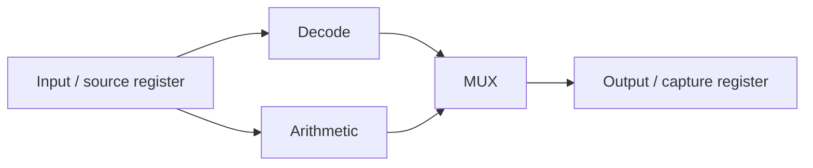

# Combinational vs Sequential Logic

## 1. Overview

RTL architecture를 이해하는 가장 기본적인 구분은 **현재 입력의 함수**와 **시간을 넘어 보존되는 state**를 나누는 것이다.

- **Combinational logic**은 현재 입력과 현재 state가 정해지면 출력이 결정된다.
- **Sequential logic**은 clock edge 같은 event에서 값을 capture하고 다음 event까지 state를 유지한다.

이 구분은 단순한 coding style이 아니다. Register boundary는 latency, timing path, throughput, reset, power와 verification contract를 결정한다. 공통 용어는 [Canonical RTL Design Terminology](terminology.md), 문법을 hardware로 읽는 전체 방법은 [Think Hardware, Not Code](think_hardware_not_code.md)를 참고한다.

> Combinational logic은 값을 변환하고, sequential logic은 그 값을 어느 시점부터 architecture의 state로 사용할지를 결정한다.

## 2. Why It Matters

같은 Boolean 또는 arithmetic function도 register를 어디에 두느냐에 따라 다른 architecture가 된다.

```text
Combinational output

input ── logic ── output
          ↑
     input 변화가 propagation된 뒤 output 변화

Registered output

input ── logic ── D [FF] Q ── output
                         ↑
                    active clock edge에서 state 갱신
```

Registered output은 interface timing을 단순하게 만들 수 있지만 한 개의 register boundary만큼 latency와 clock load를 추가한다. 반대로 긴 combinational path를 한 cycle에 넣으면 latency는 줄 수 있지만 target clock을 만족하지 못할 수 있다.

잘못 구분하면 다음 문제가 생긴다.

- combinational block의 누락된 assignment로 unintended latch가 생긴다.
- register가 필요한 값이 combinational feedback에 의존한다.
- pipeline data와 valid/control의 cycle이 어긋난다.
- reset이 필요한 control state와 valid 전에는 무의미한 datapath를 구분하지 못한다.
- combinational path가 interface 또는 clock period를 가로질러 예상보다 길어진다.
- register enable을 combinational gating이나 raw clock gating과 혼동한다.

## 3. Hardware View

### 3.1 Combinational cone

Combinational cone은 source input 또는 register output에서 시작해 arithmetic, compare, decode와 MUX를 거쳐 destination output 또는 register input에 도달하는 logic network다.



Combinational logic에는 architecture가 의도한 state가 없어야 한다. 동일한 입력 조합이라면 propagation이 안정된 뒤 동일한 출력이 나와야 한다.

### 3.2 Sequential boundary

Sequential element는 clock edge에서 D를 capture하고 Q를 유지한다. Register-to-register path는 개념적으로 다음과 같다.

```text
launch edge
    ↓
[Source FF] -- clock-to-Q --> [Combinational logic + route] --> [Capture FF]
                                                                       ↑
                                                                  capture edge
```

Register boundary를 추가하면 combinational delay를 여러 cycle로 나눌 수 있지만 다음 항목도 함께 바뀐다.

- input accept에서 output valid까지의 latency
- data와 함께 이동해야 하는 valid, tag, select와 exception
- reset, flush, stall과 backpressure behavior
- FF area, clock tree load와 switching
- verification이 추적해야 하는 transaction depth

Pipeline 판단은 [Pipeline Design](../03_timing/pipeline.md)에서 상세히 다룬다.

### 3.3 Next-state structure

Control logic은 현재 state와 입력으로 next state를 계산하고, edge에서 state register가 이를 capture하는 구조로 생각할 수 있다.

```text
                    ┌──────────────────────┐
inputs ────────────>│ next-state / output  │── state_d
state_q ───────────>│ combinational logic  │
                    └──────────────────────┘
                                │
                                v
CLK ─────────────────────────> [state FF] ── state_q
```

Combinational calculation과 sequential storage를 분리하면 state ownership, default transition과 priority를 review하기 쉽다. 작은 logic은 한 개의 `always_ff` 안에서 직접 갱신해도 되지만 hardware 의미는 동일하게 설명할 수 있어야 한다.

## 4. RTL Patterns

### 4.1 Complete combinational assignment

```systemverilog
always_comb begin
    result = fallback_data;

    if (select_a)
        result = data_a;
    else if (select_b)
        result = data_b;
end
```

`result`는 모든 실행 경로에서 값을 받는다. 이 예제의 default는 `fallback_data`이며 `select_a`가 `select_b`보다 우선한다.

Combinational block에서는 보통 blocking assignment(`=`)를 사용해 block 내부의 data dependency를 표현한다. `always_comb`은 sensitivity 관리를 돕고 하나의 variable이 여러 procedural block에서 쓰이는 문제를 tool이 발견하도록 지원한다. 세부 진단은 simulator와 synthesis tool에 따라 다를 수 있으므로 lint 결과도 확인한다.

### 4.2 Sequential state update

```systemverilog
always_ff @(posedge clk) begin
    if (rst)
        state_q <= IDLE;
    else
        state_q <= state_d;
end
```

Nonblocking assignment(`<=`)는 같은 edge에서 여러 register가 이전 state를 기준으로 함께 갱신되는 sequential behavior를 표현한다. Source order를 software의 즉시 update 순서로 해석하지 않는다.

### 4.3 Next-state and output example

```systemverilog
typedef enum logic [1:0] {
    IDLE,
    BUSY,
    DONE
} state_t;

state_t state_q, state_d;
logic   done_q, done_d;

always_comb begin
    state_d = state_q;
    done_d  = 1'b0;

    unique case (state_q)
        IDLE: begin
            if (start)
                state_d = BUSY;
        end

        BUSY: begin
            if (operation_complete)
                state_d = DONE;
        end

        DONE: begin
            done_d  = 1'b1;
            state_d = IDLE;
        end

        default: begin
            state_d = IDLE;
        end
    endcase
end

always_ff @(posedge clk) begin
    if (rst) begin
        state_q <= IDLE;
        done_q  <= 1'b0;
    end else begin
        state_q <= state_d;
        done_q  <= done_d;
    end
end
```

이 예제는 구조를 설명하기 위한 generic RTL이다. `unique case`는 state match assumption을 더 분명하게 하고 simulation 진단에 도움을 줄 수 있지만 illegal state recovery를 자동으로 증명하지 않는다. Encoding, reset, safe recovery와 X behavior는 project requirement와 tool flow에서 확인해야 한다.

### 4.4 Register enable means hold

```systemverilog
always_ff @(posedge clk) begin
    if (rst)
        data_q <= '0;
    else if (update_en)
        data_q <= data_d;
end
```

`update_en=0`이면 `data_q`가 기존 값을 유지한다. 이는 data update condition이며 raw gated clock을 만드는 것과 다르다. 합성 결과는 feedback MUX, enable-capable sequential cell 또는 clock-gating flow의 후보가 될 수 있다. 자세한 trade-off는 [Register Enable](../04_low_power/register_enable.md)을 참고한다.

## 5. Unintended Storage

### 5.1 Incomplete combinational assignment

```systemverilog
always_comb begin
    if (capture_en)
        value_next = input_value;
end
```

`capture_en=0`일 때 `value_next`가 무엇인지 정의되지 않았다. 이전 값을 유지해야 한다고 해석되면 storage가 필요하다. Tool은 unintended latch 가능성을 warning 또는 error로 보고하거나 latch structure를 추론할 수 있다.

의도가 combinational default라면 모든 경로를 정의한다.

```systemverilog
always_comb begin
    value_next = default_value;

    if (capture_en)
        value_next = input_value;
end
```

의도가 clock edge에서 hold하는 state라면 sequential register로 표현한다.

```systemverilog
always_ff @(posedge clk) begin
    if (capture_en)
        value_q <= input_value;
end
```

### 5.2 Latch is not a coding accident to ignore

Latch 자체가 항상 잘못된 hardware라는 뜻은 아니다. 특정 methodology와 timing flow에서는 의도적으로 사용할 수 있다. 그러나 latch는 level-sensitive timing, transparency, clock/gate control과 verification 책임을 가진다.

Latch가 architecture requirement라면 `always_latch` 같은 의도 표현, complete timing constraints와 dedicated review가 필요하다. 단순히 assignment를 빠뜨려 생긴 latch는 의도된 최적화로 간주하지 않는다.

### 5.3 Combinational feedback

```systemverilog
always_comb begin
    next_value = next_value + increment;
end
```

이 코드는 입력에서 출력으로 끝나는 acyclic cone이 아니라 자기 자신에 의존한다. 합성 또는 simulation에서 combinational loop, oscillation, X propagation이나 convergence 문제를 만들 수 있다.

누적처럼 이전 값을 사용해야 하는 기능은 명시적인 state가 필요하다.

```systemverilog
always_ff @(posedge clk) begin
    if (clear)
        accumulator_q <= '0;
    else if (add_en)
        accumulator_q <= accumulator_q + increment;
end
```

## 6. Combinational Output vs Registered Output

| 항목 | Combinational output | Registered output |
|---|---|---|
| 값이 변하는 시점 | Input/state 변화 후 propagation | Active edge 후 clock-to-Q |
| State | 없음 | 있음 |
| Latency | Register boundary 없음 | 보통 boundary만큼 증가 |
| Timing 책임 | Input-to-output 또는 register-to-output path | Register-to-register 또는 output path |
| Glitch 가능성 | Reconvergent logic에서 가능 | Register output은 edge 사이에 안정적이나 D cone은 toggle 가능 |
| Backpressure/hold | 별도 protocol logic 필요 | Enable로 state hold 가능 |
| 비용 | Logic와 routing | Logic에 FF/clock/reset/enable 비용 추가 |

Interface output을 register하면 timing과 glitch isolation에 유리할 수 있지만 항상 정답은 아니다. 외부 latency contract, combinational ready path, cycle-to-cycle response와 downstream timing을 함께 검토한다.

## 7. Synthesis View

| RTL pattern | 가능한 hardware interpretation | 확인할 사항 |
|---|---|---|
| Complete `always_comb` | Boolean/arithmetic/MUX network | Logic depth, inferred width, fanout |
| Incomplete assignment | Latch 또는 tool diagnostic | Storage가 정말 의도인가? |
| `always_ff` unconditional update | FF bank | 매 cycle update가 필요한가? |
| `always_ff` conditional update | FF + feedback MUX/enable structure | Enable timing과 activity |
| Next-state feedback | State FF + combinational transition logic | Illegal state와 priority |
| Combinational cycle | Logic loop 또는 unsupported structure | Architecture 오류 여부 |

RTL construct 이름만으로 최종 cell을 단정하지 않는다. Library, synthesis option, constraints와 downstream clock-gating flow가 mapping에 영향을 줄 수 있다.

## 8. Timing Impact

Combinational cone이 길수록 setup path의 data arrival가 늦어질 수 있다. 특히 다음 구조를 확인한다.

- Serial arithmetic와 dependent comparison
- Deep priority chain
- Large MUX와 late select
- Wide decode와 high fanout
- Register enable의 late condition
- Block 경계를 가로지르는 long routing

Register를 추가하면 path를 분할할 수 있지만 hold, clock skew와 새 stage의 control alignment도 검토해야 한다. Timing path의 기본은 [Timing Design & Optimization](../03_timing/overview.md)을 참고한다.

## 9. Power Impact

- Combinational logic은 input activity가 전달되는 동안 glitch와 internal switching이 생길 수 있다.
- Register는 data activity뿐 아니라 clock edge마다 clock pin과 clock tree capacitance를 구동한다.
- Register enable은 Q update를 줄일 수 있지만 D cone이 계속 toggle한다면 combinational power는 남을 수 있다.
- Operand isolation은 사용하지 않는 datapath의 input activity를 차단할 수 있지만 isolation logic 비용이 있다.
- Pipeline은 한 stage의 logic depth를 줄이지만 FF와 clock load를 늘린다.

Power 판단은 RTL 모양이 아니라 representative workload의 switching activity와 implementation capacitance로 검증한다.

## 10. Area Impact

Sequential boundary는 payload width만큼 FF를 추가하고 valid, enable, reset, scan과 clock distribution에도 영향을 준다. 반면 지나치게 긴 combinational path를 유지하면 faster cell, buffering 또는 logic duplication이 필요할 수 있다.

Unintended latch와 불필요한 register는 state element와 control network를 늘린다. 반대로 state를 제거하려다 큰 combinational recomputation을 여러 곳에 복제하면 area가 증가할 수 있다. State와 recomputation 사이에도 trade-off가 있다.

## 11. Common Mistakes

### `always_comb`을 사용했으니 latch가 절대 없다고 생각한다

Construct는 intent와 tool checking을 강화하지만 모든 경로의 assignment를 대신 작성하지 않는다. Lint와 synthesis warning을 확인한다.

### Blocking과 nonblocking을 단순 style 문제로 본다

Assignment semantics는 simulation에서 dependency와 edge update를 표현한다. Combinational block은 blocking, edge-triggered state update는 nonblocking을 기본으로 하고 예외는 methodology와 review 근거가 있어야 한다.

### Register를 추가하고 valid를 지연하지 않는다

Data와 control이 다른 transaction을 가리키게 된다. Payload와 metadata를 하나의 pipeline bundle처럼 추적한다.

### Reset이 없으면 combinational logic이라고 생각한다

Reset 여부는 state 존재 여부와 별개다. Resetless FF도 state다. Valid-before-use contract가 있다면 datapath register는 reset 없이 사용할 수 있지만, 이를 verification으로 보장해야 한다.

### Combinational ready/valid path를 무제한 연결한다

여러 block의 ready 또는 valid가 combinational하게 연결되면 긴 timing path나 loop가 될 수 있다. Interface architecture에서 register slice, skid buffer 또는 dependency 절단을 검토한다.

## 12. Recommended Pattern

1. Output과 intermediate value마다 **현재 입력의 함수인지, 보존할 state인지** 분류한다.
2. State라면 capture edge, enable, reset requirement와 소비 cycle을 정한다.
3. Combinational block의 모든 output에 default 또는 모든 branch assignment가 있는지 확인한다.
4. Register boundary마다 data와 control bundle의 alignment를 기록한다.
5. Combinational feedback과 cross-block ready/valid loop를 검사한다.
6. Synthesis report에서 inferred latch, FF, enable, logic depth와 width를 확인한다.
7. STA와 activity report로 boundary 선택이 timing/power 목표에 맞는지 검증한다.

## 13. Verification Strategy

- Lint로 incomplete assignment, inferred latch, multiple driver와 blocking/nonblocking misuse를 확인한다.
- Assertion으로 enable이 0일 때 state hold, valid와 data latency, illegal state와 protocol stability를 검증한다.
- Reset되지 않는 datapath는 valid 전 사용되지 않는다는 invariant를 검증한다.
- Back-to-back, stall, flush, reset overlap에서 pipeline alignment를 확인한다.
- Parameter boundary와 X initialization에서 combinational default와 recovery behavior를 확인한다.

## 14. Design Review Checklist

- [ ] 각 signal이 combinational result인지 state인지 설명할 수 있는가?
- [ ] 모든 state의 capture edge와 clock domain이 명확한가?
- [ ] Combinational output이 모든 path에서 assignment되는가?
- [ ] 의도하지 않은 latch와 combinational loop가 없는가?
- [ ] Sequential update가 nonblocking semantics와 일치하는가?
- [ ] Data, valid, select와 tag가 같은 stage에 정렬되는가?
- [ ] Reset되지 않는 register는 valid-before-use로 보호되는가?
- [ ] Enable이 hold semantics와 실제 priority를 정확히 표현하는가?
- [ ] Combinational interface path가 여러 block을 지나 너무 길어지지 않는가?
- [ ] 추가 register의 latency, clock power와 area 비용을 검토했는가?
- [ ] Synthesis의 inferred latch/FF/enable 결과가 예상과 일치하는가?

전체 검토에는 [RTL Design Review Checklist](../15_checklist/rtl_design_review_checklist.md)를 함께 사용한다.
