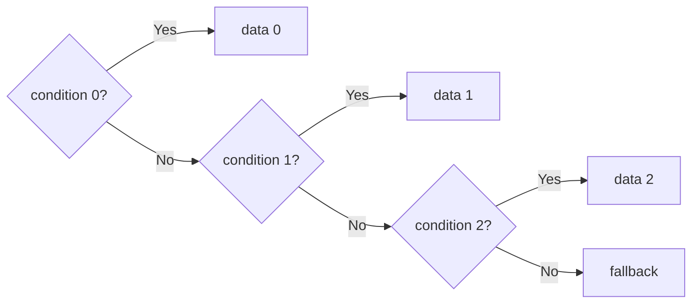

# Priority and MUX

## 1. Overview

여러 후보 중 하나를 선택하는 기능은 RTL에서 매우 흔하다. `if`, `case`, ternary, array index와 enable은 문법은 다르지만 합성 후 MUX, decoder, priority encoder와 control network가 될 수 있다.

핵심은 두 질문을 구분하는 것이다.

1. **Functional priority:** 여러 조건이 동시에 참일 때 어느 후보가 이겨야 하는가?
2. **Selection structure:** 그 결정을 목표 timing, area와 power에 맞게 어떤 hardware로 구현할 것인가?

Priority가 specification이라면 RTL과 verification이 그 순서를 명확히 표현해야 한다. 조건이 mutually exclusive라면 긴 priority chain을 우연히 만들기보다 exclusivity를 설계와 assertion으로 보장해야 한다.

문법-to-hardware 사고법은 [Think Hardware, Not Code](think_hardware_not_code.md), combinational assignment 원칙은 [Combinational vs Sequential Logic](combinational_vs_sequential.md)을 먼저 참고한다.

## 2. Why It Matters

Priority와 MUX는 function, timing과 physical structure를 동시에 좌우한다.

- `clear`, `load`, `update`가 겹칠 때 잘못된 priority는 state를 손상시킨다.
- 많은 request를 직렬 priority로 선택하면 select dependency가 깊어질 수 있다.
- Data 후보가 많고 width가 크면 MUX input capacitance와 routing이 커질 수 있다.
- Select가 늦게 도착하면 data가 일찍 준비되어도 capture timing을 제한할 수 있다.
- Mutual-exclusion assumption이 검증되지 않으면 합성 최적화와 실제 behavior가 어긋날 수 있다.
- One-hot select가 깨졌을 때 여러 data가 섞이거나 예상하지 않은 후보가 선택될 수 있다.

> Priority는 coding style이 아니라 simultaneous event에 대한 functional contract다.

## 3. Hardware View

### 3.1 Ordinary MUX

```text
data0 ───┐
data1 ───┼── [N:1 MUX] ── y
data2 ───┤        ↑
data3 ───┘      select
```

Select가 binary encoded라면 decoder와 MUX tree에 가까운 structure가 만들어질 수 있다. 실제 cell mapping과 topology는 library, width, fan-in, constraints와 physical optimization에 따라 달라진다.

### 3.2 Priority selection



앞 조건이 거짓이어야 다음 조건의 결과가 선택되는 dependency가 있다. 항목 수가 늘면 priority encoder와 cascaded selection에 해당하는 logic depth가 커질 수 있다. Tool이 구조를 재구성할 수 있어도 functional priority는 보존해야 한다.

### 3.3 One-hot selection

One-hot select에서는 각 후보마다 select bit가 하나씩 대응한다.

```text
sel[0] ─ AND data0 ─┐
sel[1] ─ AND data1 ─┼─ OR / selection network ─ y
sel[2] ─ AND data2 ─┘
```

이 구조는 `sel`이 zero-hot 또는 one-hot이라는 contract에 의존한다. 두 bit가 동시에 1이면 OR-based implementation에서는 여러 data가 섞이고, priority implementation에서는 한 후보만 이긴다. 두 behavior는 같지 않다.

## 4. RTL Constructs and Their Meaning

### 4.1 `if` / `else if`: explicit priority

```systemverilog
always_comb begin
    selected = fallback;

    if (select_a)
        selected = data_a;
    else if (select_b)
        selected = data_b;
    else if (select_c)
        selected = data_c;
end
```

동시에 여러 select가 1이면 `A > B > C > fallback` 순서다. Review에서는 “왜 A가 가장 높은가?”를 requirement로 답해야 한다.

Sequential update에서도 같은 원리가 적용된다.

```systemverilog
always_ff @(posedge clk) begin
    if (clear)
        q <= '0;
    else if (load)
        q <= load_data;
    else if (update)
        q <= next_data;
end
```

이 코드는 `clear > load > update > hold`를 정의한다. 자세한 enable 비용은 [Register Enable](../04_low_power/register_enable.md)을 참고한다.

### 4.2 Independent `if` statements writing the same value

```systemverilog
always_comb begin
    selected = fallback;

    if (select_a)
        selected = data_a;

    if (select_b)
        selected = data_b;
end
```

`select_a`와 `select_b`가 모두 1이면 block 안에서 뒤의 assignment인 `data_b`가 최종값이 된다. 결과적으로 `B > A > fallback` priority를 표현한다. 독립 조건처럼 보인다고 parallel selection이 되는 것은 아니다.

두 조건이 절대 겹치지 않는다는 의도라면 그 assumption을 assertion으로 검증하고, 독자가 priority로 오해하지 않도록 structure를 명확히 작성한다.

### 4.3 `case`: encoded selection

```systemverilog
always_comb begin
    selected = fallback;

    case (select)
        2'd0: selected = data0;
        2'd1: selected = data1;
        2'd2: selected = data2;
        2'd3: selected = data3;
        default: selected = fallback;
    endcase
end
```

서로 다른 exact `case` item은 한 select value에 대해 자연스럽게 exclusive하다. 그러나 `case` 문법을 사용했다는 이유만으로 항상 balanced MUX나 특정 cell이 보장되는 것은 아니다. Wildcard item, overlapping condition, output assignment coverage와 synthesis constraints가 mapping에 영향을 준다.

### 4.4 `unique`, `unique0` and `priority`

SystemVerilog qualifier는 설계 의도를 표현하고 simulator 진단과 synthesis optimization에 영향을 줄 수 있다.

| Qualifier | 표현하려는 contract | 주의점 |
|---|---|---|
| `unique` | 둘 이상의 match가 없어야 하며 유효 입력에서 match가 기대됨 | Default 유무와 simulator warning behavior를 flow에서 확인 |
| `unique0` | 둘 이상의 match는 없지만 no-match는 허용 | Zero-hot case를 허용하는 one-hot decode에 유용 |
| `priority` | Item 순서가 우선순위이며 유효 입력에서 match가 기대됨 | 긴 priority hardware가 사라진다는 뜻이 아님 |

Qualifier는 assumption을 증명하지 않는다. Assertion, formal 또는 exhaustive simulation으로 overlap/no-match behavior를 확인해야 한다. Tool별 warning, X handling과 optimization option도 검토한다.

### 4.5 Nested ternary

```systemverilog
assign selected = select_a ? data_a :
                  select_b ? data_b :
                             fallback;
```

이 표현도 `A > B > fallback` priority다. 짧은 표현이 얕은 hardware를 의미하지 않는다. Candidate 수가 많다면 readability와 select timing을 위해 architecture를 다시 검토한다.

### 4.6 Variable array index

```systemverilog
assign selected = data_array[index];
```

Register array의 parallel read라면 large MUX가 될 수 있고, inference condition을 만족하면 memory read structure가 될 수도 있다. `index` range, array depth, read latency와 target technology를 함께 확인한다.

## 5. Simultaneous Events Are Part of the Specification

다음 register update를 생각해 보자.

```systemverilog
always_ff @(posedge clk) begin
    if (clear)
        count_q <= '0;
    else if (load)
        count_q <= load_value;
    else if (increment)
        count_q <= count_q + 1'b1;
end
```

Code review 전에 corner-case matrix를 만든다.

| clear | load | increment | 현재 RTL 결과 | Specification 확인 |
|---:|---:|---:|---|---|
| 0 | 0 | 0 | Hold | Idle behavior인가? |
| 0 | 0 | 1 | Increment | Overflow behavior는? |
| 0 | 1 | 1 | Load | Increment를 버리는 것이 맞는가? |
| 1 | 0 | 1 | Clear | Event loss를 허용하는가? |
| 1 | 1 | 1 | Clear | Clear가 절대 우선인가? |

“동시에 발생하지 않는다”는 답도 가능하지만 다음 증거가 필요하다.

- Upstream protocol이 overlap을 금지한다.
- Clock/domain 관계가 그 protocol을 보장한다.
- Assertion 또는 formal property가 assumption을 검증한다.
- Requirement 변경 시 assumption owner와 review trigger가 있다.

Counter window의 실제 사례는 [Counter Optimization](../04_low_power/counter_optimization.md)에서 다룬다. Request/acceptance와 동시 사건을 priority, merge, reject 또는 queue로 결정하는 방법은 [Priority and Simultaneous Events](../09_control_logic/priority_and_simultaneous_events.md)를 참고한다.

## 6. Priority vs Mutual Exclusivity

두 condition이 mutually exclusive라면 기능적으로 priority가 필요하지 않다. 하지만 RTL이 priority chain으로 작성되면 tool이 exclusivity를 이용할 수 있는지, assumption이 안전한지 확인해야 한다.

```systemverilog
// This implementation is valid only when select is zero-hot or one-hot.
always_comb begin
    selected = '0;

    for (int i = 0; i < NUM_INPUTS; i++) begin
        selected |= ({DATA_W{select[i]}} & data[i]);
    end
end
```

이 OR-based selection은 여러 select가 동시에 1일 때 priority MUX와 다른 결과를 만든다. 따라서 다음과 같은 property가 design contract에 맞는 경우에만 사용한다.

```systemverilog
assert property (@(posedge clk) disable iff (rst)
    $onehot0(select));
```

`$onehot0`는 zero-hot도 허용한다. 반드시 하나가 선택되어야 한다면 `$onehot` 또는 별도의 valid condition이 더 적합할 수 있다.

## 7. Timing Impact

### 7.1 Deep priority chain

Priority 후보가 많으면 뒤 후보가 선택되기 위해 앞 조건의 false 결과를 통과해야 한다. 다음을 검토한다.

- Priority가 실제 기능 요구인가?
- 후보를 group으로 나누거나 hierarchical arbitration할 수 있는가?
- Priority decision을 이전 cycle에 계산할 수 있는가?
- Round-robin 또는 tree arbitration이 requirement에 더 적합한가?
- Request 수를 architecture에서 줄일 수 있는가?

### 7.2 Late select

Data 후보가 일찍 도착해도 select가 wide decode, state transition 또는 high-fanout control을 통과해 늦게 도착하면 MUX output이 늦어진다.

```text
early data ----------------------┐
                                MUX --> capture FF
state --> decode --> late select─┘
```

Data path만 보고 critical path를 판단하지 않는다. [Critical Path](../03_timing/critical_path.md)에서 late control과 net delay를 함께 확인하는 방법을 설명한다.

### 7.3 Large data MUX

Candidate 수 × data width가 커지면 MUX cell, input capacitance, routing과 congestion이 증가할 수 있다. Candidate가 서로 먼 hierarchy에 있다면 wire delay가 logic delay보다 중요해질 수 있다.

## 8. Power Impact

- 선택되지 않은 data 후보도 upstream logic이 계속 계산하면 toggle할 수 있다.
- MUX 내부 node는 select/data transition과 glitch에 반응할 수 있다.
- High-fanout select와 decoder는 큰 capacitance를 구동한다.
- Operand isolation은 선택되지 않은 expensive branch의 activity를 줄일 수 있지만 gating logic 비용이 있다.
- Priority control이 매 cycle 평가될 필요가 없다면 state/enable architecture를 검토할 수 있다.

MUX output의 activity만 보지 말고 모든 후보 cone과 select network의 activity를 함께 본다.

## 9. Area and Physical Impact

MUX와 priority logic의 area는 후보 수, width와 target cells에 의존한다. Resource sharing으로 operator 수를 줄여도 그 앞뒤의 MUX, arbitration, register와 fanout이 증가할 수 있다.

Logic duplication은 area를 늘리지만 각 consumer 가까이에 decode 또는 data를 배치해 fanout과 long route를 줄일 수 있다. Share와 duplicate 중 어느 쪽이 좋은지는 logical gate 수만이 아니라 placement, congestion과 timing report로 결정한다.

## 10. Synthesis View

| RTL observation | 확인할 synthesis 결과 |
|---|---|
| Long `else if` | Priority encoder/MUX depth와 critical branch |
| Exact `case` | MUX/decoder 구조와 default coverage |
| `unique`/`priority` | Assumption diagnostic와 optimization 영향 |
| Variable index | MUX 또는 memory inference |
| One-hot OR selection | AND/OR network, fanout와 exclusivity preservation |
| Shared operator | Input/output MUX, arbitration와 register 추가 |

Syntax를 바꾸기 전후로 function equivalence와 report를 비교한다. `if`를 `case`로 기계적으로 바꾸는 것만으로 timing이 개선된다고 가정하지 않는다.

## 11. Common Mistakes

### Priority를 코드에서 우연히 결정한다

작성 순서가 specification을 대신하면 simultaneous event에서 숨은 기능 오류가 생긴다. Matrix와 assertion으로 먼저 결정한다.

### Mutually exclusive라고 말하지만 검증하지 않는다

One-hot assumption이 깨지면 OR-based MUX와 optimized decode가 잘못된 결과를 낼 수 있다. Assumption을 executable property로 만든다.

### `unique`가 hardware safety를 보장한다고 생각한다

Qualifier는 intent와 diagnostic을 제공하지만 illegal input을 막는 circuit이나 proof를 자동으로 만들지는 않는다.

### `casex`로 X를 숨긴다

`casex`는 X/Z를 wildcard로 취급해 initialization 또는 illegal state 문제를 감출 수 있다. Public generic RTL에서는 control decode에 `casex` 사용을 피하고, 필요한 wildcard semantics와 X policy를 명시한다.

### Default branch가 모든 문제를 해결한다고 생각한다

Default assignment는 latch를 피하는 데 도움을 주지만 illegal encoding이나 no-request behavior가 무엇이어야 하는지 결정하지 않는다. Safe recovery와 error detection은 별도 requirement다.

### Area를 줄이려고 모든 operator를 공유한다

MUX, arbitration, fanout과 initiation interval 비용을 포함하지 않은 sharing은 timing과 throughput을 악화시킬 수 있다. Architecture 수준의 판단은 [Resource Sharing vs Duplication](../02_architecture/resource_sharing_vs_duplication.md)을 참고한다.

## 12. Recommended Pattern

1. Candidate와 select condition을 표로 나열한다.
2. 동시에 참이 될 수 있는 모든 조합을 분류한다.
3. Overlap이 허용되면 priority를 requirement로 정의한다.
4. Overlap이 금지되면 one-hot/mutual-exclusion property를 작성한다.
5. No-match behavior와 fallback/hold/error를 정의한다.
6. Data width, candidate 수, select arrival와 physical locality를 검토한다.
7. RTL construct를 선택하고 lint/simulation diagnostic을 활성화한다.
8. Synthesis에서 MUX depth, fanout, operator sharing과 critical path를 확인한다.

## 13. Verification Strategy

- 모든 select의 zero/one/multiple-hot 조합을 검증한다.
- Clear/load/update 같은 simultaneous event를 matrix로 test한다.
- Priority encoder의 first/last candidate와 no-request를 검증한다.
- One-hot contract는 `$onehot` 또는 `$onehot0` property로 확인한다.
- `unique`/`priority` no-match와 overlap warning이 regression에서 누락되지 않게 관리한다.
- X initialization과 illegal state에서 control output이 안전한지 확인한다.
- Sharing/arbitration이 back-to-back request를 잃지 않는지 검증한다.

## 14. Design Review Checklist

- [ ] 여러 condition이 동시에 참일 수 있는가?
- [ ] Priority가 있다면 requirement에 명시되어 있는가?
- [ ] Mutual exclusivity 또는 one-hot assumption이 assertion으로 검증되는가?
- [ ] No-match에서 fallback, hold 또는 error behavior가 정의되어 있는가?
- [ ] `if`, `case`, ternary가 의도한 selection semantics를 표현하는가?
- [ ] `unique`, `unique0`, `priority` qualifier의 assumption을 이해하고 있는가?
- [ ] Deep priority chain과 late select가 timing bottleneck이 아닌가?
- [ ] Large MUX의 width, fan-in, fanout과 routing을 확인했는가?
- [ ] 선택되지 않은 branch의 unnecessary switching을 검토했는가?
- [ ] Resource sharing의 MUX/control/throughput 비용을 포함했는가?
- [ ] Synthesis mapping과 critical path가 예상 구조와 일치하는가?

Wide data selection의 invalid/one-hot contract와 physical select topology는 [Datapath MUX and Select](../10_datapath/mux_and_select.md)를 참고한다. 전체 검토에는 [RTL Design Review Checklist](../15_checklist/rtl_design_review_checklist.md)를 함께 사용한다.

Priority/MUX 가설을 elaboration, generic representation과 mapped netlist로 추적하는 절차는 [RTL to Hardware Mapping](../11_synthesis/rtl_to_hardware_mapping.md)을 참고한다.

긴 selection chain을 review에서 판정하는 요약은 [Deep Priority Chain](../14_anti_patterns/deep_priority_chain.md)을 참고한다.
