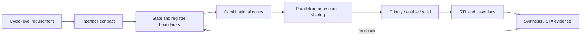

# Think Hardware, Not Code

## 1. Overview

SystemVerilog는 `if`, `for`, function, variable과 assignment 같은 software와 비슷한 문법을 사용한다. 그러나 synthesizable RTL의 결과는 processor에서 순서대로 실행되는 instruction이 아니라 **register, combinational logic, memory와 wiring으로 이루어진 hardware structure**다.

따라서 RTL을 읽고 쓸 때는 “이 문장이 몇 번째로 실행되는가?”보다 다음을 먼저 묻는다.

- 어떤 정보가 state로 저장되는가?
- 어느 clock edge에서 state가 바뀌는가?
- register 사이에 어떤 combinational cone이 생기는가?
- 여러 연산은 병렬로 존재하는가, 같은 resource를 공유하는가?
- select, enable과 valid는 data와 어느 cycle에 정렬되는가?
- 이 구조가 요구 latency, throughput과 clock period를 만족하는가?

이 문서의 공통 용어는 [Canonical RTL Design Terminology](terminology.md)를 따른다. 전체 최적화 순서는 [What Makes Good RTL?](../00_introduction/overview.md)에서 다루고, 여기서는 **RTL syntax를 hardware로 번역하는 사고 과정**에 집중한다. 세부 원칙은 [Combinational vs Sequential Logic](combinational_vs_sequential.md), [Priority and MUX](priority_and_mux.md), [Width and Signedness](width_and_signedness.md)로 이어진다.

> 읽기 좋은 RTL은 중요하지만, source code의 모양만으로 좋은 hardware를 보장할 수는 없다. 먼저 의도한 hardware를 정하고, RTL이 그 구조를 명확하게 기술하는지 확인해야 한다.

## 2. Why It Matters

Software 관점으로 RTL을 해석하면 simulation에서 기능이 맞더라도 architecture 판단을 놓칠 수 있다.

### Loop를 반복 실행으로 생각한다

고정 범위의 synthesizable loop는 일반적으로 loop body에 해당하는 hardware를 펼쳐 만든다. 네 번 반복하는 `for` loop가 자동으로 네 cycle에 걸쳐 하나의 adder를 재사용한다는 뜻은 아니다. 한 cycle의 combinational logic으로 펼쳐질 수도 있으며, 의도하지 않은 logic depth와 area를 만들 수 있다.

### 여러 assignment가 시간 순서대로 hardware를 움직인다고 생각한다

서로 다른 combinational block과 sequential element는 동시에 존재한다. Nonblocking assignment가 있는 `always_ff` 안에서도 모든 register는 같은 active edge의 이전 state를 기준으로 함께 갱신된다. 문장 순서를 pipeline의 시간 순서로 오해하면 cycle alignment가 틀어진다.

### 짧은 표현을 작은 hardware라고 생각한다

한 줄의 variable shift, division, array index 또는 wide comparison도 큰 operator나 MUX를 만들 수 있다. 반대로 여러 줄의 constant와 generate structure가 합성 후 단순한 wiring이 될 수도 있다. Source line 수는 area나 timing의 신뢰할 수 있는 metric이 아니다.

### Function call을 실행 중인 subroutine이라고 생각한다

Synthesizable function은 보통 호출된 위치의 combinational logic으로 해석된다. 여러 곳에서 호출하면 tool optimization 전에는 여러 logic instance가 필요한 구조가 될 수 있다. Software library처럼 한 개의 실행 resource가 자동 공유된다고 가정해서는 안 된다.

이러한 오해는 다음 문제로 이어질 수 있다.

- 예상보다 깊은 adder 또는 priority chain
- 늦게 도착하는 select와 large MUX
- 의도하지 않은 operator 복제 또는 resource sharing
- data, valid와 control의 cycle misalignment
- 불필요하게 넓은 register와 arithmetic
- 사용하지 않는 cycle에도 계속되는 switching
- simulation에는 보이지 않는 timing, fanout과 physical 문제

## 3. Hardware Mental Model

RTL을 작성하기 전에 requirement를 다음 구조로 바꿔 본다.



### 3.1 Interface contract

먼저 transaction이 언제 accept되고 결과가 언제 valid한지 정한다. “빠르게 계산한다”는 표현만으로는 architecture를 정할 수 없다.

```text
cycle            N      N+1      N+2
input_valid      1       0        0
input_data       A       -        -
output_valid     0       0        1
output_data      -       -       f(A)

Latency: input accept edge에서 output valid edge까지 2 cycles
Initiation interval: 별도 requirement로 정의
```

같은 latency 2 cycle이라도 매 cycle 새 input을 받을 수 있는 pipeline과, 결과가 나올 때까지 다음 input을 막는 shared iterative unit은 다른 hardware다.

### 3.2 State inventory

State는 다음 cycle 이후의 동작에 영향을 주기 위해 보존해야 하는 정보다. 각 state에 대해 아래를 정한다.

| 질문 | Hardware 의미 |
|---|---|
| 누가 값을 쓰는가? | register input cone과 ownership |
| 어느 edge에서 바뀌는가? | clock domain과 update condition |
| 언제 소비되는가? | latency와 control alignment |
| idle에서 유지해야 하는가? | enable, reset과 power architecture |
| reset value가 필요한가? | reset network와 valid-before-use contract |

Temporary variable을 선언했다는 이유만으로 register가 생기는 것은 아니다. 반대로 edge 사이에 값을 보존해야 한다면 이름이나 coding style과 무관하게 state element가 필요하다.

### 3.3 Combinational cone

Register boundary 사이의 arithmetic, compare, decode와 select를 하나의 cone으로 본다.

```text
                         ┌─ compare ─────┐
Source registers ────────┤               ├─ select ── Capture register
                         └─ arithmetic ──┘
```

Timing은 코드 줄 수가 아니라 cell delay, logic depth, fanout과 routing으로 결정된다. 병렬 branch가 MUX에서 합쳐지는지, 한 branch의 결과가 다음 계산의 입력이 되는지 구분해야 한다.

### 3.4 Control and data alignment

Data만 pipeline하고 `valid`, select, tag 또는 exception flag를 같은 cycle만큼 지연하지 않으면 기능이 틀린다. Control은 부가 정보가 아니라 datapath가 어떤 값을 의미하는지 결정하는 architecture의 일부다.

## 4. Reading Common RTL Constructs as Hardware

### 4.1 `if` / `else if`: priority select

```systemverilog
always_ff @(posedge clk) begin
    if (clear)
        q <= '0;
    else if (load)
        q <= load_data;
    else if (update)
        q <= next_data;
end
```

이 코드는 개념적으로 `clear > load > update > hold` priority와 register를 기술한다.

```text
                    clear  load  update
                       \     |     /
                        priority control
                               |
0 / load_data / next_data / q--MUX--> D [FF] --> q
```

Review의 핵심은 문법이 아니라 다음 조건이다.

- 세 조건이 동시에 1일 수 있는가?
- 동시에 1이라면 이 priority가 specification인가?
- Mutual exclusivity가 보장된다면 assertion으로 확인하는가?
- Hold를 위한 feedback path 또는 enable mapping이 timing에 미치는 영향은 무엇인가?

Priority가 필요하지 않은데 긴 `else if` chain을 작성하면 select path가 깊어질 수 있다. 다만 `case`로 바꿨다는 사실만으로 priority가 사라지는 것은 아니다. 조건의 의미와 tool mapping을 함께 확인한다.

### 4.2 Nonblocking assignment: concurrent state update

```systemverilog
always_ff @(posedge clk) begin
    if (en) begin
        stage0_q <= input_data;
        stage1_q <= stage0_q + 16'd1;
    end
end
```

`en`이 1인 edge에서 두 register는 함께 capture한다. `stage1_q`는 같은 block의 앞 문장에서 새로 정해진 `stage0_q`가 아니라 **edge 직전의 `stage0_q`**를 사용한다.

```text
input_data --> [stage0 FF] --> +1 --> [stage1 FF]
                    cycle boundary       cycle boundary
```

이 semantics는 문장을 차례로 실행하는 software model이 아니라 두 register가 나란히 존재하는 pipeline structure를 표현한다. 실제 pipeline에서는 data와 함께 valid, stall, flush와 reset behavior도 정렬해야 한다.

### 4.3 Fixed loop: spatial replication or expanded logic

```systemverilog
logic [17:0] sum;

always_comb begin
    sum = '0;
    for (int i = 0; i < 4; i++) begin
        sum = sum + {2'b00, sample[i]};
    end
end
```

이 loop는 네 cycle의 sequential accumulation을 정의하지 않는다. 합성 과정에서 네 입력을 더하는 combinational network가 만들어진다. 표현과 optimization에 따라 adder chain 또는 재구성된 tree에 가까운 network가 될 수 있으며, arithmetic semantics와 tool option이 가능한 변환을 제한할 수 있다.

한 개의 adder를 네 cycle 동안 재사용하려면 counter, accumulator, input schedule과 result-valid control을 가진 **명시적인 multi-cycle architecture**가 필요하다. 그 경우 area는 줄 수 있지만 latency와 initiation interval, accumulator feedback timing을 새로 검토해야 한다.

### 4.4 Array index and variable select: MUX or decode

```systemverilog
assign selected_data = data_array[index];
```

`data_array`가 register array로 구현되고 모든 element가 병렬로 읽힌다면, variable `index`는 array depth와 data width에 따른 MUX를 만들 수 있다. Memory inference가 가능한 구조라면 다른 hardware로 mapping될 수도 있으므로 array declaration, read/write pattern, target technology와 synthesis report를 확인한다.

반대 방향의 variable write는 decoder, write-enable fanout과 storage structure에 영향을 줄 수 있다. 한 줄의 index expression을 “공짜 접근”으로 보지 않는다.

### 4.5 Variable shift and arithmetic operator

```systemverilog
assign shifted = data << shift_amount;
```

Constant shift는 wiring과 단순화로 처리될 수 있지만 variable shift는 barrel-shifter 형태의 MUX network가 될 수 있다. 마찬가지로 `+`, `*`, `/`, `%`는 operand width, constant 여부, signedness, target library와 constraint에 따라 매우 다른 hardware를 만들 수 있다.

Operator symbol만 보고 한 gate라고 생각하거나, 반대로 항상 특정 macro가 된다고 단정하지 않는다.

## 5. From Requirement to RTL: Worked Example

다음과 같은 generic requirement를 생각해 보자.

> `req`가 accept된 뒤 정확히 2 cycle 후, `a + b`가 `limit`보다 큰지를 `result_valid`와 함께 출력한다. 매 cycle 새 request를 받을 수 있어야 한다.

### 5.1 Architecture decision

- Latency: 2 cycles
- Initiation interval: 1 cycle
- Accept edge: input과 request capture
- Stage 1: addition과 compare operand capture
- Stage 2: compare와 output capture
- `valid`도 두 cycle의 register boundary에 맞춰 이동
- Addition carry를 보존할 수 있도록 intermediate width를 한 bit 확장

```text
 a,b,limit --> [input FF] --> [add + operand FF] --> [compare + output FF]
 req ----------> req_q ----------> sum_valid_q ----------> result_valid
                  edge N              edge N+1                 edge N+2
```

```systemverilog
logic [15:0] a_q;
logic [15:0] b_q;
logic [15:0] limit_q;
logic        req_q;
logic [16:0] sum_q;
logic [16:0] compare_limit_q;
logic        sum_valid_q;
logic        result_q;
logic        result_valid_q;

always_ff @(posedge clk) begin
    if (rst) begin
        req_q          <= 1'b0;
        sum_valid_q    <= 1'b0;
        result_valid_q <= 1'b0;
    end else begin
        req_q          <= req;
        sum_valid_q    <= req_q;
        result_valid_q <= sum_valid_q;

        if (req) begin
            a_q     <= a;
            b_q     <= b;
            limit_q <= limit;
        end

        if (req_q) begin
            sum_q           <= {1'b0, a_q} + {1'b0, b_q};
            compare_limit_q <= {1'b0, limit_q};
        end

        if (sum_valid_q)
            result_q <= (sum_q > compare_limit_q);
    end
end

assign result       = result_q;
assign result_valid = result_valid_q;
```

이 예제는 architecture discussion을 위한 부분 RTL이다. 실제 interface에서는 reset polarity, request acceptance, backpressure, output hold requirement와 parameterized width를 명시해야 한다.

### 5.2 Hardware review

- `sum_q`는 addition 결과의 carry를 보존하는가?
- `limit`이 해당 request의 `a`, `b`와 함께 capture되고 compare stage까지 정렬되는가?
- `req=0`일 때 `sum_q`를 hold하는 것이 downstream validity contract와 일치하는가?
- Reset되지 않는 input/data register와 `result_q`는 대응하는 valid가 0일 때 소비되지 않는가?
- Compare stage가 timing을 만족하는가, 아니면 input capture 위치가 달라져야 하는가?

여기서 특히 `limit`을 request와 함께 capture하지 않거나 addition 결과와 같은 수만큼 지연하지 않았다면, request와 다른 cycle의 `limit`을 비교하는 architecture가 된다. “어떤 값이 어느 transaction에 속하는가?”를 hardware state 관점으로 추적해야 하는 이유다.

## 6. Synthesis View

Synthesis는 RTL을 그대로 그림으로 복사하지 않는다. Constant propagation, Boolean simplification, unused logic removal, arithmetic restructuring, sharing 또는 duplication을 수행할 수 있다. 하지만 다음 질문은 RTL designer가 먼저 답해야 한다.

- Register boundary가 latency contract와 일치하는가?
- Priority와 mutual exclusivity가 기능적으로 맞는가?
- Operand width와 signedness가 range requirement를 만족하는가?
- Resource sharing에 필요한 arbitration과 MUX를 허용할 수 있는가?
- State와 combinational logic이 원하는 clock/reset domain에 있는가?

그 다음 report와 netlist에서 가설을 확인한다.

| RTL observation | Synthesis에서 확인할 항목 |
|---|---|
| `if`/`else if` chain | MUX depth, priority mapping, select arrival |
| Fixed loop | operator 수, logic depth, unrolling 결과 |
| Function multiple calls | duplicated logic, sharing과 fanout |
| Variable index | MUX/decoder 또는 memory inference |
| Register hold | feedback MUX, enable cell, clock-gating inference 가능성 |
| Wide operator | inferred width, signed extension, critical path |

Synthesis 결과가 예상과 다르면 code를 무작정 더 복잡하게 만들기 전에 requirement, constraints와 inference condition을 다시 확인한다.

## 7. Timing, Power and Area Impact

| Architecture choice | Timing | Power | Area |
|---|---|---|---|
| Parallel operators | critical operation을 겹쳐 latency/II 개선 가능 | 여러 operator가 함께 toggle할 수 있음 | operator 복제로 증가 가능 |
| Shared operator | arbitration/MUX와 feedback path가 추가될 수 있음 | 사용 schedule과 isolation에 따라 달라짐 | operator 수는 줄지만 MUX/control 증가 |
| Pipeline register 추가 | combinational path 분할 가능 | clock load와 FF activity 증가 | FF, control, routing 증가 |
| Deep priority chain | late control path가 critical해질 수 있음 | select/data cone switching 증가 가능 | MUX 구조와 buffering 증가 가능 |
| Width 축소 | arithmetic/compare delay 개선 가능 | switched capacitance 감소 가능 | FF/operator/routing 감소 가능 |
| Register enable | enable path 또는 feedback MUX 영향 | 불필요한 update 감소 가능 | enable logic과 gating overhead |

이는 방향성이다. 실제 결과는 library, constraints, physical placement와 activity workload에 따라 달라진다. 특히 sharing과 duplication은 area와 timing을 반대 방향으로 움직일 수 있으므로 report 비교가 필요하다. 전체 비교 boundary를 정하는 방법은 [Resource Sharing vs Duplication](../02_architecture/resource_sharing_vs_duplication.md)을 참고한다.

## 8. Common Mistakes

### 8.1 “한 줄이므로 빠르다”

Wide compare, multiply, variable shift와 array select는 한 줄이어도 큰 combinational cone이 될 수 있다. Operator width와 fan-in을 표시한 hardware sketch를 만든다.

### 8.2 “Loop가 알아서 multi-cycle로 동작한다”

Cycle을 만드는 것은 clocked state와 control이다. 고정 loop만으로 resource reuse schedule은 생기지 않는다.

### 8.3 “Synthesis tool이 최적 architecture를 찾아준다”

Tool은 주어진 sequential boundary와 functional semantics 안에서 최적화한다. Latency contract, transaction ownership과 CDC protocol을 대신 결정하지 않는다.

### 8.4 “모든 intermediate를 register로 만들면 timing이 좋아진다”

Pipeline은 latency, valid alignment, reset/flush, clock power와 verification 비용을 가진다. 결과가 필요한 cycle과 feedback dependency를 먼저 확인한다. 자세한 판단은 [Pipeline Design](../03_timing/pipeline.md)을 참고한다.

### 8.5 “Readable code와 efficient hardware 중 하나만 선택해야 한다”

두 목표는 대립하지 않는다. Architecture가 명확하면 register boundary, priority와 widths를 드러내는 readable RTL을 작성할 수 있다. 난해한 coding trick으로 tool optimization을 강제하기보다 synthesis evidence를 사용한다.

### 8.6 Control을 datapath보다 덜 중요하게 본다

Late select, high-fanout enable, clear/load priority와 valid alignment는 기능과 timing을 동시에 결정한다. Control logic도 명시적인 path와 state ownership을 가진 hardware다.

## 9. Recommended Design Pattern

RTL을 작성할 때 다음 순서를 사용한다.

1. **Cycle contract를 쓴다.** Accept, capture, valid, stall과 cancel edge를 정한다.
2. **State를 나열한다.** 각 register의 owner, update condition, reset 필요성과 소비 cycle을 기록한다.
3. **Register boundary를 그린다.** Feedback path와 clock/reset domain을 표시한다.
4. **Combinational cone을 표시한다.** Arithmetic, compare, MUX, decode와 예상 width를 적는다.
5. **Parallelism을 결정한다.** Latency/II 요구를 바탕으로 share, duplicate 또는 pipeline을 선택한다.
6. **Priority와 assumption을 명시한다.** Simultaneous condition과 mutual exclusivity를 specification과 assertion으로 연결한다.
7. **RTL과 verification을 작성한다.** Data뿐 아니라 valid/control alignment를 검증한다.
8. **Synthesis와 STA로 확인한다.** Operator 수, register, MUX depth, fanout, inferred width와 timing path를 예상과 비교한다.

이 과정은 RTL을 작성하기 전에 모든 gate를 수작업으로 정하라는 뜻이 아니다. Tool이 최적화할 자유는 남기되, **state boundary와 functional schedule처럼 architecture를 결정하는 사항을 우연에 맡기지 않는 것**이 목적이다.

## 10. Verification Strategy

Hardware 관점의 RTL은 cycle과 invariant로 검증한다.

- Accepted transaction마다 정확한 latency 후 output valid가 발생하는가?
- Back-to-back transaction이 서로 섞이지 않는가?
- Stall 또는 enable이 data와 control을 같은 방식으로 멈추는가?
- 동시에 가능한 control condition의 priority가 specification과 일치하는가?
- Output valid가 0일 때 resetless datapath 값을 소비하지 않는가?
- Parameter/width boundary에서 overflow와 truncation이 의도와 일치하는가?
- Resource sharing을 선택했다면 arbitration 중 transaction loss가 없는가?

Assertion은 source-code statement가 아니라 architecture contract를 표현해야 한다. 예를 들어 fixed-latency interface라면 request acceptance와 output-valid 사이의 cycle relationship을 검증하고, mutual-exclusive control이라면 해당 assumption을 executable property로 만든다.

## 11. Design Review Checklist

- [ ] RTL을 보지 않고도 register boundary와 data flow를 설명할 수 있는가?
- [ ] Input acceptance, output-valid latency와 initiation interval이 정의되어 있는가?
- [ ] 각 state의 update condition과 소비 cycle이 명확한가?
- [ ] `if`/`case` priority가 실제 specification인가?
- [ ] Fixed loop가 만드는 operator 수와 logic depth를 예상했는가?
- [ ] Function 호출, variable shift와 array index의 hardware cost를 검토했는가?
- [ ] Width, signedness, extension과 truncation이 명시적인가?
- [ ] Data와 valid/select/tag가 같은 transaction으로 정렬되는가?
- [ ] Sharing, duplication과 pipeline 선택이 latency/II requirement에 근거하는가?
- [ ] Idle cycle의 unnecessary update와 switching을 검토했는가?
- [ ] Synthesis report와 timing path가 예상한 hardware structure와 일치하는가?
- [ ] Tool-dependent mapping을 RTL 모양만으로 단정하지 않았는가?

Array와 memory mapping을 구체화할 때는 [Memory and Register Array](../05_area/memory_and_register_array.md), 전체 설계 검토에는 [RTL Design Review Checklist](../15_checklist/rtl_design_review_checklist.md)를 함께 사용한다.
