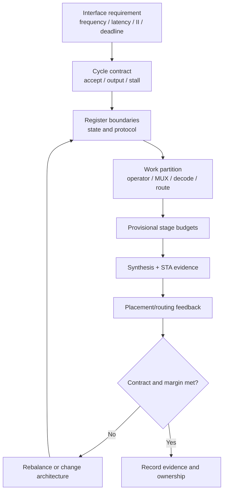

# Architectural Timing Budget

Interface requirement가 target clock과 latency를 정하면 microarchitecture는 그 요구를 register boundary와 stage별 work로 배분해야 한다. Architectural timing budget은 “각 stage에 gate 몇 개를 넣는다”는 규칙이 아니라, 어느 launch/capture boundary 사이에 어떤 combinational·routing work를 허용할지 정하고 implementation evidence로 반복 보정하는 과정이다.

> Timing budget은 합성 전의 약속이자 가설이다. Sign-off timing은 library, constraint, clock와 physical implementation을 반영한 STA evidence로 확인한다.

Setup/hold, slack와 timing-path canonical 설명은 [Timing Design & Optimization](../03_timing/overview.md)과 [Critical Path](../03_timing/critical_path.md)를 따른다. 이 문서는 STA 공식을 다시 정의하지 않고, **interface contract를 block/stage decision으로 내리는 architecture 책임**을 다룬다.

## 1. Requirement에서 Budget으로 내려가는 흐름



각 단계에서 질문이 다르다.

| 단계 | 핵심 질문 |
|---|---|
| Interface | 결과가 언제 필요하고 매 cycle 몇 transaction을 받아야 하는가? |
| Cycle contract | Accept와 output-valid edge, stall/flush latency는 무엇인가? |
| Register boundary | 어느 state가 어느 edge에 capture되는가? |
| Work partition | Arithmetic, MUX, compare, decode와 control을 어느 stage가 소유하는가? |
| Provisional budget | Sequential/clock/margin을 고려한 comb+net 목표는 얼마인가? |
| Evidence | 예상 path와 실제 critical path가 같은가? |
| Physical feedback | Net delay, fanout, congestion와 skew가 가설을 바꾸는가? |

Latency와 initiation interval의 정의는 [Canonical RTL Design Terminology](../01_fundamentals/terminology.md#3-latency-throughput-initiation-interval)를 재사용한다.

## 2. Clock Period 전체가 Logic Budget은 아니다

Register-to-register setup path를 개념적으로 그리면 다음과 같다.

```text
launch edge
    │
    ▼
[Source FF] ── clock-to-Q ── combinational cells ── nets ──> [Destination FF]
                                                                    ▲
                                                        setup / capture edge
```

한 period 안에는 combinational cell delay만 있는 것이 아니다.

- Source sequential element의 clock-to-Q
- Destination setup requirement
- Combinational cell delay
- Net delay, buffering와 fanout
- Clock relationship, latency/skew와 uncertainty
- Variation/derating과 analysis-mode 조건
- Architecture 또는 project가 요구하는 margin

이 항목을 단순히 모두 더하거나 특정 sign으로 넣는 공식은 analysis mode와 STA convention에 따라 달라질 수 있다. RTL designer는 tool report의 required/arrival time을 authoritative evidence로 사용하되, architecture 단계에서는 comb+net work에 period 전체를 배정하지 않는다는 사실을 반영한다.

### 명백히 가상인 예

다음 수치는 방법을 설명하기 위한 illustrative example이며 특정 공정/library의 목표가 아니다.

```text
hypothetical clock period                    1.00 ns
provisional sequential overhead reserve      0.15 ns
provisional clock/uncertainty reserve         0.10 ns
architecture margin                          0.10 ns
-------------------------------------------------------
provisional combinational + net target        0.65 ns
```

실제 STA에서 각 항목은 다른 방식으로 계산될 수 있고 corner/mode마다 달라진다. `0.65 ns`를 RTL 규칙으로 고정하지 않고 stage 후보를 거르는 초기 가설로만 사용한다.

## 3. Block Budget과 Stage Budget

두 combinational stage를 사용한다고 stage delay를 정확히 절반씩 나눌 수 있는 것은 아니다. 아래처럼 E0 input capture와 E2 output-register publication 사이에 두 combinational stage가 있으면, 이 가이드의 synchronous-consumer convention에서 interface latency는 E0→E3의 3 cycle이다.

```text
Accept E0          E1                     E2 Output FF       E3 Consumer
   │               │                       │                    │
   └─ Stage A ─────┴────── Stage B ─────────┘                    │
```

Stage마다 다음을 기록한다.

- Launch/capture registers
- Payload width와 operator type
- Select/enable의 arrival source
- Expected cell logic와 MUX depth
- High-fanout control과 physical span
- Macro/interface fixed delay
- Provisional comb+net target와 margin

### Budget worksheet 예

| Stage | Work | Early estimate | 주요 위험 | 확인 evidence |
|---|---|---|---|---|
| A | input capture → 9-bit add | medium arithmetic depth | operand routing | synthesis path |
| B | sum → XOR/format | shallow logic | late mask/control fanout | STA + placement |

“Medium”과 “shallow”는 sign-off 수치가 아니다. 예상 원인을 기록해 첫 synthesis report에서 확인할 hypothesis다.

## 4. Equal Logic Count가 Equal Delay가 아닌 이유

RTL operator 또는 Boolean term 수가 같아도 delay는 다를 수 있다.

### Operator topology

9-bit ripple-like carry path, balanced reduction tree와 9-bit bitwise XOR는 같은 “한 줄”이어도 구조가 다르다. 실제 mapping은 library와 constraint에 따라 달라진다.

### Input arrival

Data가 일찍 도착해도 select가 늦으면 final MUX output이 늦다.

```text
early data  ───────────────┐
                           ├─ MUX ─> capture
late select ── decode ─────┘
```

### Fanout와 capacitance

한 개 control signal이 넓은 bank와 여러 hierarchy를 구동하면 buffer와 net delay가 커질 수 있다.

### Physical locality

논리적으로 인접한 statement가 layout에서도 가까운 것은 아니다. Macro boundary, congestion와 floorplan 때문에 short logic가 long route를 가질 수 있다.

### Reconvergence와 glitch

여러 path가 다시 합쳐지는 decode/MUX 구조는 logic depth뿐 아니라 arrival imbalance와 switching을 가진다.

따라서 stage balance는 source line 수나 operator count가 아니라 path delay composition과 physical feedback으로 판단한다.

## 5. Early Control과 Late Control

Control을 앞 stage에서 decode/register하면 다음 stage의 select arrival를 앞당길 수 있다.

```text
Before

payload ────────────────> wide MUX ─> operator ─> FF
mode ── late decode ────> select

Candidate

mode ─> early decode ─> control FF ──┐
payload ─────────────────────────────┼─> local select/operator ─> FF
```

비용:

- Control FF와 valid alignment
- Speculative decode switching
- Reset/flush state 증가
- Control duplication과 fanout 변화
- Latency 또는 mode-change visibility 변경 가능성

Control만 앞당기고 payload/tag를 같은 transaction에 맞추지 않으면 기능 오류다. 반대로 wide payload를 불필요하게 한 stage 더 이동하면 FF area와 clock power가 증가할 수 있다.

## 6. RTL Example: 명시적인 Stage Contract

다음 generic block은 unsigned 8-bit `a+b`의 9-bit 결과를 9-bit mask와 XOR한다.

- E0: input operands, mask와 valid capture
- E1: 9-bit sum, aligned mask와 valid capture
- E2 NBA 뒤: output result와 valid를 output register에서 publish
- E3: downstream sequential consumer 또는 concurrent SVA가 matching output을 처음 관찰·capture
- Interface latency: accept E0 → synchronous output observation E3, 3 cycle
- II: 1, stall 없는 free-running pipeline
- Event priority: reset → normal advance

```systemverilog
module budgeted_transform (
    input  logic       clk,
    input  logic       rst_n,
    input  logic       in_valid,
    input  logic [7:0] in_a,
    input  logic [7:0] in_b,
    input  logic [8:0] in_mask,
    output logic       out_valid,
    output logic [8:0] out_result
);
    logic       valid_input_q;
    logic [7:0] a_input_q;
    logic [7:0] b_input_q;
    logic [8:0] mask_input_q;

    logic       valid_sum_q;
    logic [8:0] sum_q;
    logic [8:0] mask_sum_q;

    // Event priority: reset discards all in-flight transactions;
    // otherwise every stage advances and invalid cycles are bubbles.
    always_ff @(posedge clk or negedge rst_n) begin
        if (!rst_n) begin
            valid_input_q <= 1'b0;
            valid_sum_q   <= 1'b0;
            out_valid     <= 1'b0;
        end else begin
            valid_input_q <= in_valid;
            valid_sum_q   <= valid_input_q;
            out_valid     <= valid_sum_q;

            if (in_valid) begin
                a_input_q    <= in_a;
                b_input_q    <= in_b;
                mask_input_q <= in_mask;
            end

            if (valid_input_q) begin
                sum_q      <= {1'b0, a_input_q} + {1'b0, b_input_q};
                mask_sum_q <= mask_input_q;
            end

            if (valid_sum_q)
                out_result <= sum_q ^ mask_sum_q;
        end
    end
endmodule
```

### Cycle audit

```text
edge                         E0        E1        E2        E3        E4
accept                        A         B
captured input, NBA 후        A         B
sum/mask state, NBA 후                  A         B
output register, NBA 후                           A         B
downstream observation                                      A         B
```

Nonblocking assignment 때문에 E1의 sum은 E0에서 capture한 operands를 사용하고, output register는 E2에서 E1의 `sum_q`와 `mask_sum_q`를 읽어 NBA 뒤 A를 publish한다. 같은 E2 edge의 downstream FF와 concurrent SVA는 이전 값을 sampling했으므로 A를 처음 synchronous하게 관찰·capture하는 edge는 E3다. Mask와 valid가 data와 같은 stage를 이동하므로 back-to-back transaction A/B가 섞이지 않는다.

Payload registers는 corresponding valid가 0일 때 hold하고 reset하지 않는다. Valid state만 reset하여 in-flight transaction을 폐기한다. Safety/test requirement가 invalid payload의 known value를 요구하면 reset strategy를 별도로 결정한다.

## 7. Stage Boundary를 옮길 때 바뀌는 것

### Latency와 protocol

새 register를 추가하면 output-valid cycle, queue depth, tag와 timeout contract가 바뀔 수 있다. Existing interface latency를 바꿀 권한이 없다면 pipeline은 단순 timing fix가 아니다.

### State와 control

Stall, flush, replay와 mode change에서 새 stage의 valid/payload를 어떻게 처리할지 정의해야 한다. 일부 stage만 hold하면 transaction alignment가 깨진다.

### Area와 clock power

Payload width × 추가 stage만큼 FF와 clock loads가 증가할 수 있다. Enable/reset MUX와 distribution도 포함한다.

### Hold와 minimum delay

Setup path를 나눈 뒤 매우 짧은 새 path와 skew 때문에 hold risk가 바뀔 수 있다. Setup 개선만 보고 끝내지 않는다.

### Physical boundary

Register가 floorplan상 적절한 cut에 놓이지 않으면 stage가 논리적으로 균형이어도 routing delay는 균형이 아닐 수 있다.

## 8. Stage Balancing 방법

1. Worst path 한 개가 아니라 같은 endpoint/startpoint pattern을 묶는다.
2. Cell delay, net delay, late control과 fanout 비중을 나눈다.
3. Functionally movable한 work와 고정된 macro/interface boundary를 구분한다.
4. Candidate boundary마다 payload/control FF cost와 latency를 계산한다.
5. Synthesis/STA로 가설을 확인한다.
6. Placement/routing 뒤 net/locality 변화로 다시 balance한다.

### 균등 분할이 답이 아닌 사례

- 한 stage가 fixed-latency memory/macro를 포함함
- Final stage에 unavoidable output formatting 또는 protocol logic이 있음
- Control이 특정 state edge 뒤에만 available함
- Register overhead가 logic delay에 비해 큼
- Feedback dependency가 boundary 이동을 금지함

Feedback loop의 legal boundary는 [Feedback Dependency](feedback_dependency.md)를 먼저 확인한다.

## 9. Pre-Synthesis에서 Physical까지 Evidence Loop

### Pre-synthesis estimate

- Operator width/count와 MUX fan-in
- Register boundaries와 control source
- Known macro latency와 interface budget
- Rough physical span/hierarchy

목적은 정확한 delay 예측이 아니라 위험 path와 비교 후보를 만드는 것이다.

### Synthesis STA

- 실제 mapped cells와 path topology
- Arrival/required time와 slack
- Cell/net delay 비중
- High-fanout, transition/capacitance warning
- 예상하지 못한 sharing, duplication 또는 logic removal

### Physical feedback

- Placement 이후 wire delay와 congestion
- Clock skew/latency 변화
- Buffering/replication과 area 증가
- Route detour와 macro crossing
- Corner/mode별 critical path 이동

Pre-layout에서 stage A가 worst였는데 post-route에서 stage B의 wide control net이 worst가 될 수 있다. 이것은 report 오류가 아니라 architecture hypothesis가 physical reality로 업데이트된 것이다.

## 10. Timing Budget과 MCP/False Path는 다르다

Timing budget은 실제 functional launch/capture path가 목표 cycle relationship 안에서 구현되도록 work와 margin을 배분하는 설계 활동이다.

- **Pipeline:** hardware register boundary를 바꾼다.
- **MCP:** 이미 여러 edge 뒤 capture하는 functional contract를 STA에 표현한다.
- **False path:** functional/analysis상 capture 관계가 없다는 근거로 분석 대상에서 제외한다.

Negative slack이 budget을 넘었다는 이유만으로 MCP나 false path를 적용할 수 없다. Destination이 다음 edge에 실제 capture하면 one-cycle path다. Constraint의 정확한 조건과 setup/hold 관계는 [Multi-Cycle Path](../03_timing/multi_cycle_path.md)를 참고한다.

## 11. Synthesis와 Physical Trade-off

| 선택 | Timing | Power | Area | Protocol/verification |
|---|---|---|---|---|
| Stage 추가 | logic depth 분할 가능 | FF clock power 증가, glitch 감소 가능 | FF/control 증가 | latency/alignment 변경 |
| Boundary 이동 | stage balance 개선 가능 | activity 위치 변화 | register width 변화 | state ownership 재검토 |
| Early decode | late select 개선 가능 | speculative decode switching | control FF/logic 증가 | mode/tag alignment |
| Local duplication | fanout/route 개선 가능 | duplicate switching | logic 증가 | coherency/equivalence |
| Sharing | operator 감소 가능 | MUX/control activity | total area 조건부 | II/arbitration 영향 |

실제 결론은 동일 constraint, corner, workload와 comparison boundary에서 evidence로 판단한다.

## 12. 적용하면 안 되는 경우

- Asynchronous CDC path에 synchronous stage budget만 적용하는 경우
- Fixed macro latency/port timing을 확인하지 않고 logic처럼 분할하는 경우
- External latency contract를 승인 없이 변경하는 경우
- Feedback loop를 legal schedule 검토 없이 pipeline하는 경우
- Pre-layout cell delay estimate를 post-route 보장처럼 사용하는 경우
- Worst-case mode/corner 대신 nominal path만 budget하는 경우
- Budget 부족을 timing exception으로 숨기는 경우

## 13. Common Mistakes

### Clock period를 전부 logic에 배정한다

Sequential, clock, uncertainty와 margin을 무시한다.

### RTL line 또는 operator 개수로 stage를 균등화한다

Topology, input arrival, fanout와 routing이 빠져 있다.

### Data path만 나누고 late control을 남긴다

Adder는 짧아졌지만 select/enable path가 새 critical path가 된다.

### Valid/control을 다른 boundary에 둔다

Timing은 통과하지만 transaction A data에 B mode가 적용된다.

### First synthesis 숫자를 고정 budget으로 본다

Placement, routing와 clock가 반영되면 path 순서와 margin이 바뀔 수 있다.

### Setup 개선 뒤 hold를 확인하지 않는다

새 register boundary가 minimum-delay risk를 만든다.

## 14. Verification Strategy

### Functional and latency equivalence

- Boundary 변경 전후 arithmetic 결과가 같은가?
- Accepted transaction이 정확히 contract cycle에 output-valid가 되는가?
- Back-to-back와 bubble에서 mask/mode/tag가 섞이지 않는가?
- Stall/flush가 있다면 모든 stage가 동일한 protocol로 advance/hold되는가?

```systemverilog
parameter int LATENCY = 3;

ap_budgeted_latency:
    assert property (@(posedge clk) disable iff (!rst_n)
        in_valid |-> ##LATENCY out_valid
    );
```

이 property는 문서의 E0 accept→E3 synchronous observation interface contract를 표현하는 설명용 예다. Producer output register의 E2 NBA publication과 E3 preponed observation을 구분한다. 실제 환경에 backpressure가 있으면 acceptance와 consumption event를 protocol에 맞게 바꾼다.

### Timing evidence review

- Path startpoint/endpoint와 launch/capture edge
- Correct clock/mode/corner와 exception scope
- Cell/net delay composition
- New worst path와 hold report
- Post-route correlation과 remaining margin

## 15. Design Review Checklist

### Requirement와 partition

- [ ] Frequency, latency, II와 response deadline이 구분됐는가?
- [ ] Accept/output/stall/flush cycle contract가 있는가?
- [ ] 각 stage의 launch/capture state와 owned work가 명확한가?
- [ ] Macro/interface/feedback로 고정된 boundary를 표시했는가?

### Budget

- [ ] Period 전체를 combinational budget으로 사용하지 않았는가?
- [ ] Sequential overhead, clock effects와 margin을 고려했는가?
- [ ] Early/late control, fanout와 physical span을 포함했는가?
- [ ] Illustrative estimate와 STA sign-off evidence를 구분했는가?
- [ ] Mode/corner별로 budget risk가 다른지 확인했는가?

### Implementation와 evidence

- [ ] Data/valid/mode/tag가 boundary 이동 뒤에도 정렬되는가?
- [ ] Width/signedness와 arithmetic order가 유지되는가?
- [ ] Setup뿐 아니라 hold와 minimum path를 확인했는가?
- [ ] Synthesis mapping과 post-route net delay를 비교했는가?
- [ ] MCP/false path가 budget 보정 수단으로 사용되지 않았는가?
- [ ] FF/clock power, area와 congestion 증가를 측정했는가?

## 관련 문서

- [Requirement to Microarchitecture](requirement_to_microarchitecture.md)
- [Feedback Dependency](feedback_dependency.md)
- [Parallelism and Pre-computation](parallelism_and_precomputation.md)
- [Timing Design & Optimization](../03_timing/overview.md)
- [Critical Path](../03_timing/critical_path.md)
- [Pipeline Design](../03_timing/pipeline.md)
- [Multi-Cycle Path](../03_timing/multi_cycle_path.md)
