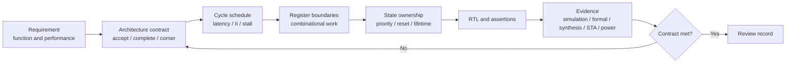

# Requirement to Microarchitecture

좋은 microarchitecture는 RTL coding style에서 출발하지 않는다. 먼저 자연어 requirement를 **cycle, state, protocol과 evidence로 검증할 수 있는 architecture contract**로 바꾼 뒤, 그 contract를 구현하는 register boundary와 combinational work를 정한다.

> Requirement를 RTL로 바로 번역하면 빠진 assumption이 code와 constraint 뒤에 숨는다. Requirement → contract → state ownership → evidence의 연결을 먼저 만든다.

공통 용어는 [Canonical RTL Design Terminology](../01_fundamentals/terminology.md)를 재사용한다. RTL 문법을 hardware로 해석하는 기본 방법은 [Think Hardware, Not Code](../01_fundamentals/think_hardware_not_code.md)가 담당한다. 이 문서는 그보다 앞 단계인 **architecture 결정을 만드는 방법**에 집중한다.

## 1. 자연어 Requirement가 부족한 이유

“두 입력을 더해 빠르게 결과를 낸다”는 문장은 다음을 결정하지 않는다.

- Input은 어느 edge에서 accept되는가?
- 결과는 몇 cycle 뒤 어떤 valid 조건으로 관찰되는가?
- Back-to-back request를 받을 수 있는가?
- Input이 accept 뒤에도 안정적이어야 하는가, 내부에서 capture하는가?
- Reset, stall, cancel과 mode change 중 in-flight transaction은 어떻게 되는가?
- Overflow 또는 illegal input은 wrap, saturate, report 중 무엇을 하는가?
- 같은 state를 여러 block이 변경하려 할 때 우선순위는 무엇인가?

이 질문에 답하지 않고 RTL을 시작하면 designer, verification engineer와 timing owner가 서로 다른 기능을 구현할 수 있다. Simulation이 nominal case를 통과해도 interface boundary와 simultaneous event에서 오류가 남는다.

## 2. Architecture Contract의 최소 구성

Contract는 특정 RTL statement가 아니라 block boundary에서 관찰할 수 있는 동작을 정의한다.

| 항목 | 반드시 정할 내용 | 남겨야 할 evidence |
|---|---|---|
| Function | 입력 범위, arithmetic 의미, 오류 처리 | reference model, directed test |
| Acceptance | `valid`, `ready`, enable 중 transaction 성립 조건 | protocol assertion |
| Completion | output이 유효한 조건과 소비 규칙 | latency/data association check |
| Schedule | latency, throughput, initiation interval | cycle table, performance model |
| Stability | accept 전후 input/output hold 조건 | interface assertion |
| State | 저장할 정보, lifetime, reset/flush 동작 | state inventory, RTL owner |
| Priority | 동시 event의 결과 | priority table, corner test |
| Timing | register boundary와 stage별 budget | synthesis/STA report |
| Power/Area | idle activity, width, sharing/duplication 가설 | activity/area comparison |
| Assumptions | clock, reset, CDC, mode와 environment 조건 | constraint/CDC review link |

Contract가 fixed latency인지 variable latency인지도 명시한다. “보통 2 cycle”은 contract가 아니다. Stall 때문에 길어질 수 있다면 latency를 세는 event와 최대 대기 조건을 따로 적는다.

## 3. Requirement에서 Evidence까지



이 흐름은 일방향 handoff가 아니다. 예상한 operator, MUX 또는 routing이 timing/area 목표를 만족하지 않으면 evidence를 근거로 contract 또는 microarchitecture 후보를 다시 검토한다. 다만 report를 통과시키기 위해 functional contract를 조용히 바꾸면 안 된다.

## 4. Step 1 — 관찰 가능한 Transaction을 정의한다

먼저 block 밖에서 의미가 있는 event를 적는다.

```text
accept   = in_valid && in_ready at active edge
complete = out_valid && out_ready at active edge
cancel   = cancel_valid && matching transaction exists
```

Ready가 없는 interface라면 `in_valid`이 asserted된 모든 edge를 accept하는지, busy 중 valid를 무시하는지, protocol violation으로 처리하는지 명시한다. Output도 valid가 올라온 cycle에만 의미가 있는지, ready를 기다리는 동안 payload를 hold해야 하는지 구분한다.

### Cycle contract 예

```text
edge                       E0       E1       E2       E3       E4
input A accept              A
input B accept                       B
input state, NBA 후          A        B
sum state, NBA 후                     A        B
output register, NBA 후                         A        B
downstream observation                                   A        B

Contract: A는 E0에서 accept되고 E2 NBA 뒤 producer output에 publish되며,
          E3에 downstream sequential logic이 output-valid/data를 관찰·capture한다.
          Stall이 없을 때 매 edge 새 input을 accept한다.
```

여기서 latency, throughput과 initiation interval의 정의는 [canonical terminology](../01_fundamentals/terminology.md#3-latency-throughput-initiation-interval)를 따른다. 구체적인 schedule 설계는 [Latency, Throughput and Initiation Interval](latency_throughput_ii.md)에서 다룬다.

## 5. Step 2 — Register Boundary를 Architecture로 결정한다

Register boundary는 단순한 timing fix가 아니다. 다음을 동시에 정한다.

- 어느 edge부터 값이 block 내부 state가 되는가?
- Input change가 어느 transaction에 영향을 미칠 수 있는가?
- Combinational work가 어느 cycle에 수행되는가?
- Output과 valid가 언제 외부에 보이는가?
- Stall 또는 clock enable에서 무엇이 함께 hold되는가?

```text
External input
      │
      ▼
[Input/Stage register] ── transform ── [Result register] ── protocol output
       ownership begins                  completion state
```

Input을 내부 register에 capture하지 않고 여러 cycle 사용한다면 source가 그 기간 안정적으로 유지한다는 protocol이 필요하다. 그런 contract가 없다면 input 변화가 진행 중 transaction의 의미를 바꾼다.

Stage를 나눌 때에는 payload만 보지 않는다. 다음 metadata도 같은 transaction에 속할 수 있다.

- valid와 transaction ID
- mode, sign, rounding 또는 saturation control
- destination tag와 packet boundary
- exception, permission과 cancel state

Data/control alignment의 상세 구현은 [Pipeline Design](../03_timing/pipeline.md#5-control-alignment)을 참고한다.

## 6. Step 3 — State Inventory와 Ownership을 만든다

State는 “always_ff 안에 있는 signal 목록”보다 넓은 개념이다. 이후 동작에 영향을 주기 위해 보존되는 정보마다 owner, update event와 lifetime을 정한다.

| State | Owner | 생성 | 갱신/소비 | 무효화 |
|---|---|---|---|---|
| Captured operands/control | input stage | accept | arithmetic stage가 읽음 | corresponding input-valid clear |
| Sum/intermediate metadata | arithmetic stage | input-valid | result stage가 읽음 | corresponding sum-valid clear |
| In-flight valid | pipeline control | accept | input → arithmetic → output advance | reset/flush |
| Output payload | result stage | result commit | downstream consume | valid가 의미를 mask |
| Busy/slot state | scheduler | resource allocation | issue/complete | reset/cancel |
| Error flag | transaction/control stage | check event | output과 함께 이동 | transaction complete |

### Single-writer 원칙

가능하면 하나의 architecture state는 한 곳에서 소유하고 모든 update priority를 그곳에서 표현한다. 여러 block이 같은 state를 암묵적으로 소유하면 동시 event와 verification 책임이 불명확해진다.

예를 들어 counter에 `clear`, `load`, `increment`가 동시에 올 수 있다면 code 순서가 아니라 requirement table로 결정한다.

| clear | load | increment | next state |
|---:|---:|---:|---|
| 1 | X | X | 0 |
| 0 | 1 | X | load value |
| 0 | 0 | 1 | current + 1 |
| 0 | 0 | 0 | hold |

이 표가 RTL event priority, assertion과 review의 공통 source가 된다. Priority와 MUX 자체의 canonical 설명은 [Priority and MUX](../01_fundamentals/priority_and_mux.md)를 참고한다.

## 7. Worked Example: 명시적인 3-Cycle Interface Contract

다음 generic requirement를 가정한다.

- 두 unsigned 8-bit input과 unsigned 8-bit limit를 accept한다.
- 9-bit full-precision sum과 `sum > limit` flag를 반환한다.
- Stall 없는 interface이며 매 cycle input을 accept할 수 있다.
- Accept 뒤 3 cycle에 downstream sequential consumer가 matching output valid/data를 관찰·capture한다.
- Reset은 in-flight transaction을 폐기한다. Invalid payload 값은 관찰하지 않는다.

### Hardware structure

```text
                          transaction ownership begins
                                      │
in_a/in_b/limit ──> [S0 input capture] ──> [S1 add + limit] ──> [S2 output register] ──> consumer
in_valid          ──> [valid input]      ──> [valid sum]      ──> out_valid            ──> capture

accept E0: S0 captures operands/limit
edge   E1: S1 captures 9-bit sum and aligned limit
edge   E2: S2 publishes output payload/valid after NBA
edge   E3: downstream sequential logic observes/captures that output
```

### Generic SystemVerilog

```systemverilog
module contract_pipeline_example (
    input  logic       clk,
    input  logic       rst_n,
    input  logic       in_valid,
    input  logic [7:0] in_a,
    input  logic [7:0] in_b,
    input  logic [7:0] in_limit,
    output logic       out_valid,
    output logic [8:0] out_sum,
    output logic       out_over_limit
);
    logic       valid_input_q;
    logic [7:0] a_input_q;
    logic [7:0] b_input_q;
    logic [7:0] limit_input_q;

    logic       valid_sum_q;
    logic [8:0] sum_q;
    logic [8:0] limit_sum_q;

    // Event priority: reset discards all in-flight transactions;
    // otherwise the pipeline advances every cycle and bubbles use valid=0.
    always_ff @(posedge clk or negedge rst_n) begin
        if (!rst_n) begin
            valid_input_q <= 1'b0;
            valid_sum_q   <= 1'b0;
            out_valid     <= 1'b0;
        end else begin
            valid_input_q <= in_valid;
            valid_sum_q   <= valid_input_q;
            out_valid     <= valid_sum_q;

            if (in_valid) begin
                a_input_q     <= in_a;
                b_input_q     <= in_b;
                limit_input_q <= in_limit;
            end

            if (valid_input_q) begin
                sum_q       <= {1'b0, a_input_q} + {1'b0, b_input_q};
                limit_sum_q <= {1'b0, limit_input_q};
            end

            if (valid_sum_q) begin
                out_sum        <= sum_q;
                out_over_limit <= (sum_q > limit_sum_q);
            end
        end
    end
endmodule
```

Accept edge에는 operand와 `limit`를 먼저 capture한다. 다음 edge에는 두 operand를 9-bit로 **먼저 확장한 뒤** 더해 carry를 보존하고, `limit`도 9-bit로 확장해 sum과 같은 transaction으로 이동한다. 그다음 edge에는 sum, compare flag와 `out_valid`를 함께 capture한다. Mode나 tag가 추가된다면 `limit`와 마찬가지로 실제 소비 stage까지 같은 valid pipeline을 따라야 한다.

Reset은 `valid_input_q`, `valid_sum_q`와 `out_valid`를 우선적으로 clear해 모든 in-flight transaction을 폐기한다. Operand, intermediate와 output payload register를 reset하지 않은 이유는 각 corresponding valid가 0일 때 그 값이 의미 없고 consumer가 관찰하지 않는다는 contract 때문이다. Known invalid payload가 필요한 safety/test 환경이라면 이 선택을 다시 검토한다.

이제 A는 E0에서 input state가 되고, E1에서 sum state가 되며, E2 NBA 뒤 output register에 publish된다. 같은 E2 edge의 downstream FF와 concurrent SVA는 이전 값을 sampling했으므로 A를 처음 synchronous하게 관찰·capture하는 edge는 E3다. 따라서 위 cycle table과 `LATENCY=3` contract가 RTL register boundary와 consumer-visible behavior에 대응한다.

Ready/backpressure가 있는 interface에는 이 단순 free-running 구조를 그대로 적용하면 안 된다. Downstream stall 시 output payload/valid hold와 upstream ready propagation 또는 elastic storage가 필요하다.

## 8. Synthesis와 Physical View

이 RTL에서 일반적으로 예상하는 구조는 다음과 같다.

- 두 8-bit operand와 8-bit limit의 input capture registers
- 9-bit adder, 9-bit sum/limit stage registers
- 9-bit comparator와 output payload registers
- Input, sum과 output stage의 valid FF
- Invalid cycle payload hold를 위한 enable 또는 feedback selection

실제 mapping은 library, synthesis option, timing constraint와 hierarchy에 따라 달라질 수 있다. Enable-capable FF를 사용할지 feedback MUX로 구현할지, adder/comparator가 어떤 cells로 구성될지는 report로 확인한다.

Register boundary는 logic depth를 나누지만 물리적 거리가 멀거나 `valid` fanout가 크면 net delay가 지배할 수 있다. Post-synthesis netlist만으로 결론내지 않고 placement/congestion feedback을 architecture 가설과 연결한다.

## 9. PPA와 Trade-off

| 결정 | Timing | Power | Area |
|---|---|---|---|
| Input capture | 외부 late path를 끊고 source hold requirement를 줄일 수 있음 | capture clock/data activity 증가 | operand/control FF 증가 |
| Sum stage | adder와 comparator path를 서로 다른 cycle로 분할 | valid/payload clock load 증가, glitch 감소 가능 | sum/aligned-control FF 증가 |
| Payload hold on invalid | 불필요한 datapath switching 감소 가능 | enable control 자체 비용 | enable MUX/cell 비용 |
| Control duplication | local timing/fanout 개선 가능 | duplicate switching 가능 | logic 증가 |
| Resource sharing | operator 수 감소 가능 | MUX/arbitration activity 증가 가능 | total area는 부가 logic 포함 필요 |

이 표는 방향성이다. 최종 PPA는 target frequency, cell library, workload, placement와 routing에 따라 달라진다.

## 10. 이 접근을 그대로 적용하면 안 되는 경우

- Asynchronous CDC를 단일-clock cycle table처럼 취급하는 경우
- Variable-latency memory 또는 external protocol의 최대 응답 조건이 정의되지 않은 경우
- Feedback algorithm에 register를 추가해도 recurrence 의미가 유지된다고 가정하는 경우
- Safety requirement상 invalid payload도 known value여야 하는데 valid로만 mask하는 경우
- Clock stop/reset/mode transition 중 edge가 존재한다고 가정하는 경우
- Interface latency 변경 권한 없이 내부 pipeline을 추가하는 경우

CDC contract는 [CDC Overview](../08_cdc/overview.md), gated/stopped clock과 reset 관계는 [Clock Design Overview](../06_clock/overview.md)가 canonical한 책임을 가진다.

## 11. Common Mistakes

### Requirement 문장을 signal list로만 바꾼다

Port width와 이름만 정하고 acceptance/completion event를 정하지 않으면 transaction boundary가 없다.

### Register를 implementation detail로 취급한다

Register 추가는 latency, state lifetime, reset/flush와 verification mapping을 바꿀 수 있다.

### State owner가 없다

여러 control path가 같은 state를 바꾸는데 simultaneous event priority가 requirement에 없다.

### Data만 transaction이라고 생각한다

Valid, mode, tag와 error가 다른 cycle의 payload와 결합될 수 있다.

### Constraint를 functional specification처럼 사용한다

MCP나 false path는 기능을 만들지 않는다. 실제 capture schedule의 evidence 없이 timing exception을 추가하면 오류를 숨길 수 있다. [Multi-Cycle Path](../03_timing/multi_cycle_path.md)를 참고한다.

### Report 숫자가 architecture 의도를 대신한다고 생각한다

Slack, area와 power가 좋아도 잘못된 transaction schedule을 구현했다면 올바른 설계가 아니다.

## 12. Verification Strategy

### Contract property

Fixed-latency, stall 없는 block이라면 accept와 output-valid 관계를 assertion으로 표현한다.

```systemverilog
parameter int LATENCY = 3;

ap_accept_to_valid:
    assert property (@(posedge clk) disable iff (!rst_n)
        in_valid |-> ##LATENCY out_valid
    );
```

이 property만으로 data correctness나 overlapping transaction association은 증명되지 않는다. 실제 환경에서는 tag 또는 queue-based scoreboard로 각 accepted input과 output을 연결한다.

### Corner-case matrix

- Back-to-back valid, single bubble와 긴 idle
- Minimum/maximum operand와 carry 발생
- Limit과 동일한 sum, limit보다 1 작은/큰 sum
- Reset 직전·중·직후 input
- Mode, cancel, stall이 있다면 모든 동시 조합
- Invalid payload가 X여도 consumer가 사용하지 않는지

### Evidence chain

1. Requirement ID가 cycle contract와 연결된다.
2. Contract가 RTL state와 assertion에 연결된다.
3. Register boundary가 synthesis netlist/area report에 보인다.
4. Stage budget가 STA path group/report로 확인된다.
5. Power 가설은 representative activity로 비교한다.
6. 변경 시 어떤 evidence를 다시 만들어야 하는지 owner를 남긴다.

## 13. Design Review Checklist

### Requirement와 interface

- [ ] Accept와 complete event가 edge 단위로 정의됐는가?
- [ ] Latency, throughput, II와 response deadline을 구분했는가?
- [ ] Input/output stability와 backpressure 규칙이 명시됐는가?
- [ ] Reset, cancel, flush와 mode change 중 in-flight transaction 동작이 정해졌는가?

### State와 structure

- [ ] 모든 persistent state에 owner, update event와 lifetime이 있는가?
- [ ] Register boundary가 latency contract와 일치하는가?
- [ ] Data, valid, mode, tag와 error가 transaction 단위로 정렬되는가?
- [ ] 동시 event priority가 requirement 표와 RTL에서 동일한가?
- [ ] Width, signedness, overflow behavior가 범위 requirement와 일치하는가?

### Evidence

- [ ] Assertion이 source-code 모양이 아니라 architecture contract를 검사하는가?
- [ ] Back-to-back, bubble, reset과 boundary case가 검증됐는가?
- [ ] 예상 operator/register/MUX가 synthesis 결과에서 확인됐는가?
- [ ] Setup/hold와 physical fanout/congestion feedback을 검토했는가?
- [ ] PPA 주장이 같은 constraint와 workload의 비교 evidence를 가지는가?

## 관련 문서

- [Latency, Throughput and Initiation Interval](latency_throughput_ii.md)
- [State Partitioning and Ownership](state_partitioning_and_ownership.md)
- [Microarchitecture Decision Record](microarchitecture_decision_record.md)
- [Resource Sharing vs Duplication](resource_sharing_vs_duplication.md)
- [Think Hardware, Not Code](../01_fundamentals/think_hardware_not_code.md)
- [Combinational vs Sequential Logic](../01_fundamentals/combinational_vs_sequential.md)
- [Pipeline Design](../03_timing/pipeline.md)
- [RTL Design Review Checklist](../15_checklist/rtl_design_review_checklist.md)
