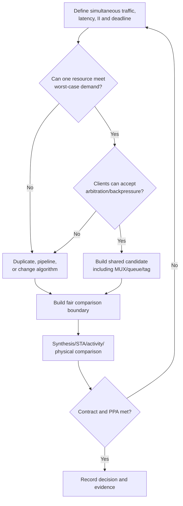

# Resource Sharing vs Duplication

Resource sharing은 같은 hardware operator를 여러 transaction 또는 consumer가 시간적으로 나누어 사용하는 microarchitecture 선택이다. Duplication은 operator, decode 또는 control을 여러 곳에 두어 병렬 처리나 locality를 얻는 선택이다. 어느 한쪽도 항상 area 또는 PPA에 유리하지 않다.

> “Operator 하나를 줄였다”가 최적화의 결론이 아니다. MUX, arbitration, storage, routing, latency/II와 switching을 포함한 전체 architecture boundary를 비교한다.

MUX와 priority의 기본 의미는 [Priority and MUX](../01_fundamentals/priority_and_mux.md)가 담당한다. Latency, throughput과 II의 canonical definition은 [Canonical RTL Design Terminology](../01_fundamentals/terminology.md#3-latency-throughput-initiation-interval)를 따르며, schedule 적용은 [Latency, Throughput and Initiation Interval](latency_throughput_ii.md)에서 다룬다.

## 1. 왜 단순한 Operator Count 비교가 실패하는가

두 client가 각각 adder를 가지는 구조를 하나의 shared adder로 바꾸면 arithmetic operator는 줄어든다. 하지만 shared 구조에는 보통 다음 hardware가 추가된다.

- Operand input MUX
- Request arbitration과 grant logic
- Owner/tag state
- Result demultiplexing 또는 response routing
- Busy/valid/ready control
- Waiting transaction storage 또는 upstream backpressure
- Central control의 fanout와 long route

```text
Duplicated

client 0 ──> [adder 0] ──> result 0
client 1 ──> [adder 1] ──> result 1

Shared

client 0 ──┐
           ├─> [operand MUX] ─> [adder] ─> [response route] ─┬─> result 0
client 1 ──┘          ▲             │                       └─> result 1
                 arbitration     owner/tag
```

Wide operands, distant clients 또는 high request rate에서는 MUX와 wiring 비용이 operator 절감보다 중요해질 수 있다. 반대로 큰, 낮은-utilization operator가 서로 가까운 mutually-exclusive clients에 쓰인다면 sharing이 유리할 수 있다. 결과는 library, constraints, floorplan과 workload에 의존한다.

## 2. 먼저 Requirement를 고정한다

Sharing과 duplication 후보는 같은 functional/performance contract로 비교해야 한다.

| 질문 | Sharing 결정에 미치는 영향 |
|---|---|
| 두 request가 동시에 올 수 있는가? | Arbitration, queue 또는 drop policy 필요 여부 |
| 각 request의 deadline은 무엇인가? | Waiting latency 허용 범위 |
| Required II/throughput은 얼마인가? | 한 resource의 service capacity 충분 여부 |
| Response가 in-order여야 하는가? | Tag/reorder state 필요 여부 |
| Client가 backpressure를 받을 수 있는가? | Ready 또는 input buffering 필요 여부 |
| Operand/source 위치가 가까운가? | Wide MUX와 route cost |
| Activity가 겹치는가? | Dynamic power와 contention |
| Resource가 pipeline 가능한가? | 한 operator에서도 II=1 가능 여부 |

두 client가 “논리적으로 동시에 사용하지 않는다”는 assumption은 executable property 또는 upstream protocol로 검증한다. 사실이 아니라 희망이라면 sharing 후 transaction loss나 starvation이 발생한다.

## 3. Sharing의 여러 형태

### 3.1 Mutually-exclusive combinational sharing

두 operation이 한 cycle에 동시에 필요하지 않고 register schedule도 같다면 MUX로 operator를 선택할 수 있다.

```text
selected operands ──> operator ──> selected destination
```

Latency는 유지할 수 있지만 input select가 늦거나 wide하면 operator 앞 path가 길어진다.

### 3.2 Pipelined resource sharing

Pipeline된 multiplier처럼 한 resource가 여러 in-flight transaction을 받을 수 있다면 operator는 하나여도 II=1일 수 있다. Owner/tag가 pipeline latency만큼 함께 이동해야 한다.

### 3.3 Iterative time sharing

한 transaction이 여러 cycle 동안 resource와 feedback state를 점유한다. Operator area는 줄 수 있지만 latency와 II가 증가하고 scheduler/state가 필요하다.

### 3.4 Common-expression sharing

여러 consumer가 같은 decode 또는 subexpression을 사용한다. Logical duplication을 줄일 수 있지만 shared net fanout와 routing이 커질 수 있다. Synthesis가 Boolean equivalence와 constraint 범위 안에서 자동으로 공유하거나 복제할 수도 있다.

## 4. Duplication의 여러 목적

### Throughput parallelism

독립 lane이 동시에 transaction을 처리한다. Input/output bandwidth가 받쳐 주면 aggregate throughput을 높일 수 있다.

### Timing isolation

각 consumer 가까이에 operator 또는 decode를 배치해 wide MUX, central arbitration과 long route를 제거할 수 있다.

### Fanout reduction

High-fanout control/decode를 local copy로 나눠 buffer depth와 route를 줄일 수 있다. Functional state를 복제하는 것과 단순 combinational decode를 복제하는 것은 verification 위험이 다르다.

### Fault/availability requirement

Redundancy를 위한 duplication은 PPA optimization과 다른 requirement다. Error detection, voting, independence와 common-cause failure 분석이 필요하며 이 문서의 일반 throughput 복제와 혼동하지 않는다.

## 5. Cycle과 Protocol 영향

### Shared single-issue resource

```text
cycle          0      1      2      3
client 0 req   A      B
client 1 req   X      Y
grant          A      X      B      Y
wait c0               B
wait c1        X             Y
```

두 client가 동시에 요청하면 적어도 하나는 기다린다. Resource가 매 cycle issue 가능해도 **각 client가 보는 latency**는 arbitration에 따라 variable해진다. Request queue가 없다면 upstream이 ready를 지키며 payload를 hold해야 한다.

### Duplicated resources

```text
cycle          0      1      2
client 0       A      B
client 1       X      Y
lane 0         A      B
lane 1         X      Y
```

동시 accept가 가능하지만 result merge가 하나뿐이면 completion 쪽에서 다시 serialize될 수 있다. Duplication boundary를 operator까지만 잡지 말고 memory ports, result buses와 commit bandwidth까지 본다.

## 6. RTL Example: Shared Adder와 Arbitration

다음 generic block은 두 client의 unsigned 16-bit addition request 중 cycle당 하나를 accept한다.

- Fixed priority: client 0이 client 1보다 높다.
- Shared adder는 매 cycle 한 request를 issue할 수 있다.
- Accepted request의 result는 다음 output-valid slot에 owner와 함께 나타난다.
- Reset 우선순위는 pending output-valid를 폐기한다.
- Client는 `req*_ready == 0`이면 valid와 payload를 유지해야 한다.

```systemverilog
module shared_adder_two_clients (
    input  logic        clk,
    input  logic        rst_n,
    input  logic        req0_valid,
    output logic        req0_ready,
    input  logic [15:0] req0_a,
    input  logic [15:0] req0_b,
    input  logic        req1_valid,
    output logic        req1_ready,
    input  logic [15:0] req1_a,
    input  logic [15:0] req1_b,
    output logic        rsp_valid,
    output logic        rsp_owner,
    output logic [16:0] rsp_sum
);
    logic        grant0;
    logic        grant1;
    logic [15:0] selected_a;
    logic [15:0] selected_b;

    always_comb begin
        grant0    = req0_valid;
        grant1    = !req0_valid && req1_valid;
        req0_ready = 1'b1;
        req1_ready = !req0_valid;

        selected_a = req0_a;
        selected_b = req0_b;
        if (grant1) begin
            selected_a = req1_a;
            selected_b = req1_b;
        end
    end

    // Event priority: reset discards an unobserved response;
    // otherwise every cycle produces either one response or a bubble.
    always_ff @(posedge clk or negedge rst_n) begin
        if (!rst_n) begin
            rsp_valid <= 1'b0;
            rsp_owner <= 1'b0;
        end else begin
            rsp_valid <= grant0 || grant1;
            if (grant0 || grant1) begin
                rsp_owner <= grant1;
                rsp_sum   <= {1'b0, selected_a} + {1'b0, selected_b};
            end
        end
    end
endmodule
```

`rsp_owner == 0`은 client 0, `rsp_owner == 1`은 client 1을 뜻한다. Operand를 17-bit로 확장한 뒤 더해 carry를 보존한다. `rsp_valid`와 owner는 sum과 같은 transaction에 맞춰 register된다.

이 예제는 output backpressure가 없다는 contract를 가정한다. `rsp_ready`가 필요하다면 output hold 또는 response FIFO가 추가되어야 하며, 그 상태가 찼을 때 request ready를 낮춰야 한다.

### Fixed-priority의 기능적 결과

Client 0이 계속 valid이면 client 1은 영원히 accept되지 않을 수 있다. Fixed priority가 requirement에 맞지 않으면 round-robin, age-based arbitration 또는 bandwidth reservation을 검토한다. 더 복잡한 arbiter는 fairness를 개선하지만 state, timing과 verification 비용이 증가한다.

## 7. Duplication Candidate

두 client가 동시에 매 cycle accept되어야 한다면 각각 local adder와 response register를 갖는 구조가 직접적이다.

```systemverilog
module duplicated_adders_two_clients (
    input  logic        clk,
    input  logic        rst_n,
    input  logic        req0_valid,
    input  logic [15:0] req0_a,
    input  logic [15:0] req0_b,
    input  logic        req1_valid,
    input  logic [15:0] req1_a,
    input  logic [15:0] req1_b,
    output logic        rsp0_valid,
    output logic [16:0] rsp0_sum,
    output logic        rsp1_valid,
    output logic [16:0] rsp1_sum
);
    // Event priority: reset clears validity; otherwise both lanes advance.
    always_ff @(posedge clk or negedge rst_n) begin
        if (!rst_n) begin
            rsp0_valid <= 1'b0;
            rsp1_valid <= 1'b0;
        end else begin
            rsp0_valid <= req0_valid;
            rsp1_valid <= req1_valid;

            if (req0_valid)
                rsp0_sum <= {1'b0, req0_a} + {1'b0, req0_b};
            if (req1_valid)
                rsp1_sum <= {1'b0, req1_a} + {1'b0, req1_b};
        end
    end
endmodule
```

이 구조는 두 adders와 두 response paths를 사용하지만 arbitration, operand MUX와 owner routing이 없다. 두 예제는 interface capacity가 다르므로 area만 비교해서는 안 된다. Shared candidate가 요구 throughput을 만족하는지 먼저 확인한 뒤 같은 requirement boundary에서 PPA를 비교한다.

## 8. Timing 관점

### Sharing이 만드는 path

```text
request detect → arbitration → operand MUX → operator → result register
```

Late request/select, wide MUX와 central routing이 operator 자체보다 critical할 수 있다. Pipelined operator라도 owner/tag alignment path와 ready fanout를 확인한다.

### Duplication이 줄일 수 있는 path

Local operator는 select stage를 제거하고 consumer 가까이에 놓일 가능성을 높인다. 그러나 duplicated result를 다시 큰 MUX로 합치면 이점이 사라질 수 있다.

### Fanout와 locality

공유 control 또는 common decode가 넓은 block을 가로질러 많은 loads를 구동하면 net delay와 buffering이 증가할 수 있다. Local duplication은 logical area를 늘려도 physical timing과 congestion을 개선할 수 있다. 어느 결과가 나오는지는 placement, routing와 fanout report로 확인한다.

## 9. Power 관점

Sharing이 power를 줄일 수 있는 이유:

- 큰 operator와 clocked pipeline state 수가 줄 수 있다.
- 낮은 utilization에서 inactive resource를 제거할 수 있다.

Sharing이 power를 늘릴 수 있는 이유:

- Wide MUX 입력과 central wires가 request 변화마다 toggle한다.
- 선택되지 않은 operand 변화가 operator 내부까지 전파될 수 있다.
- Arbitration, queue와 tag state가 매 cycle 움직인다.
- Longer route와 buffering이 capacitance를 늘릴 수 있다.

Duplication도 반대 방향의 효과를 함께 가진다. Local operand isolation과 enable로 inactive lane switching을 줄일 수 있지만, enable/clock structure 자체 비용과 duplicated leakage/clock load가 생긴다. Destination hold와 combinational activity suppression의 차이는 [Operand Isolation](../04_low_power/operand_isolation.md)을 참고한다.

Power 비교에는 실제 또는 representative request correlation이 중요하다. 두 clients가 거의 동시에 active하지 않는 workload와 둘 다 지속 active인 workload의 결론이 다를 수 있다.

## 10. Area 관점

공유 후보의 total area는 개념적으로 다음을 모두 포함한다.

```text
shared operator
+ input/output MUX
+ arbiter and tag/control
+ queue or operand holding registers
+ buffers and routing-related cells
```

Duplication 후보는 다음을 포함한다.

```text
multiple operators
+ local registers/control
+ any result merge or ordering logic
```

RTL operator 수는 출발점일 뿐이다. Synthesis가 constant propagation, mutually-exclusive condition, resource sharing 또는 timing-driven replication을 수행할 수 있으므로 mapped cell/area report와 netlist structure를 확인한다. Physical footprint는 congestion과 buffering 때문에 logical cell area와 다를 수 있다.

## 11. Share를 선택하면 안 되는 경우

- Required simultaneous issue 또는 II를 한 resource가 만족하지 못하는 경우
- Client가 backpressure를 받을 수 없고 loss/retry도 허용되지 않는 경우
- Arbitration worst-case latency가 response deadline을 넘는 경우
- Wide operands가 물리적으로 멀리 있어 central MUX/routing이 지배적인 경우
- Independent security/safety domain의 data를 shared state에 섞는 것이 금지된 경우
- Resource utilization이 이미 높아 queue가 지속적으로 증가하는 경우
- Sharing을 위해 functional MCP를 새로 꾸며내야 하는 경우

## 12. Duplicate를 선택하면 안 되는 경우

- Input/output bandwidth가 한 lane만 공급해 추가 lane이 idle인 경우
- 큰 operator의 area/leakage/clock power가 budget을 넘는 경우
- Shared memory port나 commit bus가 bottleneck이라 operator 복제로 throughput이 늘지 않는 경우
- 복제 state의 coherency를 유지할 protocol이 없는 경우
- Physical congestion이 이미 높아 routing과 placement를 더 악화시키는 경우
- Utilization evidence 없이 timing 문제를 추측만으로 replication하는 경우

## 13. Recommended Decision Flow



최적화 순서는 operator를 바로 share하는 것보다 먼저 불필요한 기능/bit/activity를 제거·비활성화·단순화하는 것이다. 그 뒤 bottleneck에 맞춰 sharing 또는 duplication을 선택한다.

## 14. Common Mistakes

### “두 adders가 보이니 하나로 합친다”

동시 request와 II requirement를 확인하지 않아 functionality 또는 throughput을 바꾼다.

### Arbitration을 공짜로 본다

Priority, fairness, ready path와 queue state가 timing/area/verification 비용을 가진다.

### MUX width와 physical distance를 무시한다

Operator는 줄었지만 wide central route가 critical path와 power hotspot이 된다.

### Duplication 뒤 merge bottleneck을 남긴다

두 lane이 계산해도 single result bus 때문에 completion throughput은 그대로다.

### Mutual exclusivity를 comment로만 남긴다

Assumption이 깨졌을 때 silent drop 또는 wrong-owner response가 발생한다.

### Tool이 의도대로 share/duplicate했다고 가정한다

Sequential boundary, hierarchy, constraints와 optimization option에 따라 mapping이 달라질 수 있다. Report와 netlist로 확인한다.

## 15. Verification Strategy

### Shared resource

- 두 request가 단독, 동시, back-to-back으로 오는 경우
- Fixed-priority에서 grant와 ready가 truth table과 일치하는지
- Accepted request마다 정확히 한 response가 나오는지
- Owner/tag와 payload가 같은 transaction인지
- Non-accepted client가 payload를 protocol대로 hold하는지
- Reset/flush 중 queued 또는 in-flight transaction 처리
- Fairness가 requirement라면 bounded grant 또는 no-starvation property

```systemverilog
ap_at_most_one_accept:
    assert property (@(posedge clk) disable iff (!rst_n)
        !((req0_valid && req0_ready) &&
          (req1_valid && req1_ready))
    );

ap_owner_matches_client1:
    assert property (@(posedge clk) disable iff (!rst_n)
        (req1_valid && req1_ready) |=> (rsp_valid && rsp_owner)
    );
```

위 property는 설명용이며 output stall 또는 추가 pipeline이 있으면 latency와 hold 조건을 반영해야 한다.

### Duplicated resource

- 두 lanes가 동시에 active할 때 cross-coupling이 없는지
- 각 lane의 valid/data alignment
- Shared downstream merge가 no-drop/no-duplicate와 ordering을 유지하는지
- Inactive lane enable/isolation이 기능을 바꾸지 않는지

### Equivalence와 performance

Sharing 전후 cycle-by-cycle output이 다를 수 있으므로 transaction identity와 allowed latency window를 기준으로 비교한다. Formal 또는 scoreboard에서 arbitration으로 허용된 reorder가 있는지도 모델링한다. Long maximum-rate test로 service rate와 queue bound를 함께 확인한다.

## 16. Design Review Checklist

### Requirement와 schedule

- [ ] Simultaneous request가 가능한지 evidence가 있는가?
- [ ] Client별 latency deadline, II와 throughput이 정의됐는가?
- [ ] Backpressure, queue, drop/retry와 ordering rule이 명시됐는가?
- [ ] Arbitration policy와 starvation/fairness requirement가 일치하는가?

### Hardware structure

- [ ] Operator뿐 아니라 MUX, arbiter, tag, storage와 response route를 포함했는가?
- [ ] Shared memory port/output bus 같은 숨은 bottleneck을 찾았는가?
- [ ] Wide MUX, select arrival와 ready/grant fanout를 timing path로 검토했는가?
- [ ] Client/operator의 physical locality와 congestion을 고려했는가?
- [ ] Duplicate state가 있다면 coherency owner가 명확한가?

### Power와 area

- [ ] Representative workload에서 client activity correlation을 사용했는가?
- [ ] Selected/unselected operand switching과 isolation을 확인했는가?
- [ ] Clocked state, buffers와 routing 관련 cells까지 area 비교에 포함했는가?
- [ ] Leakage, dynamic와 clock power를 구분해 측정했는가?

### Verification와 evidence

- [ ] Simultaneous, back-to-back, long contention과 reset/flush를 검증했는가?
- [ ] No-drop, no-duplicate, owner/tag alignment property가 있는가?
- [ ] Fairness requirement가 있다면 bounded progress를 확인했는가?
- [ ] Mapped netlist에서 예상 sharing/replication을 확인했는가?
- [ ] Achieved timing, throughput, area와 activity evidence로 최종 선택했는가?

## 관련 문서

- [Requirement to Microarchitecture](requirement_to_microarchitecture.md)
- [Latency, Throughput and Initiation Interval](latency_throughput_ii.md)
- [Parallelism and Pre-computation](parallelism_and_precomputation.md)
- [Area Design & Optimization](../05_area/overview.md)
- [Priority and MUX](../01_fundamentals/priority_and_mux.md)
- [Think Hardware, Not Code](../01_fundamentals/think_hardware_not_code.md)
- [Critical Path](../03_timing/critical_path.md)
- [Operand Isolation](../04_low_power/operand_isolation.md)
