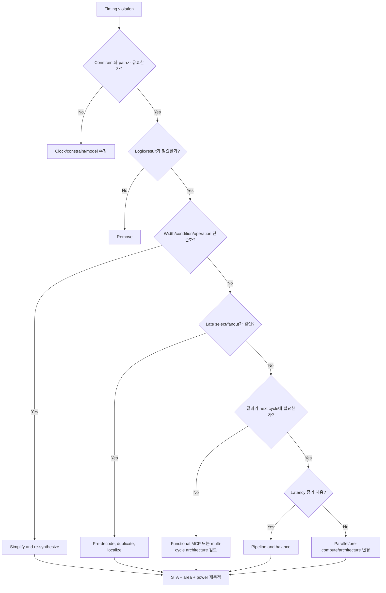

# Critical Path

Critical path는 “RTL에서 가장 길어 보이는 코드”가 아니다. 특정 mode, corner, clock와 constraint에서 **가장 작은 slack을 갖는 분석 경로**다.

> Critical path를 고치는 일은 gate 수를 무조건 줄이는 일이 아니라, requirement에서 시작해 path의 논리·배선·control·physical 원인을 분리하는 일이다.

공통 용어는 [Canonical RTL Design Terminology](../01_fundamentals/terminology.md), timing equation의 기본은 [Timing Overview](overview.md)를 참고한다.

## 1. Why It Matters

한 개의 setup violation도 target frequency를 제한할 수 있다. 그러나 worst path만 국소적으로 고치면 다음 path가 즉시 critical해질 수 있다. 따라서 review에서는 다음을 함께 본다.

- Worst Negative Slack(WNS)
- Total Negative Slack(TNS)
- violating endpoint 수
- 같은 RTL 구조가 반복되는지
- cell delay와 net delay의 비율
- mode/corner별 path 변화

WNS 하나가 심한 문제와 작은 violation이 수천 개 반복되는 문제는 다른 해결법이 필요하다.

## 2. Hardware View

```text
launch clock path                              capture clock path
        │                                              │
        ▼                                              ▼
   [Launch FF] -- clk→Q -- logic -- routing -- [Capture FF]
                        <---- data path ---->
```

Setup 분석의 개념적 budget은 다음과 같다.

```text
available time
  ≈ capture edge relationship
    + useful clock skew
    - clock uncertainty
    - setup time

required:
  clock-to-Q + combinational cell delay + net delay <= available time
```

실제 식과 부호 convention은 STA tool과 clock model에 따라 report 형식이 달라질 수 있다. 이 식은 원인을 분해하기 위한 model이다.

## 3. RTL Structure가 Critical Path가 되는 방식

### 3.1 Deep priority chain

```systemverilog
if (cond0)
    next = a;
else if (cond1)
    next = b;
else if (cond2)
    next = c;
else
    next = d;
```

조건이 실제 priority를 가진다면 cascade MUX나 priority logic으로 구현될 수 있다. 뒤쪽 branch일수록 더 많은 select level을 통과할 가능성이 있다.

검토할 질문:

- 조건이 정말 priority인가, mutually exclusive인가?
- priority를 architecture에서 줄일 수 있는가?
- select decode를 더 일찍 계산할 수 있는가?
- `unique case` 같은 문법 표시는 실제 exclusivity proof와 일치하는가?

문법만 바꾸는 것이 아니라 조건 관계를 바꿀 수 있는지 본다.

### 3.2 Large MUX와 late select

Data input이 일찍 준비돼도 select가 늦게 도착하면 final MUX가 critical path가 된다.

```text
data0 ───────────────┐
data1 ───────────────┼─> Large MUX ─> FF
data2 ───────────────┤       ▲
                     │       │
late state/decode ───┴──── select
```

MUX input 수뿐 아니라 select generation depth, physical spread와 fanout을 본다.

### 3.3 Wide compare and arithmetic

Wide adder, comparator, variable shifter와 multiplier는 target technology에 따라 carry chain, tree, macro 또는 standard-cell network로 mapping된다.

```systemverilog
if (wide_count == limit)
    result <= (a * b) + c;
```

여기에는 wide equality compare, multiply, add, enable/select가 한 cycle에 이어질 수 있다. Width가 실제 requirement보다 큰지, compare가 arithmetic 뒤에 있어야 하는지, pre-compute나 pipeline이 가능한지 검토한다.

### 3.4 Decode and reconvergence

하나의 source가 여러 조건으로 분기되었다가 다시 MUX/OR에서 합쳐지면 논리 단순화가 어려워지고 glitch와 routing이 늘 수 있다.

### 3.5 High fanout and net delay

Reset, enable, mode, valid와 state decode가 많은 load를 구동하면 buffer tree와 routing delay가 커질 수 있다. RTL expression이 단순해도 physical net delay가 critical할 수 있다.

## 4. Report를 읽는 순서

### Step 1: Path가 실제 기능 경로인지 확인

- startpoint와 endpoint가 예상한 register인가?
- clock와 mode가 맞는가?
- false path/MCP 같은 exception scope가 맞는가?
- unconstrained 또는 잘못 생성된 clock이 아닌가?

잘못된 constraint를 RTL 최적화로 보상하지 않는다.

### Step 2: Delay composition 확인

| 지배 요소 | 관찰되는 특징 | 먼저 검토할 것 |
|---|---|---|
| Cell delay | logic level과 operator가 많음 | width, priority, decomposition, architecture |
| Net delay | 적은 logic인데 route delay가 큼 | fanout, placement, duplication, hierarchy |
| Late control | data보다 select/enable이 늦음 | decode 위치, pre-compute, state partition |
| Clock relationship | uncertainty/skew 영향이 큼 | clock definition, CTS 상태, mode assumption |

### Step 3: Single path인가 pattern인가 확인

한 endpoint만 보지 말고 같은 source hierarchy, operator, enable과 width를 가진 path를 묶어 본다. 반복 pattern이면 RTL/architecture 수정의 효과가 크다.

### Step 4: 다음 bottleneck 예상

현재 worst path를 개선하면 다른 path가 critical해진다. WNS뿐 아니라 TNS와 path distribution 변화를 함께 비교한다.

## 5. Optimization Decision Flow



## 6. Optimization Techniques and Trade-offs

### Remove

사용하지 않는 result, redundant condition과 unreachable mode를 제거한다. 가장 좋은 timing optimization은 path 자체가 없어지는 것이다.

### Simplify

- 실제 범위에 맞게 bit width 축소
- constant propagation이 가능하도록 parameter/mode 정리
- mutually exclusive condition을 증명하고 decode 단순화
- arithmetic rearrangement가 numeric semantics를 바꾸지 않는지 확인

Signedness, overflow와 rounding이 바뀌면 단순화가 아니라 기능 변경이다.

### Pre-compute and parallelize

```text
Before: select → expensive operation

After:  operation A ─┐
                     ├─ final select
        operation B ─┘
```

Timing은 개선될 수 있지만 area와 switching이 늘 수 있다. 결과가 자주 사용되지 않으면 operand isolation도 함께 검토한다.

### Share or duplicate

Resource sharing은 area를 줄일 수 있지만 input/output MUX와 fanout을 만든다. Logic duplication은 area를 늘리지만 load를 localize하고 routing을 줄일 수 있다.

| 선택 | Area | Timing | Power/Physical |
|---|---|---|---|
| Share | 감소 가능 | MUX/fanout로 악화 가능 | central routing 집중 |
| Duplicate | 증가 | locality로 개선 가능 | switching/load 분산 여부 확인 |

### Pipeline

Register를 넣어 combinational path를 실제로 분할한다. 자세한 내용은 [Pipeline Design](pipeline.md)을 참고한다.

### Multi-cycle constraint

Architecture가 이미 delayed capture를 보장할 때만 사용한다. 자세한 내용은 [Multi-Cycle Path](multi_cycle_path.md)를 참고한다.

## 7. Common Mistakes

### RTL 모양만 보고 critical path를 단정

Synthesis optimization, macro mapping, placement와 routing이 실제 delay를 바꾼다.

### WNS 한 경로만 수정

같은 구조의 TNS와 endpoint population을 보지 않으면 반복 violation이 남는다.

### Pipeline stage 수만 늘림

Stage balance가 나쁘면 한 stage가 여전히 critical하고 latency/clock power만 증가한다.

### High fanout를 logic depth 문제로만 취급

Buffering, placement와 duplicated driver가 더 중요한 경우가 있다.

### MCP로 violation 숨김

Functional delayed-capture contract가 없으면 real violation을 느슨하게 분석하는 것이다.

### Setup만 보고 hold를 잊음

Pipeline, duplication, clock skew 변경은 hold risk를 바꿀 수 있다. 모든 implementation 단계에서 setup/hold를 함께 확인한다.

## 8. Verification and Feedback Loop

```text
RTL hypothesis
      ↓
Synthesis structure/report
      ↓
Pre-layout STA
      ↓
Placement/routing + CTS
      ↓
Post-route STA / congestion / power
      ↓
Feedback to RTL or architecture
```

변경 전후 비교 조건을 동일하게 유지한다. Corner, mode, constraint, library와 activity가 다르면 개선 원인을 해석하기 어렵다.

## 9. Design Review Checklist

- [ ] Path의 startpoint, endpoint, clock와 mode가 의도와 일치하는가?
- [ ] Unconstrained path나 잘못된 exception이 아닌가?
- [ ] Cell delay와 net delay 중 무엇이 지배적인가?
- [ ] Priority chain과 MUX select가 실제 specification인가?
- [ ] Width와 signedness가 최소이면서 정확한가?
- [ ] High-fanout control을 localize하거나 duplicate할 수 있는가?
- [ ] 결과가 정말 next cycle에 필요한가?
- [ ] Pipeline latency와 control alignment를 감당할 수 있는가?
- [ ] MCP라면 delayed-capture contract와 hold 관계가 증명되는가?
- [ ] WNS, TNS, endpoint 수와 다음 critical path를 함께 비교했는가?
- [ ] Post-route에서 wire delay, skew와 congestion까지 다시 확인했는가?
- [ ] Timing 개선이 area, power, latency 또는 verification cost를 과도하게 늘리지 않았는가?

## 관련 문서

- [Timing Design & Optimization](overview.md)
- [Pipeline Design](pipeline.md)
- [Multi-Cycle Path](multi_cycle_path.md)
- [RTL Design Review Checklist](../15_checklist/rtl_design_review_checklist.md)
