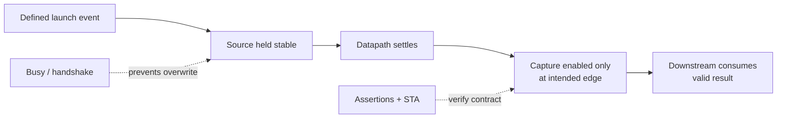
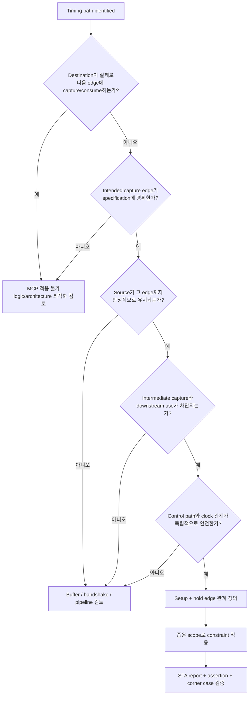

# Multi-Cycle Path

> **Multi-Cycle Path(MCP)는 느린 path를 빠르게 만드는 기능이 아니다.** Architecture가 이미 여러 clock cycle 뒤에만 데이터를 capture하도록 정의되어 있을 때, 그 functional timing requirement를 STA constraint로 표현하는 방법이다.

MCP는 매우 유용하지만 timing exception 중에서도 오용 위험이 크다. Constraint 한 줄로 negative slack이 사라질 수 있기 때문에, hardware protocol이 준비되지 않은 상태에서도 문제가 해결된 것처럼 보일 수 있다. MCP의 출발점은 timing report가 아니라 **launch와 capture 사이의 기능 계약(functional contract)** 이어야 한다.

[Timing Design & Optimization](overview.md)에서 설명한 logic simplification, pre-computation, duplication과 pipeline을 먼저 함께 검토하고, architecture가 실제로 multi-cycle일 때만 이 문서의 기준을 적용한다.

---

## 1. MCP가 의미하는 것

기본적인 same-clock register-to-register path에서 STA는 보통 한 clock edge에서 launch된 데이터가 다음 active edge까지 capture FF의 setup requirement를 만족해야 한다고 분석한다.

```text
E0                E1                E2                E3
│ launch           │ default         │                 │
│                  │ capture check   │                 │
└──────────────────┘
    one-cycle setup requirement
```

하지만 specification이 다음과 같이 정의될 수 있다.

```text
E0                E1                E2                E3
│ launch           │ no capture      │ no capture      │ intended capture
│                  │ / no consume    │ / no consume    │
└─────────────────────────────────────────────────────┘
                  three-cycle functional requirement
```

이 경우 default single-cycle 분석은 실제 요구사항보다 엄격하다. MCP는 STA가 E0에서 launch한 데이터를 E3의 intended capture edge에 대해 검사하도록 edge relationship을 표현한다.

MCP가 하는 일과 하지 않는 일을 분리하면 다음과 같다.

| MCP가 하는 일 | MCP가 하지 않는 일 |
|---|---|
| STA의 launch/capture edge 관계를 functional requirement에 맞춘다. | Register, enable, handshake 또는 state machine을 추가하지 않는다. |
| 지정된 path의 max-delay와 min-delay check 관계를 바꾼다. | Combinational logic 자체를 더 빠르게 만들지 않는다. |
| Architecture상 허용된 여러 cycle의 timing budget을 분석에 반영한다. | Source 데이터를 자동으로 hold하지 않는다. |
| Constraint review를 통해 설계 의도를 추적할 수 있게 한다. | Destination이 intermediate cycle에 capture/consume하는 것을 막지 않는다. |

따라서 “MCP를 적용했으므로 multi-cycle hardware가 되었다”는 설명은 틀렸다. **먼저 RTL과 protocol이 multi-cycle이어야 하고, constraint는 그 사실을 기술해야 한다.**

이 문서의 “three-cycle”은 E0 source launch에서 E3 destination/result-register capture까지의 **내부 timing-path requirement**를 뜻한다. Result register가 E3 NBA 뒤 valid/data를 publish한다면 같은 E3 edge의 downstream sequential consumer나 concurrent SVA는 그 새 값을 아직 sampling하지 못하고 E4에서 처음 관찰할 수 있다. 그 경우 [canonical interface latency](../01_fundamentals/terminology.md#3-latency-throughput-initiation-interval)는 4 cycle일 수 있지만, MCP endpoint의 intended capture edge는 여전히 E3다. 두 metric을 섞어 MCP setup cycle을 임의로 한 cycle 늘려서는 안 된다.

---

## 2. Hardware View: Constraint 전후의 회로는 같다

```text
Before MCP constraint

┌───────────┐      ┌───────────────────────┐      ┌────────────┐
│ Source FF │─────►│ Combinational datapath│─────►│ Capture FF │
└───────────┘      └───────────────────────┘      └────────────┘

After MCP constraint

┌───────────┐      ┌───────────────────────┐      ┌────────────┐
│ Source FF │─────►│ Combinational datapath│─────►│ Capture FF │
└───────────┘      └───────────────────────┘      └────────────┘

Gate/net structure: unchanged
STA edge relationship: changed
```

Combinational circuit에는 “두 cycle 동안 계산한다”는 내부 clock 개념이 없다. Source가 E0 이후 안정적으로 유지되면 signal은 실제 gate와 wire를 따라 전파되어 정착한다. STA는 그 max delay가 intended capture edge E3의 setup requirement 안에 들어오는지 확인한다.

E1과 E2 동안 combinational node에 transient transition이 있을 수 있다. 안전한 architecture는 destination capture enable을 끄고 intermediate value가 state나 output으로 들어가지 않게 한다. 단순히 “어차피 software가 안 읽는다”는 말만으로는 충분하지 않다.

특히 destination FF가 매 cycle 불안정한 D를 실제로 sampling한다면 intermediate Q가 metastable하거나 잘못된 state로 전파될 가능성까지 검토해야 한다. 일반적인 권장 pattern은 **intermediate capture 자체를 명시적으로 막고, intended edge에서만 capture하는 것**이다.

---

## 3. MCP를 정당화하는 Functional Contract

MCP를 적용하기 전에 최소한 다음 계약이 성립해야 한다.

### 3.1 Launch event가 명확하다

- 어느 edge에서 새 source data가 launch되는가?
- Launch를 일으키는 `start`, `accept`, state transition이 명확한가?
- Back-to-back launch가 가능한가, 아니면 transaction 사이에 간격이 필요한가?

Launch 시점을 모르면 N cycle을 어디서 세어야 하는지도 정할 수 없다.

### 3.2 Source가 충분히 오래 안정적이다

- Source register는 intended capture까지 overwrite되지 않는가?
- External input이라면 source-side protocol이 같은 stability를 보장하는가?
- Reset, abort, mode change가 진행 중 source를 바꾸지 않는가?

MCP는 source hold circuit을 만들지 않는다. STA는 constraint에 지정된 launch/capture edge와 delay를 분석할 뿐, source가 protocol상 overwrite되지 않는지 또는 E0의 값이 E3까지 유지되는지를 증명하지 않는다. Source가 중간에 바뀌면 후속 data wave가 functional result를 바꿀 수 있으므로 stability는 RTL assertion과 protocol verification으로 별도 확인해야 한다.

### 3.3 Destination capture schedule이 명확하다

- Destination capture enable은 E1, E2에서 꺼져 있는가?
- E3에서 capture된다는 사실이 RTL state/control로 표현되는가?
- Capture enable을 만드는 control path 자체는 매 cycle timing을 만족하는가?

Datapath를 MCP로 선언했다고 해서 phase counter, state decode, capture enable까지 넓게 MCP로 묶어서는 안 된다. Control은 정확한 edge에 capture를 열어야 하므로 보통 별도의 single-cycle timing requirement를 갖는다.

### 3.4 Intermediate value가 사용되지 않는다

- Destination 또는 downstream logic이 E1/E2 값에 의존하지 않는가?
- Status, interrupt, comparison, feedback가 intermediate value를 관찰하지 않는가?
- Scan/test, debug mode나 error handling 경로가 같은 값을 예상보다 일찍 쓰지 않는가?

“최종 output valid가 E3에만 올라간다”는 것과 “중간 값이 회로 어디에서도 사용되지 않는다”는 것은 다를 수 있다. 모든 fanout을 확인해야 한다.

### 3.5 Transaction protocol이 overwrite를 방지한다

- Busy 중 새 `start`를 거부하거나 backpressure하는가?
- 여러 outstanding transaction이 필요하다면 별도 storage나 tag가 있는가?
- Source와 destination의 initiation interval이 throughput requirement를 만족하는가?

Source를 N cycle 동안 hold하는 단순 MCP architecture는 대개 매 cycle 새 input을 받지 못한다. 매 cycle throughput이 필요하면 pipeline이 더 적절할 수 있다.

### 3.6 Clock와 mode 관계가 정의되어 있다

- Source와 destination이 같은 clock edge 관계를 사용하는가?
- Clock gating으로 일부 edge가 사라질 때 capture schedule이 유지되는가?
- Generated clock 또는 서로 다른 clock waveform이라면 edge 관계를 정확히 모델링했는가?

서로 asynchronous한 clock 사이의 문제를 MCP로 대체하면 안 된다. 그런 경로는 synchronizer, handshake, async FIFO 등 CDC architecture가 필요하다.

### Contract 요약



이 연결 중 하나라도 문서나 RTL에 존재하지 않으면 MCP는 constraint만의 숨은 가정이 된다.

이 장은 이해와 검증이 쉬운 **same-clock source-hold + destination capture-enable** 구조를 보수적인 권장 pattern으로 사용한다. 모든 MCP가 반드시 같은 RTL 모양이어야 한다는 뜻은 아니다. 서로 다른 관련 clock edge, 특정 mux phase 또는 다른 protocol로 multi-cycle behavior를 보장할 수도 있지만, 그 경우에도 실제 launch/capture 관계, data stability와 중간 사용 여부를 해당 architecture에 맞게 별도로 증명해야 한다.

---

## 4. Recommended RTL Pattern

다음 예는 operand를 E0에서 잡고, 두 intermediate edge 동안 유지한 뒤 E3에서 결과를 capture하는 단순한 three-cycle architecture다. 곱셈은 긴 combinational datapath를 대표하기 위한 generic example일 뿐이며, 실제 mapping은 target technology와 synthesis 설정에 따라 달라진다.

```systemverilog
module three_cycle_capture #(
    parameter int W = 16
) (
    input  logic                 clk,
    input  logic                 rst,
    input  logic                 start,
    input  logic [W-1:0]         operand_a,
    input  logic [W-1:0]         operand_b,
    output logic                 busy,
    output logic                 result_valid,
    output logic [(2*W)-1:0]     result
);

    logic [W-1:0]     a_hold;
    logic [W-1:0]     b_hold;
    logic [1:0]       phase;
    logic [(2*W)-1:0] product;

    // Generic long combinational datapath.
    assign product = a_hold * b_hold;

    always_ff @(posedge clk) begin
        if (rst) begin
            busy         <= 1'b0;
            result_valid <= 1'b0;
            phase        <= '0;
        end else begin
            result_valid <= 1'b0;

            if (!busy) begin
                if (start) begin
                    // E0: launch. Operands remain unchanged while busy is high.
                    a_hold <= operand_a;
                    b_hold <= operand_b;
                    phase  <= 2'd0;
                    busy   <= 1'b1;
                end
            end else if (phase == 2'd2) begin
                // E3: the only destination capture edge.
                result       <= product;
                result_valid <= 1'b1;
                busy         <= 1'b0;
            end else begin
                // E1 and E2: source holds; destination does not capture.
                phase <= phase + 1'b1;
            end
        end
    end

endmodule
```

이 예의 edge별 동작은 다음과 같다.

| Edge | `a_hold`, `b_hold` | `phase` 동작 | `result` capture |
|---|---|---|---|
| E0 | 새 operand capture | `0`으로 시작 | 안 함 |
| E1 | hold | `0 → 1` | 안 함 |
| E2 | hold | `1 → 2` | 안 함 |
| E3 | hold | transaction 종료 | `product` capture |

### Hardware로 보면

```text
operand_a,b
     │
     ▼
┌──────────────┐      ┌────────────────────┐      ┌─────────────┐
│ Operand hold │─────►│ Combinational      │─────►│ Result FF   │
│ registers    │      │ datapath           │      │ with enable │
└──────────────┘      └────────────────────┘      └─────────────┘
       ▲                                                  ▲
       │                                                  │
 start / busy                                  phase == capture phase
```

합성 결과에는 operand register, combinational operator, result register와 enable MUX 또는 equivalent structure, phase/control logic이 생길 수 있다. **MCP constraint는 이 중 어떤 회로도 추가하지 않는다.**

### 이 pattern의 trade-off

- Source overwrite를 막기 쉬워 functional assumption이 명확하다.
- Result FF가 intermediate cycle에 capture하지 않는다.
- 하나의 combinational resource를 여러 cycle 점유하므로 initiation interval이 길다.
- 매 cycle 새 operand를 받아야 한다면 이 구조만으로 throughput requirement를 만족하지 못한다.
- `phase == 2` decode와 result enable control은 intended edge에 정확히 도착해야 한다.
- Reset 중 transaction을 폐기하는지 재시작하는지 protocol을 별도로 정의해야 한다.

Datapath register에 reset을 넣지 않은 것은 `result_valid` 전에는 값이 사용되지 않는다는 예시의 contract 때문이다. 실제 설계에서는 interface requirement, X-propagation strategy와 safety requirement에 따라 reset 여부를 결정한다.

---

## 5. Setup MCP와 Hold Relationship

### 5.1 Setup edge를 옮긴다는 의미

위 예에서 default STA는 보통 E0 launch에 대해 E1 capture를 요구한다.

```text
Default setup relationship

launch E0 ─────────► capture E1
          1 period
```

Architecture의 intended relationship은 E3다.

```text
Intended setup relationship

launch E0 ─────────────────────────────────► capture E3
                  3 periods
```

Setup MCP는 required arrival time을 intended edge로 맞춘다. 이때도 data path에는 E3 setup time, clock uncertainty, variation과 기타 analysis margin이 적용된다. “3-cycle MCP”가 정확히 `3 × clock period` 전체를 combinational delay로 쓸 수 있다는 뜻은 아니다.

### 5.2 Hold는 자동으로 끝난 문제가 아니다

Hold는 earliest data arrival이 capture edge 주변에서 너무 빨리 변하지 않는지 검사한다. 여러 STA/SDC flow에서 setup multicycle을 바꾸면 그와 연관된 default hold edge 관계도 영향을 받을 수 있다. Setup만 완화하고 hold relationship을 명시적으로 검토하지 않으면 다음 중 하나가 생길 수 있다.

- 의도보다 지나치게 긴 min-delay requirement가 만들어진다.
- 실제로 보호해야 할 same-edge hold check가 잘못된 edge를 기준으로 분석된다.
- Report는 clean하지만 architecture가 기대한 launch/capture 관계와 다르다.

단순한 same-clock, same-edge 예에서는 흔히 **setup N**에 대응해 **hold N−1 조정**을 사용하여 hold check를 원래의 intended same-edge 관계로 되돌리는 convention이 사용된다. 그러나 이를 복사 가능한 공식으로 취급하면 안 된다.

- Tool마다 option 해석과 default가 다를 수 있다.
- `-start` 또는 `-end` 기준에 따라 edge 이동 방향이 달라질 수 있다.
- Rising/falling edge, phase-shifted clock, generated clock에서는 단순 N/N−1 설명만으로 부족하다.
- Constraint가 register, pin, clock 중 무엇을 endpoint로 선택하는지에 따라 적용 결과가 달라질 수 있다.

따라서 이 가이드는 특정 숫자가 들어간 tool command를 정답으로 제시하지 않는다. 사용하는 STA tool과 project flow의 공식 문서를 확인하고, 실제 timing report에서 edge 관계를 검증해야 한다.

| Check | 개념적 edge 관계 |
|---|---|
| Default setup | E0 launch → E1 capture |
| Default hold | E0 launch → E0 capture 주변의 min-delay 보호 |
| Intended setup-N | E0 launch → E_N capture |
| Corresponding hold | Tool의 edge 이동 규칙을 확인해 보호하려는 original/intended min-delay edge로 명시 |

이 표는 edge를 이해하기 위한 model이며 constraint command가 아니다. `N−1`이라는 숫자만 보지 말고 report에서 실제 launch/capture timestamp를 확인한다. Pre-CTS와 post-CTS에서는 clock propagation과 skew 모델이 달라질 수 있으므로 uncertainty나 skew margin을 중복 반영하지 않는지도 함께 확인한다.

개념적으로 필요한 것은 다음 두 선언이다.

```text
1. Setup check:
   E0에서 launch한 data를 architecture가 정한 E3 capture edge까지 검사한다.

2. Hold check:
   Earliest data transition이 보호해야 할 capture edge 주변의 hold requirement를
   그대로 만족하도록 min-delay edge relationship을 설정한다.
```

### 5.3 Constraint 적용 후 반드시 report에서 확인할 것

- [ ] Startpoint가 intended source register인가?
- [ ] Endpoint가 intended destination register인가?
- [ ] Launch edge timestamp가 E0에 해당하는가?
- [ ] Setup capture edge timestamp가 intended edge(`E_N`, 위 예에서는 E3)에 해당하는가?
- [ ] Required time이 예상한 cycle 수만큼만 확장되었는가?
- [ ] Hold launch/capture edge가 architecture가 의도한 min-delay 관계인가?
- [ ] Clock uncertainty와 setup/hold time이 여전히 반영되는가?
- [ ] 같은 register의 unrelated path까지 exception에 포함되지 않았는가?
- [ ] Constraint가 object를 0개 선택하거나 예상보다 많은 object를 선택하지 않았는가?

Constraint 문장이 syntax error 없이 읽혔다는 사실만으로 올바르게 적용된 것은 아니다. **Resolved object와 timing edge를 report로 확인해야 한다.**

---

## 6. MCP와 False Path의 차이

MCP와 false path는 모두 timing exception이지만 의미가 완전히 다르다.

| 구분 | Multi-Cycle Path | False Path |
|---|---|---|
| Functional meaning | 실제로 capture되는 path이며, 허용 시간이 여러 cycle이다. | 정의된 mode에서 기능적으로 sensitized/captured되지 않는 path다. |
| STA behavior | 완화된 setup edge와 올바른 hold 관계로 timing을 계속 검사한다. | 지정한 timing analysis를 제거한다. |
| Hardware requirement | Source stability와 delayed capture protocol이 필요하다. | 해당 mode에서 path가 기능적으로 활성화되지 않는다는 증거가 필요하다. |
| 주요 위험 | 실제 single-cycle path를 느슨하게 분석할 수 있다. | 실제 functional path를 분석에서 완전히 숨길 수 있다. |

다음 논리는 잘못되었다.

```text
Timing violation이 크다
→ MCP로도 부족하다
→ false path로 선언한다
```

Exception 종류는 slack의 크기가 아니라 기능 관계로 선택한다. E3에서 실제 데이터를 capture한다면 그 path는 false가 아니다. 반대로 어떤 mode에서도 capture될 수 없는 구조라면 MCP로 임의의 시간을 주는 것보다 functional false path 근거를 정확히 표현해야 한다.

Async CDC path를 무조건 false path로 처리하는 것도 별도 검토가 필요하다. CDC 구조, synchronizer의 역할, clock relationship과 project constraint methodology에 따라 분석해야 하며 MCP가 CDC circuit을 대신하지 않는다.

---

## 7. MCP와 Pipeline 비교

두 구조의 차이를 hardware에서 보면 명확하다.

```text
MCP architecture

Source FF ───────── long combinational logic ─────────► Destination FF
   hold for N cycles                              capture at E_N

Pipeline architecture

Source FF ── logic A ──► Stage FF ── logic B ──► Destination FF
              cycle 1                 cycle 2
```

| 항목 | Pipeline | Multi-Cycle Path |
|---|---|---|
| Hardware 변경 | Register와 control alignment가 추가된다. | Constraint만으로는 hardware가 바뀌지 않는다. |
| Combinational path | Stage별로 물리적으로 분할된다. | 기존 long path가 그대로 남는다. |
| Latency | 보통 stage 수만큼 증가한다. | Architecture가 원래 정한 delayed capture latency를 표현한다. |
| Throughput | 균형 잡힌 pipeline은 매 cycle input을 받을 수 있다. | 단순 source-hold 구조는 initiation interval이 길 수 있다. |
| Area | FF, valid/control, routing이 증가할 수 있다. | Constraint 자체는 area를 바꾸지 않는다. |
| Power | Clock load와 pipeline register switching이 증가할 수 있다. | Constraint 자체는 power를 바꾸지 않는다. Protocol activity에 따라 회로 power가 결정된다. |
| Timing risk | Stage balancing과 inter-stage path를 검토한다. | Source stability, capture protocol, exception scope와 hold 관계를 검토한다. |
| Verification | Latency, ordering, flush, backpressure를 검증한다. | No-early-capture, stability, overwrite 방지와 constraint 적용을 검증한다. |
| Maintainability | RTL에서 구조가 눈에 보이지만 control이 복잡해질 수 있다. | Hardware intent가 constraint에 분리되어 있어 drift 위험이 있다. |

### Pipeline이 더 적합한 경우

- 매 cycle 새로운 input을 받아야 한다.
- Target frequency를 위해 실제 logic depth를 나눠야 한다.
- Source를 여러 cycle hold할 수 없다.
- Constraint exception보다 명시적인 stage 구조가 유지보수에 유리하다.
- Interface가 추가 latency를 허용하고 valid/control을 함께 정렬할 수 있다.

### MCP가 더 적합할 수 있는 경우

- Destination이 specification상 N cycle 뒤에만 capture한다.
- Source가 그동안 안정적으로 유지된다.
- Intermediate cycle에는 capture와 consumption이 없다.
- Throughput requirement가 source-hold 또는 scheduled capture 구조와 맞는다.
- Setup/hold constraint와 protocol assertion을 지속적으로 관리할 수 있다.

### 둘 다 바로 적용할 수 없는 경우

결과가 반드시 next cycle에 필요하고 추가 register도 허용되지 않는다면 MCP와 pipeline은 모두 답이 아닐 수 있다. 이때는 logic 제거/단순화, pre-computation, parallelization, resource sharing 해제, duplication, timing budget 재분배와 physical optimization을 검토한다.

---

## 8. Common Misuse와 실패 방식

### 8.1 Timing fail을 보고 cycle 수를 임의로 늘린다

```text
Bad
Timing fail → “3 cycle이면 통과하겠지” → MCP 3

Good
Specification: launch 후 E3에서만 capture
→ RTL이 source hold와 no-early-capture를 구현
→ STA에 해당 edge relationship을 표현
```

필요 cycle 수는 slack을 없애는 최소 숫자가 아니라 architecture가 정한 capture event에서 나온다.

### 8.2 Source가 매 cycle 바뀌는데 MCP를 건다

Source가 E1 또는 E2에서 새 data로 overwrite되면 E0 데이터에 3 cycle을 주었다는 가정이 깨진다. 이 경우 pipeline, input buffering 또는 handshake가 필요할 수 있다.

### 8.3 Destination이 intermediate cycle에도 capture한다

Output valid가 늦게 올라간다는 이유만으로 destination D path가 multi-cycle인 것은 아니다. Destination FF가 매 cycle capture한다면 E1/E2 setup violation으로 intermediate Q가 잘못되거나 metastable할 가능성을 검토해야 한다. Capture enable 또는 충분히 강한 isolation 근거가 필요하다.

### 8.4 Datapath와 control path를 함께 예외 처리한다

Capture enable을 생성하는 phase/state path는 intended edge를 정확히 열어야 한다. Broad endpoint pattern으로 control까지 MCP 처리하면 enable이 늦게 도착하는 실제 violation을 숨길 수 있다.

### 8.5 Setup만 지정하고 Hold를 확인하지 않는다

Setup report가 깨끗해진 뒤 min-delay relationship이 잘못될 수 있다. Setup과 hold report를 한 쌍으로 검토한다.

### 8.6 Wildcard로 넓은 hierarchy를 묶는다

한 block 전체를 broad pattern으로 선택하면 unrelated register, 새로 추가된 path, single-cycle control까지 exception을 상속할 수 있다. 가능한 한 architectural path group을 좁고 명확하게 선택하고 resolved endpoint 목록을 regression에서 확인한다.

### 8.7 Assumption이 SDC에만 있다

RTL reader는 source가 hold되어야 한다는 사실을 보지 못하고, verification engineer는 intended capture edge를 알지 못하며, constraint owner만 숨은 가정을 갖게 된다. Specification, RTL comment, assertion, constraint가 같은 contract를 가리켜야 한다.

### 8.8 Clock cycle과 wall-clock time을 혼동한다

Clock gating으로 edge가 멈추거나 source/destination clock이 다르면 “3 cycle 뒤”의 의미가 달라질 수 있다. STA는 정의된 clock waveform과 edge를 분석한다. Function clock의 enable/disable protocol까지 포함하여 capture relationship을 검토한다.

### 8.9 CDC 문제에 MCP를 사용한다

Metastability, pulse loss, multi-bit coherency는 capture 시간을 늘린다고 해결되지 않는다. Async crossing에는 CDC protocol이 필요하다.

---

## 9. Verification Strategy

MCP 안전성은 한 종류의 tool만으로 증명되지 않는다.

```text
Functional specification
        │
        ├─ RTL simulation / formal: protocol과 capture schedule 검증
        ├─ CDC / lint review: clock와 structure 검증
        └─ STA: max/min delay와 exception edge 검증
```

### 9.1 Simulation과 Formal이 확인할 것

- Source register가 busy 동안 변하지 않는다.
- Destination은 intended phase 전에 capture하지 않는다.
- Busy 동안 새 transaction이 source를 overwrite하지 않는다.
- Result는 `result_valid`일 때만 소비된다.
- Reset, abort, mode transition이 transaction contract를 깨지 않는다.
- Back-to-back request와 illegal request에 대한 동작이 정의되어 있다.

앞의 RTL 예에 대해 다음과 같은 assertion을 설계할 수 있다. 실제 project에서는 reset semantics와 SVA sampling 시점을 interface contract에 맞게 조정한다.

```systemverilog
// Held operands must not change across consecutive busy cycles.
property p_operands_stable_while_busy;
    @(posedge clk) disable iff (rst)
        busy && $past(busy) |-> $stable({a_hold, b_hold});
endproperty
assert property (p_operands_stable_while_busy);

// An observed valid pulse must have been produced by the prior capture edge.
property p_result_valid_follows_capture;
    @(posedge clk) disable iff (rst)
        result_valid |-> $past(!rst && busy && (phase == 2'd2));
endproperty
assert property (p_result_valid_follows_capture);

// This example defines result_valid as a single-cycle pulse.
property p_result_valid_is_one_cycle;
    @(posedge clk) disable iff (rst)
        result_valid |=> !result_valid;
endproperty
assert property (p_result_valid_is_one_cycle);

// A result update is only observable with a valid indication.
property p_result_change_has_valid;
    @(posedge clk) disable iff (rst)
        $changed(result) |-> result_valid;
endproperty
assert property (p_result_change_has_valid);
```

이 예는 reset이 먼저 관찰되어 `result_valid`가 known 0에서 시작한다는 testbench contract를 사용한다. Reusable formal environment처럼 첫 sampled edge 이전의 history가 보장되지 않으면 local `past_valid` guard를 두어 `$past(...)`가 유효해진 뒤 property를 활성화한다.

Environment가 busy 중 `start`를 보내지 않는 것이 interface contract라면 assumption 또는 assertion으로 명시한다. Design이 busy 중 request를 무시하도록 정의되었다면 그 behavior를 test한다. 어느 쪽이 맞는지는 protocol specification이 결정한다.

RTL simulation은 analog gate delay를 모델링하지 않으므로 “product가 E3 전에 물리적으로 도착한다”는 것을 증명하지 못한다. 그것은 STA의 역할이다. 반대로 STA는 `result_valid` protocol이 functional corner case에서 항상 지켜지는지 증명하지 못한다.

### 9.2 STA가 확인할 것

- Intended datapath에 MCP setup relationship이 적용되었는가?
- Corresponding hold relationship이 올바른가?
- Datapath max delay가 expanded budget 안에 들어오는가?
- Capture enable과 control path는 필요한 single-cycle requirement를 만족하는가?
- Unconstrained path가 생기지 않았는가?
- Exception이 의도한 endpoint 수와 일치하는가?
- 모든 relevant mode/corner에서 동일한 functional contract가 유지되는가?

### 9.3 Review와 Regression이 확인할 것

- RTL latency 변경과 constraint 변경이 같은 review에서 다뤄지는가?
- Exception count 또는 resolved object 변화가 자동으로 드러나는가?
- Renaming, hierarchy flattening, replication 후 constraint가 여전히 올바른 object를 선택하는가?
- Assertion과 test가 intended cycle count를 hard-coded assumption으로만 숨기고 있지 않은가?

---

## 10. RTL과 Constraint Maintainability

MCP의 가장 큰 장기 위험은 **assumption drift**다. V0에서는 source가 3 cycle hold되었지만, 나중에 throughput 개선을 위해 E2에 새 operand를 받도록 RTL이 바뀔 수 있다. Constraint가 그대로 남아 있으면 STA는 여전히 선택된 E0→E3 edge relationship으로 delay를 분석한다. STA는 E0의 functional value가 그 기간 유지되는지를 증명하지 않으므로, overwrite로 인한 실제 data corruption이 timing violation으로 드러나지 않을 수 있다.

다음 practice가 drift를 줄인다.

### Functional contract를 한 곳에서 추적한다

- Requirement에 launch event, capture event와 allowed latency를 기록한다.
- RTL state 이름이나 comment만이 아니라 transaction diagram을 남긴다.
- Constraint에는 왜 MCP인지 설명하는 justification을 둔다.
- Assertion은 source stability와 no-early-capture를 직접 확인한다.

### RTL과 constraint를 함께 review한다

다음 변경은 MCP 재검토 trigger다.

- Latency 또는 phase counter 변경
- Source register enable 변경
- Back-to-back transaction 지원 추가
- Result register 또는 consumer 이동
- Clock gating, generated clock 또는 clock waveform 변경
- Reset/abort/mode transition 변경
- Synthesis hierarchy나 register replication 변경

### Constraint target을 좁고 검증 가능하게 만든다

- 가능한 한 intended startpoint/endpoints만 선택한다.
- 이름 pattern이 선택한 object 수를 report한다.
- 0개 match도 성공으로 넘어가지 않게 regression check를 둔다.
- Broad hierarchy wildcard가 새 register를 자동 포함하지 않는지 본다.
- Synthesis optimization 후 object mapping이 유지되는지 확인한다.

### 복잡성이 커지면 architecture를 다시 본다

하나의 datapath를 설명하기 위해 많은 mode별 exception, 복잡한 `through` 조건과 여러 edge 조합이 필요하다면 유지보수 비용이 지나치게 클 수 있다. 명시적인 pipeline, local capture register 또는 handshake로 hardware intent를 더 눈에 보이게 만드는 편이 나을 수 있다.

---

## 11. MCP Decision Flow



MCP 적용 여부는 “몇 cycle이면 timing이 통과하는가?”가 아니라 다음 문장으로 설명할 수 있어야 한다.

> E0에서 launch된 source data는 protocol에 의해 E3까지 안정적으로 유지되고, destination capture는 E1/E2에는 비활성화되며 E3에서만 활성화된다. 따라서 해당 datapath의 setup requirement는 E3 capture edge에 대해 분석하고, hold relationship은 사용하는 STA flow에서 의도한 min-delay edge로 검증한다.

이 문장을 RTL, waveform과 assertion으로 증명할 수 없다면 MCP를 적용할 준비가 되지 않은 것이다.

---

## 12. Design Review Checklist

### Architecture와 protocol

- [ ] MCP cycle 수가 slack이 아니라 specification의 capture event에서 나왔는가?
- [ ] Launch edge와 intended capture edge가 cycle diagram으로 정의되어 있는가?
- [ ] Source data가 intended capture까지 안정적으로 유지되는가?
- [ ] Busy 중 overwrite 또는 back-to-back launch가 방지되는가?
- [ ] Destination capture가 intermediate cycle에 비활성화되는가?
- [ ] Intermediate value를 읽는 downstream, status, feedback path가 없는가?
- [ ] Latency와 initiation interval이 throughput requirement를 만족하는가?

### RTL

- [ ] Source hold가 explicit register enable 또는 protocol로 보장되는가?
- [ ] Capture enable/control path가 MCP datapath와 분리되어 있는가?
- [ ] Reset, abort와 mode change 시 transaction 처리가 정의되어 있는가?
- [ ] Function clock이 멈추거나 다시 시작할 때 cycle count가 안전한가?
- [ ] Assertion으로 stability와 no-early-capture를 검증하는가?

### Constraint와 STA

- [ ] Startpoint와 endpoint scope가 최소한으로 제한되어 있는가?
- [ ] Setup capture edge가 intended cycle과 일치하는가?
- [ ] Hold relationship을 tool report에서 확인했는가?
- [ ] Tool/flow별 `N`, `N−1`, start/end edge convention을 공식 문서로 확인했는가?
- [ ] Unrelated control path나 새 register가 exception에 포함되지 않았는가?
- [ ] Resolved object 수가 예상과 일치하는가?
- [ ] 모든 relevant mode/corner에서 max/min timing을 확인했는가?
- [ ] Unconstrained path나 과도한 exception coverage가 없는가?

### Alternatives와 trade-off

- [ ] Remove, simplify, pre-compute를 먼저 검토했는가?
- [ ] 매 cycle throughput이 필요하다면 pipeline을 비교했는가?
- [ ] Pipeline의 FF/clock power/latency와 MCP의 protocol/constraint 복잡성을 비교했는가?
- [ ] MCP 유지보수 비용이 architecture 단순화보다 작다고 판단할 근거가 있는가?

전체 관점의 검토 항목은 [RTL Design Review Checklist](../15_checklist/rtl_design_review_checklist.md)를 참고한다.

---

## 13. 핵심 정리

1. MCP는 hardware optimization이 아니라 functional requirement의 STA 표현이다.
2. Source stability, delayed destination capture와 no-intermediate-use가 먼저 RTL/protocol에 존재해야 한다.
3. Setup multicycle과 hold relationship을 반드시 함께 검토한다.
4. False path는 MCP보다 더 강한 exception이며 실제 capture되는 path에 사용할 수 없다.
5. Pipeline은 hardware를 분할하고 throughput을 개선할 수 있지만 latency, area와 clock power를 바꾼다.
6. Constraint가 RTL과 분리되어 drift하지 않도록 assertion, report check와 change trigger를 운영한다.
7. Timing violation을 감추기 위해 cycle 수를 늘리는 것은 MCP가 아니다.

---

## 14. 관련 문서

- [Assumption Hidden Only in SDC](../14_anti_patterns/assumption_hidden_only_in_sdc.md): timing exception의 functional contract, mode/lifecycle과 constraint drift 관리
- [MCP Used to Hide Timing](../14_anti_patterns/mcp_used_to_hide_timing.md): negative slack 은폐를 판정하는 review evidence
- [Timing Design & Optimization](overview.md): timing path와 RTL optimization decision flow
- [Critical Path](critical_path.md): violation의 실제 logic/net/control 원인 분석
- [Pipeline Design](pipeline.md): hardware stage를 추가하는 대안과 control alignment
- [CDC Overview](../08_cdc/overview.md): asynchronous crossing에 MCP를 사용하면 안 되는 이유
- [RTL Design Review Checklist](../15_checklist/rtl_design_review_checklist.md): timing exception을 포함한 전체 review 항목
