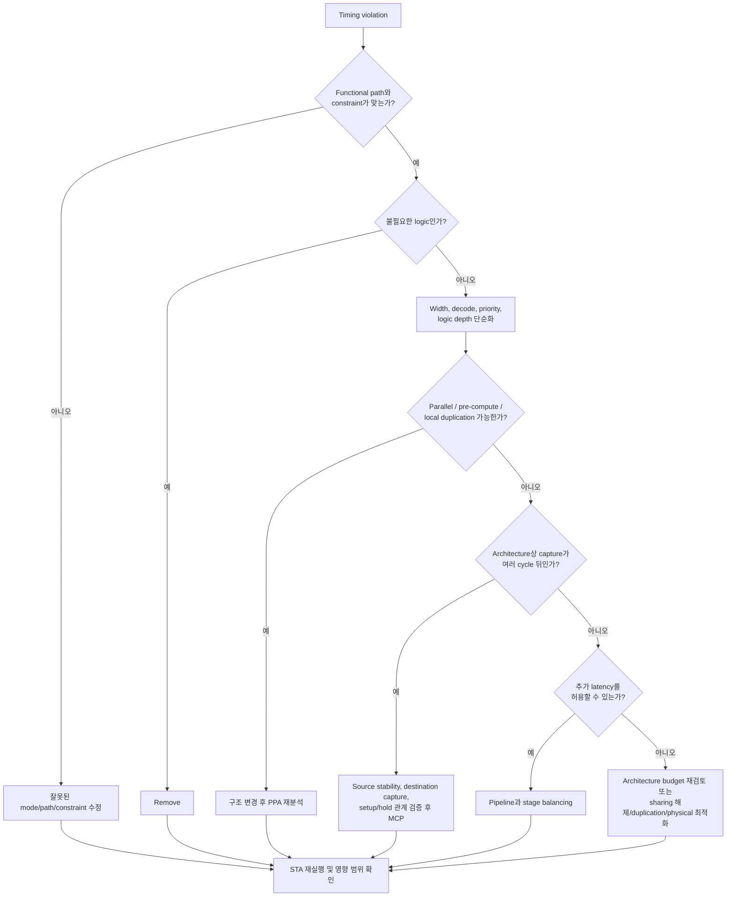

# Timing Design & Optimization

> **Timing optimization은 느린 RTL 문장을 빠르게 고치는 일이 아니다.**
> 데이터가 언제 생성되고, 언제까지 도착해야 하며, 어느 clock edge에서 소비되는지를 architecture와 일치시키는 일이다.

기능 시뮬레이션(functional simulation)이 통과해도 실제 회로가 목표 주파수에서 동작한다는 보장은 없다. 시뮬레이터는 보통 RTL 연산을 이상적인 zero-delay 동작으로 취급하지만, 합성(synthesis)된 회로에는 flip-flop의 지연, combinational logic의 지연, 배선 지연, clock skew와 jitter가 존재한다. Timing design은 이 물리적 시간을 설계 요구사항 안에 배치하는 과정이다.

이 문서는 synchronous single-clock 경로를 중심으로 timing의 기본 모델과 RTL 단계에서의 최적화 순서를 설명한다. 서로 다른 clock domain 사이의 경로는 일반적인 setup 최적화 문제가 아니라 CDC protocol 문제일 수 있으므로 [CDC 가이드](../08_cdc/overview.md)와 함께 검토해야 한다.

---

## 1. Timing을 보는 기본 관점

가장 단순한 register-to-register 경로는 다음과 같다.

```text
          launch edge                                      capture edge
CLK ──────────┬─────────────────────────────────────────────────┬────
              ▼                                                 ▼
         ┌───────────┐   Q   ┌─────────────────────────┐   D  ┌────────────┐
Data in ►│ Launch FF │──────►│ Logic cells + routing   │─────►│ Capture FF │► Data out
         └───────────┘       └─────────────────────────┘      └────────────┘
                └─ Tcq ─┘          └─ Tcomb ─┘                 Tsetup / Thold
```

1. **Launch FF**가 clock edge에서 데이터를 내보낸다.
2. 출력은 clock-to-Q delay(`Tcq`) 뒤에 변하기 시작한다.
3. 데이터는 combinational logic과 routing을 통과한다.
4. **Capture FF**는 다음 유효 capture edge 전에 setup 조건을, capture edge 주변에서는 hold 조건을 만족해야 한다.

회로의 논리 기능만 보면 두 FF 사이에 어떤 식이 있는지만 중요해 보인다. Timing 관점에서는 그 식이 몇 단계의 gate로 구현되는지, MUX가 얼마나 깊은지, 배선이 얼마나 길어지는지, 하나의 control이 몇 개의 load를 구동하는지도 중요하다.

### 주요 용어

| 용어 | 의미 | 설계자가 확인할 질문 |
|---|---|---|
| **Launch edge** | source FF가 새 데이터를 시작하는 clock edge | 어떤 event가 이 데이터를 launch하는가? |
| **Capture edge** | destination FF가 데이터를 받아야 하는 clock edge | 정말 바로 다음 edge인가, 더 나중 edge인가? |
| **Clock-to-Q (`Tcq`)** | launch edge부터 source FF의 Q가 변할 때까지의 지연 | 사용 cell과 corner에 따라 어떻게 달라지는가? |
| **Combinational delay** | logic cell과 routing을 통과하는 지연 | logic depth와 wire delay 중 무엇이 지배적인가? |
| **Setup time** | capture edge 전에 데이터가 안정되어 있어야 하는 시간 | 목표 period 안에 max-delay path가 들어오는가? |
| **Hold time** | capture edge 뒤에도 데이터가 유지되어야 하는 시간 | min-delay path가 너무 빠르지 않은가? |
| **Clock uncertainty** | jitter, 잔여 skew, 분석 margin 등 clock 변동을 반영한 예산 | 현재 flow가 무엇을 uncertainty에 포함하는가? |
| **Slack** | required time과 actual arrival time의 차이 | 음수 slack의 크기와 영향을 받는 endpoint 수는? |
| **Critical path** | 분석 조건에서 가장 작은 slack을 갖는 경로 | 한 경로의 문제인가, 같은 구조가 반복되는가? |

`Critical path`는 RTL에서 영구히 고정된 한 줄이 아니다. clock period, operating corner, mode, placement, routing, clock tree와 constraint가 바뀌면 critical path도 달라질 수 있다. 한 경로를 개선한 뒤에는 그 다음 경로가 새로운 critical path가 되는 것도 정상이다.

---

## 2. Setup과 Hold

### 2.1 Setup: 데이터가 늦게 도착하는 문제

개념적인 single-cycle setup 조건은 다음과 같이 볼 수 있다.

```text
Tperiod >= Tcq,max + Tcomb,max + Tsetup + timing margin

setup slack = required arrival time - actual data arrival time
```

Launch와 capture clock arrival를 같은 시간축에 놓으면 단순 모델을 더 명확히 쓸 수 있다.

```text
max data arrival = launch edge arrival + Tcq,max + data-path max delay
setup required   = next capture edge arrival - Tsetup - setup uncertainty
setup slack      = setup required - max data arrival
```

`setup slack < 0`이면 데이터가 요구 시간보다 늦게 도착한다. 실제 STA(static timing analysis)는 launch/capture clock arrival, skew, uncertainty, variation과 cell/routing delay를 분석 조건에 맞게 계산하므로 위 식은 사고를 위한 단순 모델이다.

Pre-CTS의 ideal/estimated clock과 post-CTS의 propagated clock은 clock arrival와 skew를 다르게 모델링할 수 있다. Flow가 propagated skew나 특정 margin을 이미 포함했다면 RTL review용 식에서 같은 항목을 uncertainty로 다시 더해 이중 계산하지 않는다. Report의 `arrival`, `required`, `uncertainty`가 어떤 성분을 포함하는지 해당 분석 flow에서 확인한다.

Setup을 개선하는 대표 방법은 다음과 같다.

- 불필요한 logic과 path를 제거한다.
- Boolean expression, decode, width, priority 구조를 단순화한다.
- 긴 dependency chain을 parallel computation 또는 pre-computation으로 바꾼다.
- fanout이 지나치게 크다면 logic/register duplication과 buffering을 검토한다.
- architecture가 허용하면 pipeline으로 path를 분할한다.
- architecture가 원래 여러 cycle 뒤 capture하도록 정의되었다면 MCP를 정확히 표현한다.
- 합성 이후에는 placement, buffering, cell sizing, routing 등 physical optimization 결과를 확인한다.

단순히 clock period를 늘리는 것도 setup을 완화하지만, 이는 성능 요구사항을 변경하는 architecture 결정이지 일반적인 “수정”이 아니다.

### 2.2 Hold: 데이터가 너무 빨리 바뀌는 문제

개념적인 hold 조건은 다음과 같다.

```text
earliest data arrival >= hold requirement at the capture FF
```

같은 시간축의 단순 모델은 다음과 같다.

```text
min data arrival = launch edge arrival + Tcq,min + data-path min delay
hold required    = same capture edge arrival + Thold + hold uncertainty
hold slack       = min data arrival - hold required
```

Hold는 같은 capture edge 주변의 **minimum delay**를 보는 문제다. 다음 clock edge까지의 period를 늘려도 일반적인 same-edge hold violation은 해결되지 않는다. Hold fix는 보통 실제 구현 단계에서 delay cell, buffer, routing 조정 등으로 수행되지만, RTL 변경과 constraint 변경이 min path에 어떤 영향을 주는지는 여전히 확인해야 한다.

Setup과 hold는 같은 방향으로 움직이지 않을 수 있다.

- logic을 줄이면 setup에는 유리하지만 min delay가 더 짧아질 수 있다.
- delay를 추가하면 hold에는 유리하지만 setup margin을 소모한다.
- pipeline FF를 추가하면 각 stage의 setup path는 짧아질 수 있지만 새로운 short path와 clock load가 생긴다.
- MCP의 setup 관계만 바꾸고 hold 관계를 검토하지 않으면 의도하지 않은 hold check가 만들어질 수 있다.

따라서 “timing clean”은 setup report 하나만 깨끗하다는 뜻이 아니다. 모든 sign-off mode/corner에서 max-delay와 min-delay가 모두 설계 의도와 일치해야 한다.

### 2.3 Slack을 읽는 법

Slack은 결과이지 원인 자체가 아니다. 음수 slack을 보면 다음을 분리해서 확인한다.

1. **Path가 실제 functional path인가?** 잘못된 constraint나 비활성 mode가 분석되고 있지 않은가?
2. **Required time이 맞는가?** 실제 capture가 다음 cycle인지, protocol상 더 나중인지 확인한다.
3. **Data path가 왜 긴가?** cell delay, logic depth, fanout, routing 중 지배 항목을 찾는다.
4. **한 endpoint만의 문제인가?** 같은 RTL pattern이 여러 경로에서 반복되는지 본다.
5. **개선이 다른 경로에 미치는 영향은 무엇인가?** share, duplicate, pipeline은 PPA와 다른 path를 바꾼다.

Worst negative slack(WNS)은 가장 나쁜 경로의 심각도를, total negative slack(TNS)은 위반 경로 전체의 규모를 이해하는 데 도움을 준다. 단, report metric의 정확한 정의와 path 집계 방식은 사용하는 flow에서 확인해야 한다.

---

## 3. RTL 구조가 Timing Path가 되는 방식

### 3.1 Logic depth

긴 combinational dependency는 뒤 연산이 앞 연산의 결과를 기다리게 한다.

```text
a,b ─► compare ─► select ─► add ─► clamp ─► output MUX ─► FF
```

각 연산이 작아 보여도 직렬로 이어지면 전체 delay가 누적된다. 다음을 검토한다.

- 중간 조건을 이전 cycle에 계산할 수 있는가?
- 서로 독립적인 계산을 병렬로 수행한 뒤 마지막에 선택할 수 있는가?
- 범위나 bit width를 줄여 비교기와 산술기를 작게 만들 수 있는가?
- 동일한 condition을 여러 번 decode하고 있지 않은가?
- 결과가 정말 next cycle에 필요한가?

Parallelization이나 pre-computation은 logic depth를 줄일 수 있지만 중복 연산으로 area와 switching power가 증가할 수 있다.

### 3.2 Priority chain

다음 RTL은 문법적으로 간단하지만 조건 사이에 명시적인 priority가 있다.

```systemverilog
always_comb begin
    if (req[0])
        data_next = data0;
    else if (req[1])
        data_next = data1;
    else if (req[2])
        data_next = data2;
    else if (req[3])
        data_next = data3;
    else
        data_next = '0;
end
```

기능상 “가장 낮은 index의 request가 이긴다”는 의미이며, 합성 결과에는 priority selection 구조가 필요하다. 항목 수가 커지면 긴 dependency가 생길 수 있다. 개선 전에 먼저 priority가 정말 specification인지 확인한다.

- request가 mutual exclusive라면 그 invariant를 설계와 검증에 명확히 표현할 수 있는가?
- arbitration을 tree 또는 staged architecture로 바꿀 수 있는가?
- priority 결정을 한 cycle 앞당길 수 있는가?
- encoder 결과를 여러 곳에서 재사용하면서 fanout을 과도하게 만들고 있지 않은가?

`case`로 문법만 바꾼다고 반드시 더 빠른 hardware가 되는 것은 아니다. 기능 semantics, synthesis inference, constraint가 함께 달라져야 구조가 달라진다.

### 3.3 Large MUX

많은 입력을 선택하는 MUX는 select decode, MUX tree, routing congestion을 만들 수 있다.

```text
many data sources ──► decode / MUX tree ──► destination FF
                         ▲
                    wide select
```

Large MUX가 critical하면 다음을 함께 본다.

- 사용되지 않는 input이나 mode를 제거할 수 있는가?
- data source를 locality에 맞게 hierarchy로 나눌 수 있는가?
- select를 pre-decode할 수 있는가?
- MUX 전후에 pipeline boundary를 둘 수 있는가?
- resource sharing 때문에 MUX가 커진 것은 아닌가?

### 3.4 Wide compare와 arithmetic

Wide adder, subtractor, comparator, multiplier는 width와 operation 종류에 따라 carry propagation 또는 큰 operator structure를 만들 수 있다. Width를 줄이면 operator뿐 아니라 연결된 MUX, register, routing도 함께 작아질 가능성이 있다.

확인할 항목은 다음과 같다.

- 실제 numeric range에 필요한 bit 수인가?
- signed/unsigned extension이 의도치 않게 width를 키우지 않았는가?
- constant operand를 tool이 최적화할 수 있는 형태인가?
- 전체 결과가 필요한가, 일부 bit나 threshold 결과만 필요한가?
- saturation, rounding, compare를 한 cycle에 모두 직렬 배치했는가?

정확한 implementation은 target library와 synthesis 설정에 따라 달라질 수 있으므로 RTL 모양만으로 adder topology나 delay를 단정하지 않는다. 합성 netlist와 timing report로 확인한다.

### 3.5 Decode logic

여러 state, mode, opcode를 한 번에 조합하는 decode는 넓은 AND/OR 구조와 reconvergent path를 만들 수 있다. 특히 decode 결과가 다시 MUX select나 register enable로 퍼지면 logic depth와 fanout이 동시에 증가한다.

Decode를 최적화할 때는 다음 trade-off가 있다.

- decode 공유: area는 줄 수 있지만 fanout과 routing이 커질 수 있다.
- local decode 복제: area는 늘 수 있지만 path와 placement locality가 좋아질 수 있다.
- registered decode: timing은 나아질 수 있지만 latency와 state alignment가 바뀐다.
- early decode: 다음 stage는 짧아지지만 speculative switching이 늘 수 있다.

### 3.6 High fanout

한 signal이 많은 load를 구동하면 load capacitance, buffer tree와 routing delay가 증가한다. 흔한 예는 global enable, mode, reset 이외의 넓은 datapath select다.

```text
                 ┌─► load
                 ├─► load
control ─────────┼─► load      fanout ↑, route span ↑
                 ├─► load
                 └─► load
```

High fanout 개선은 RTL과 physical implementation의 경계에 있다.

- 불필요한 consumer를 제거한다.
- hierarchy별 local condition을 만들 수 있는지 본다.
- source register 또는 logic을 복제할 수 있는지 검토한다.
- physical synthesis의 buffering/replication 결과를 확인한다.

복제는 timing을 개선할 수 있지만 register 수, clock load, area, verification point와 ECO 복잡도를 늘릴 수 있다. 무조건적인 duplication은 피한다.

---

## 4. Timing Optimization의 우선순위

이 가이드의 기본 순서는 다음과 같다.

```text
Remove
  ↓
Disable
  ↓
Simplify
  ↓
Share / Duplicate as appropriate
  ↓
Pipeline or MCP
  ↓
Physical optimization
```

### 4.1 Remove

가장 빠른 logic은 존재하지 않는 logic이다.

- 요구사항상 사용하지 않는 output이나 mode인가?
- constant propagation으로 제거할 수 있는 condition인가?
- 같은 값을 중복 계산하고 있지 않은가?
- 잘못된 width 또는 defensive logic이 불필요하게 남아 있지 않은가?

제거는 timing뿐 아니라 power와 area에도 동시에 이득일 가능성이 크다. 단, verification coverage나 향후 호환성을 이유로 필요한 기능을 임의로 없애면 안 된다.

### 4.2 Disable

사용하지 않는 cycle에는 update나 evaluation을 멈출 수 있는지 본다. Register enable, operand isolation, function enable이 대표적이다. 이는 주로 power 최적화지만, inactive mode의 불필요한 data movement와 control complexity를 줄여 architecture를 명확하게 만들 수도 있다.

여기서 `Disable`은 STA 명령으로 path를 무시하라는 뜻이 아니다. 기능적으로 존재하는 path를 timing exception으로 숨기면 안 된다. Enable 자체도 MUX와 enable decode를 만들 수 있으므로 critical path에 추가되는지 확인한다.

### 4.3 Simplify

- logic depth를 줄인다.
- bit width를 실제 range에 맞춘다.
- 중복 decode와 불필요한 priority를 제거한다.
- constant와 invariant를 synthesis가 알 수 있게 표현한다.
- 복잡한 condition을 architecture state로 더 직접 표현할 수 있는지 본다.

“코드 줄 수가 적다”와 “hardware가 단순하다”는 같은 뜻이 아니다. 합성 결과를 기준으로 판단한다.

### 4.4 Share or Duplicate as appropriate

하나의 operator를 공유하면 area가 줄 수 있지만 input/output MUX와 fanout이 추가된다. 반대로 logic을 복제하면 area와 switching은 늘 수 있지만 각 consumer까지의 path와 routing을 짧게 만들 수 있다.

| 선택 | 기대 효과 | 주의할 비용 |
|---|---|---|
| Logic/resource sharing | operator 수 감소, area 절감 가능 | MUX, arbitration, fanout, timing 악화 가능 |
| Logic/register duplication | locality와 timing 개선 가능 | area, clock/data power, consistency 관리 증가 |

최적점은 utilization, throughput, placement와 target frequency에 따라 달라진다.

### 4.5 Pipeline or MCP

두 방법은 서로 대체 가능한 “timing option”이 아니다.

- **Pipeline**은 register를 추가하여 hardware와 latency를 바꾸고 combinational path를 나눈다.
- **Multi-Cycle Path(MCP)**는 hardware를 바꾸지 않는다. Architecture가 이미 여러 cycle 뒤 capture하도록 정의되었을 때 그 functional requirement를 STA constraint로 표현한다.

결과가 실제로 next cycle에 필요하다면 MCP를 적용할 근거가 없다. Pipeline도 interface latency를 바꾸므로 specification이 허용하거나 architecture를 함께 변경할 때만 가능하다. 자세한 내용은 [Multi-Cycle Path](multi_cycle_path.md)를 참고한다.

### 4.6 Physical optimization

Post-synthesis 또는 post-route timing은 cell delay뿐 아니라 routing, congestion, placement distance, clock tree의 영향을 받는다. RTL에서 합리적인 구조를 만든 뒤 다음 피드백을 반복한다.

```text
RTL / Architecture
        ↓
Synthesis
        ↓
Timing report + Netlist
        ↓
Placement / Routing feedback
        ↓
RTL 또는 constraint 재검토
```

Cell sizing, buffering, placement constraint와 routing optimization은 implementation flow의 영역이다. 물리 단계에서 해결 가능한 문제와 architecture를 바꿔야 하는 문제를 구분해야 한다.

---

## 5. Timing Violation Decision Flow



이 흐름에서 중요한 질문은 두 가지다.

1. **이 결과가 정말 다음 cycle에 필요한가?**
2. **필요하지 않다면 hardware가 실제로 나중에 capture하도록 설계되어 있는가?**

첫 질문의 답이 “아니오”라는 이유만으로 MCP가 자동으로 정당화되지는 않는다. Source가 안정적으로 유지되고 destination이 intermediate cycle의 값을 capture/consume하지 않는다는 protocol이 RTL과 verification에서 확인되어야 한다.

또한 잘못된 path를 고치는 것과 false path를 선언하는 것은 다르다. Functional path가 실제로 존재한다면 constraint를 없애서 report에서 감추어서는 안 된다.

---

## 6. Example: 한 Cycle에 너무 많은 일을 하는 Datapath

다음은 하나의 cycle 안에서 compare, add, saturation과 selection을 수행하는 예다.

```systemverilog
logic [15:0] sum;

always_comb begin
    if (mode_fast) begin
        if ({1'b0, a} + {1'b0, b} > 17'h0_FFFF)
            sum = 16'hFFFF;
        else
            sum = a + b;
    end else begin
        sum = bypass_data;
    end
end

always_ff @(posedge clk) begin
    if (sum_en)
        sum_q <= sum;
end
```

가능한 hardware path는 다음과 비슷하다.

```text
a,b ─► wide add ─► overflow compare/select ─┐
                                            ├─► mode MUX ─► enable MUX ─► sum_q
bypass_data ────────────────────────────────┘
```

검토 순서는 다음과 같다.

1. `sum_q`가 사용되지 않는 mode를 제거하거나 update를 막을 수 있는가?
2. 덧셈이 두 번 표현되어도 synthesis가 공통화하는지, 혹은 RTL로 명확한 intermediate를 둘지 확인한다.
3. Overflow는 carry-out만으로 판단할 수 있는가?
4. `mode_fast`와 `sum_en` decode가 path 앞에서 준비되어 있는가?
5. 결과가 next cycle에 필요하지 않다면 capture schedule을 명시할 수 있는가?
6. 추가 latency가 허용된다면 add와 final select 사이에 pipeline을 둘 수 있는가?

어떤 답이 최선인지는 specification과 합성 결과에 달려 있다. 코드 모양만 보고 MUX 개수나 operator 공유를 단정하지 않는다.

---

## 7. 흔한 잘못된 접근

### Negative slack만큼 무조건 pipeline 추가

Pipeline은 강력하지만 latency, valid alignment, feedback dependency, flush/replay behavior, FF area와 clock power를 바꾼다. Stage를 추가하기 전에 interface contract가 허용하는지 확인한다.

### Timing fail이면 MCP 적용

MCP는 violation을 숨기는 수단이 아니다. Architecture가 원래 여러 cycle 뒤에 capture한다는 증거가 없다면 적용할 수 없다. 자세한 실패 사례와 검증 방법은 [Multi-Cycle Path](multi_cycle_path.md)에 설명한다.

### `if`를 `case`로 바꾸면 빨라진다고 가정

Syntax가 아니라 functional semantics와 inferred hardware가 중요하다. Priority가 그대로라면 표현만 바꾸어도 근본 구조가 남을 수 있다.

### Logic sharing이 항상 좋다고 가정

Sharing은 input MUX, output steering과 high fanout을 만들 수 있다. Area와 timing을 함께 보고 결정한다.

### RTL만 보고 timing을 확정

RTL은 architecture risk를 찾는 데 유용하지만 최종 delay에는 cell mapping과 physical routing이 포함된다. Synthesis/STA/P&R feedback loop가 필요하다.

### Setup만 확인

Hold, clock interaction, mode/corner와 timing exception의 범위도 함께 확인해야 한다. 하나의 report가 clean하다고 전체 timing이 clean한 것은 아니다.

---

## 8. Timing Design Review Checklist

### Requirement와 constraint

- [ ] 목표 clock period와 interface timing requirement가 명확한가?
- [ ] Launch event와 intended capture event가 명확한가?
- [ ] 분석하는 path가 실제 active mode에서 functional path인가?
- [ ] Input/output delay, generated clock, uncertainty 등 필요한 constraint가 누락되지 않았는가?
- [ ] Timing exception은 functional justification과 함께 관리되는가?

### RTL structure

- [ ] Deep combinational dependency가 있는가?
- [ ] 긴 priority chain이 specification상 정말 필요한가?
- [ ] Large MUX와 wide decode가 한 path에 겹치지 않는가?
- [ ] Wide arithmetic/comparator의 width가 실제 range보다 크지 않은가?
- [ ] High-fanout control이 critical datapath까지 길게 퍼지지 않는가?
- [ ] Signed/unsigned conversion과 implicit extension이 의도한 것인가?

### Architecture

- [ ] 결과가 정말 next cycle에 필요한가?
- [ ] Latency와 throughput requirement를 분리해 정의했는가?
- [ ] Parallelization 또는 pre-computation이 가능한가?
- [ ] Resource sharing이 MUX와 fanout을 과도하게 만들지 않는가?
- [ ] Timing을 위해 duplication이 필요한 곳과 area를 위해 sharing할 곳을 구분했는가?
- [ ] Pipeline을 추가할 경우 valid/control/feedback도 올바르게 정렬되는가?
- [ ] MCP를 고려한다면 source stability와 destination capture protocol이 명시되어 있는가?

### 결과 확인

- [ ] Synthesis 후 critical path의 실제 cell/logic structure를 확인했는가?
- [ ] Cell delay와 net delay 중 어느 쪽이 지배적인가?
- [ ] Setup과 hold를 모두 확인했는가?
- [ ] 모든 관련 mode/corner를 확인했는가?
- [ ] 한 경로 수정 후 새 critical path와 TNS 변화를 확인했는가?
- [ ] Timing 개선으로 power/area/latency/verification complexity가 악화되지 않았는가?

전체 review 항목은 [RTL Design Review Checklist](../15_checklist/rtl_design_review_checklist.md)에서 확인할 수 있다.

---

## 9. 다음 문서

- [Architectural Timing Budget](../02_architecture/architectural_timing_budget.md): interface requirement를 stage budget과 implementation evidence로 연결하는 방법
- [Critical Path](critical_path.md): timing report의 cell/net/control/physical 원인을 분리하는 방법
- [Pipeline Design](pipeline.md): latency와 throughput을 구분하고 stage를 균형 있게 나누는 방법
- [Multi-Cycle Path](multi_cycle_path.md): 여러 cycle 뒤 capture하는 functional contract를 STA에 안전하게 표현하는 방법
- [Physical Area and Congestion](../05_area/physical_area_and_congestion.md): cell/net delay와 congestion을 실제 block footprint evidence로 연결하는 방법
- [CDC Overview](../08_cdc/overview.md): 서로 다른 clock domain 사이에서 timing constraint만으로 해결할 수 없는 문제
- [RTL Design Review Checklist](../15_checklist/rtl_design_review_checklist.md): Architecture, timing, power, clock, CDC를 함께 검토하는 체크리스트
