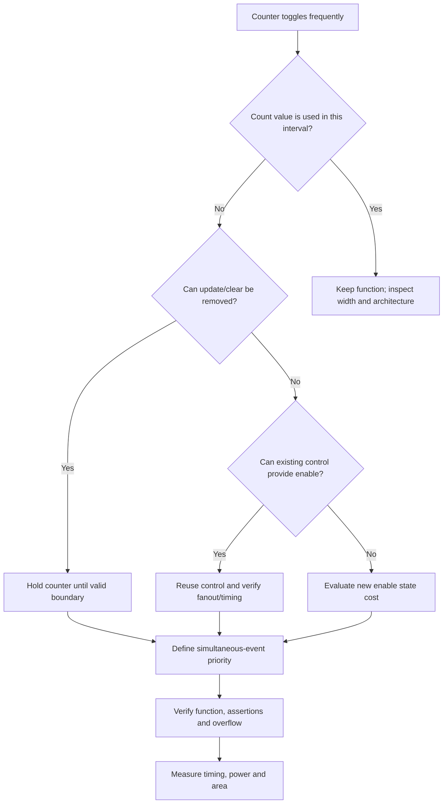

# Counter Optimization

counter는 작고 익숙한 RTL block이지만, 매 cycle state와 arithmetic logic을 움직이는 대표적인 toggle hotspot이다. 특히 count 결과가 사용되지 않는 구간에서도 계속 증가하는 free-running counter는 기능 simulation에서는 문제가 없어 보이면서 불필요한 동적 전력(dynamic power)을 소비할 수 있다.

이 장의 핵심 원칙은 다음과 같다.

> 사용하지 않는 값을 굳이 `0`으로 만드는 것보다, 아예 변경하지 않는 것이 더 효율적일 수 있다.

최적화의 목적은 모든 counter에 enable을 추가하는 것이 아니다. count가 유효한 시간과 관찰되는 시점을 requirement에서 찾아, 불필요한 clear와 increment를 architecture에서 제거하는 것이다.

## 1. 문제 상황: A, B, C Event

다음 generic sequence를 생각해 보자.

- `A`: operation이 시작되는 event다.
- `B`: 실제 측정 window가 시작되는 event다. 이 시점에서 count 기준값은 `0`이어야 한다.
- `C`: 측정 대상 event다. 유효한 측정 window 안에서 발생한 `C`만 count한다.

```text
time ──────────────────────────────────────────────────────▶

        A                         B
        │                         │
        ▼                         ▼
phase   operation setup           measurement window
        ├─────────────────────────┼─────────────────────────
C       ·    ↑    ↑       ↑       ·    ↑       ↑    ↑
count   clear/increment/…          clear, then count C events
        └──── discarded ─────────┘└──── result is used ────
```

기존 구현이 `A`에서 clear한 뒤 `A`와 `B` 사이의 `C`까지 count하고, `B`에서 다시 clear한다면 중간 count는 모두 버려진다. 이 경우 `A`에서의 clear와 `A`~`B` 구간의 increment는 최종 결과에 기여하지 않는다.

최적화 전 반드시 requirement를 다음과 같이 구체화해야 한다.

1. `A`~`B` 사이의 count 값은 어느 functional consumer도 읽지 않는다.
2. 실제 결과는 `B` 이후에만 valid하다.
3. `B`가 결과 사용 전에 반드시 발생한다.
4. `B`에서 count의 기준값을 정의한다.
5. `B`와 `C`가 같은 cycle에 발생할 때 그 `C`를 포함할지 명세가 정의한다.

이 조건이 없다면 “중간 값은 필요 없어 보인다”는 추측만으로 update를 제거해서는 안 된다.

이 장의 parameterized RTL 예제는 `COUNT_W >= 1`을 전제로 한다. 실제 reusable block에서는 parameter legality를 elaboration check나 프로젝트의 검증 방식으로 확인한다.

## 2. Before: 버려질 값을 계속 계산하는 구조

다음은 operation 전체에서 count를 동작시키는 단순화된 예다.

```systemverilog
module event_counter_before #(
    parameter int unsigned COUNT_W = 16
) (
    input  logic                 clk,
    input  logic                 rst_n,
    input  logic                 event_a,
    input  logic                 event_b,
    input  logic                 operation_active,
    input  logic                 event_c,
    output logic [COUNT_W-1:0]   count
);

    always_ff @(posedge clk or negedge rst_n) begin
        if (!rst_n)
            count <= '0;
        else if (event_a)
            count <= '0;
        else if (event_b)
            count <= '0;
        else if (operation_active && event_c)
            count <= count + 1'b1;
    end

endmodule
```

이 예에서 `operation_active`가 `A` 이후부터 active라면, counter는 `A`~`B` 구간의 `C`에도 증가한다. 그러나 `B`에서 다시 `0`으로 clear되므로 그 결과는 사라진다.

### Hardware view

개념적인 data path는 다음과 같다.

```text
                  ┌───────────────┐
 count ──────────▶│ + 1 increment │────┐
    │             └───────────────┘    │
    │                                  ▼
    └──────────────────────────────▶ update/hold MUX ─▶ Counter FFs
                                         ▲
                       zero ──────────────┘
                       A, B, active, C control
```

`event_c`가 참인 cycle마다 counter FF 일부가 toggle한다. binary counter에서는 LSB가 가장 자주 바뀌고 carry 조건에 따라 더 높은 bit와 incrementer 내부 node도 전환된다. counter output이 comparator, decode 또는 bus에 연결되어 있으면 downstream logic도 함께 움직일 수 있다.

### 숨은 문제: RTL priority

코드의 `if` 순서는 hardware priority다. 위 예에서는 다음 순서다.

```text
reset > A clear > B clear > increment > hold
```

따라서 `A`와 `B`가 동시에 발생하면 `A` branch가 선택되고, `B`와 `C`가 동시에 발생해도 `B` clear가 increment보다 우선한다. 두 clear 결과가 같더라도, 이후 control state의 의미까지 같다는 보장은 없다. 우선순위는 코딩 편의가 아니라 specification이어야 한다.

## 3. After: 실제 측정 window에서만 count

`B` 이후의 값만 필요하다면 counter를 `B`에서 초기화하고, measurement window에서만 update한다.

```systemverilog
module event_counter_after #(
    parameter int unsigned COUNT_W = 16
) (
    input  logic                 clk,
    input  logic                 rst_n,
    input  logic                 event_b,
    input  logic                 count_active,
    input  logic                 event_c,
    output logic [COUNT_W-1:0]   count
);

    always_ff @(posedge clk or negedge rst_n) begin
        if (!rst_n)
            count <= '0;
        else if (event_b)
            count <= '0;
        else if (count_active && event_c)
            count <= count + 1'b1;
    end

endmodule
```

변경의 핵심은 두 가지다.

- `A`에서 불필요하게 clear하지 않는다.
- `A`~`B` 구간에는 count를 update하지 않는다.

`B` 전의 `count`에는 이전 transaction 값이 남아 있을 수 있다. 이것은 `count`가 invalid인 구간에서 아무도 값을 사용하지 않는다는 interface contract가 있을 때 의도된 동작이다. “항상 보기 좋은 0”을 유지하기 위해 clear를 추가하면 그 자체가 switching과 control logic을 만든다.

### Count validity를 명시하기

stale value가 보이는 것이 혼란스럽다면 count 값을 반복해서 clear하기보다 validity를 명확히 표현한다.

```systemverilog
assign count_valid = count_active;
```

consumer는 `count_valid == 1`일 때만 `count`를 사용한다. 실제 설계에서는 `count_active`와 결과 valid의 시작/종료 cycle이 같지 않을 수 있으므로 protocol에 맞게 정의해야 한다. 중요한 점은 data를 강제로 known value로 만드는 것과 그 data가 유효함을 표시하는 것을 구분하는 것이다.

## 4. B와 C가 동시에 발생하면 무엇을 세는가

대표 코드에서는 다음 priority를 사용한다.

```systemverilog
if (event_b)
    count <= '0;
else if (count_active && event_c)
    count <= count + 1'b1;
```

따라서 `B && C`인 cycle의 `C`는 count되지 않는다. clock edge에서 `B`가 measurement window를 열고, 그 다음 cycle부터 `C`가 유효하다는 명세라면 적절하다.

```text
B && C at edge
      ↓
clear wins
      ↓
count after edge = 0
```

반대로 `B`가 발생한 바로 그 edge의 `C`를 첫 event로 포함해야 한다면 RTL을 명시적으로 바꿔야 한다.

```systemverilog
always_ff @(posedge clk or negedge rst_n) begin
    if (!rst_n)
        count <= '0;
    else if (event_b)
        count <= event_c;  // event_c==1이면 zero-extended 1
    else if (count_active && event_c)
        count <= count + 1'b1;
end
```

이 방식은 `COUNT_W >= 1`을 전제로 하고 `event_c`를 counter width로 zero-extension한다. 또는 readability를 위해 별도 constant를 사용할 수 있다.

중요한 것은 둘 중 어느 패턴이 일반적으로 더 좋다는 것이 아니다. 다음 질문에 답한 뒤 RTL과 assertion이 같은 답을 표현해야 한다.

- `B`는 window가 열리기 전의 알림인가, window 첫 cycle 자체인가?
- `C`는 pulse인가 level인가?
- 한 cycle에 최대 한 event만 표현되는가?
- `B`와 `C`가 동시에 오는 것이 legal한가?
- legal하다면 해당 `C`는 새 window와 이전 window 중 어디에 속하는가?

“우연히 `if`가 위에 있어서 clear가 이겼다”는 설계 결정이 아니다.

## 5. 기존 Control 재사용과 새 Enable FF

최적화된 예의 `count_active`를 어떻게 만들지가 PPA를 좌우할 수 있다.

### 기존 registered control을 재사용

FSM state, transaction valid 또는 이미 존재하는 phase control이 정확히 measurement window를 표현한다면 이를 재사용할 수 있다.

```systemverilog
logic count_active;

assign count_active = (state == MEASURE);
```

장점:

- 새 state FF를 추가하지 않을 수 있다.
- 기존 기능 조건과 count window가 일치해 assumption이 명확해질 수 있다.

주의점:

- state decode가 넓거나 glitch-prone하면 enable logic의 switching과 delay가 생길 수 있다.
- 기존 control의 fanout을 크게 늘리면 routing, transition과 timing이 악화될 수 있다.
- state encoding이나 pipeline 변경으로 enable arrival가 바뀔 수 있다.
- `state == MEASURE`가 counter update의 정확한 cycle boundary와 일치하는지 확인해야 한다.

### 별도 `count_active` FF 추가

기존 control로 window를 명확히 표현하기 어렵다면 별도 FF를 둘 수 있다.

```systemverilog
always_ff @(posedge clk or negedge rst_n) begin
    if (!rst_n)
        count_active <= 1'b0;
    else if (event_b)
        count_active <= 1'b1;
    else if (measurement_done)
        count_active <= 1'b0;
end
```

이 구조는 phase를 명확히 만들지만 비용이 있다.

- enable FF 자체의 area와 clock power
- reset cell 및 reset routing 비용
- `event_b`/`measurement_done` priority와 simultaneous event 검증
- counter 외 logic이 이 FF를 사용하면서 늘어나는 fanout
- clock gating을 적용할 경우 enable이 safe phase에 안정적이어야 하는 추가 조건

작은 counter 하나를 드물게 멈추기 위해 새 FF와 복잡한 decode를 추가하면 순전력 절감이 없을 수 있다. 반대로 넓은 counter bank와 downstream datapath를 오랫동안 idle시키고 여러 register가 같은 enable을 공유한다면 새 control 비용이 충분히 상쇄될 수 있다. 실제 activity와 구현 결과로 판단한다.

### “기존 signal 재사용”도 무조건 공짜가 아니다

기존 signal에 logic load를 추가하면 capacitance와 fanout이 증가한다. source가 먼 위치에 있거나 여러 block으로 퍼지면 routing power와 delay가 늘 수 있다. 필요하면 physical feedback에 따라 control을 locally register하거나 logic을 replicate하는 선택도 검토할 수 있지만, cycle alignment와 CDC 의미가 바뀌지 않도록 해야 한다.

## 6. Synthesis View

최적화된 counter RTL은 일반적으로 다음 요소를 만들 가능성이 있다.

- `COUNT_W`개의 state bit를 가진 counter register
- increment 연산을 위한 adder 또는 incrementer
- clear, increment, hold를 선택하는 mux 또는 enable-capable sequential structure
- `event_b`, `count_active`, `event_c`의 control logic

개념적 next-state equation은 다음과 같다.

```text
next_count = event_b                  ? 0
           : (count_active && event_c) ? count + 1
           :                            count;
```

합성 도구는 constant propagation, mux factoring, enable inference와 target cell mapping을 수행할 수 있다. 같은 enable을 공유하는 충분한 register group이 있고 flow가 허용한다면 clock gating 후보로 인식할 수도 있다. 그러나 `if (enable)`을 썼다는 사실만으로 ICG가 반드시 삽입되거나 clock pin activity가 사라진다고 단정할 수 없다.

확인해야 할 구현 결과는 다음과 같다.

- counter가 예상 width로 합성되었는가?
- `A` 관련 clear/update cone이 실제로 제거되었는가?
- feedback mux 또는 enable cell이 data timing에 어떤 영향을 주었는가?
- `count_active`의 fanout과 logic depth는 어떤가?
- clock gating이 의도라면 실제로 inferred/inserted되었는가?
- downstream compare/decode가 idle 구간에 toggle하지 않게 되었는가?

RTL이 짧아진 것과 hardware가 개선된 것은 같은 의미가 아니다. netlist, timing, area와 power report로 mapping을 확인한다.

## 7. PPA Impact

### Power

기대할 수 있는 주요 효과는 switching activity `α` 감소다.

- `A`에서의 불필요한 clear transition 제거
- `A`~`B` 사이 counter FF update 제거
- incrementer와 carry logic activity 감소
- counter output에 연결된 comparator, decode와 bus activity 감소 가능

counter의 Q가 hold되어도 clock pin에는 clock이 계속 들어올 수 있다. clock power를 줄이려면 구현 flow가 enable을 clock gating으로 mapping했는지 별도로 확인해야 한다. clock gating에는 ICG, enable control, test와 clock-tree overhead가 있으므로 data activity 절감과 구분해 측정한다.

절감 크기는 대략 다음 요인에 민감하다.

- 전체 시간 중 `A`~`B` idle-for-count 구간의 비율
- 해당 구간의 `C` activity
- counter width와 downstream load
- counter가 clock-gated group에 포함되는지
- physical capacitance와 glitch activity

### Area

기존 `operation_active` 대신 이미 있는 `count_active`를 사용하고 `event_a` clear condition을 제거하면 control logic이 단순해질 가능성이 있다. counter FF 수와 incrementer width 자체는 보통 변하지 않는다.

반대로 별도 `count_active` FF, decode, isolation mux 또는 ICG를 추가하면 area가 늘 수 있다. 작은 counter에서는 이 overhead가 상대적으로 크다. width가 실제 count 범위보다 넓다면 enable 최적화와 별개로 [Bit-Width Minimization](../05_area/bit_width_minimization.md)을 검토한다. Width 감소는 FF뿐 아니라 incrementer, comparator, mux와 routing에도 영향을 줄 수 있다.

### Timing

enable 조건은 next-state selection path에 들어갈 수 있다.

```text
count_active / event_c
          ↓
      control logic
          ↓
   feedback/update MUX
          ↓
      Counter D pin
```

복잡한 state decode, late-arriving `event_c`, high-fanout enable은 counter의 setup path를 악화할 수 있다. 반대로 불필요한 clear term을 제거하고 control depth를 줄이면 개선될 여지도 있다. clock gating이 구현되면 gating enable check와 clock-tree 조건도 별도로 만족해야 한다.

counter path가 critical하지 않더라도 `count_active`가 다른 여러 block으로 확산되면 physical routing이 새 critical path를 만들 수 있다. 합성 단계와 placement 이후 결과를 모두 확인한다.

## 8. Functional Trade-offs와 적용하지 말아야 할 경우

이 최적화는 invalid 구간의 count 값을 바꾼다. 따라서 완전한 cycle-by-cycle equivalence가 아니라 명세가 허용한 observation point에서의 equivalence를 목표로 한다.

다음 경우에는 그대로 적용하면 안 된다.

- `A`~`B` count가 timeout, early warning 또는 debug status에 사용된다.
- `B`가 오지 않아도 중간 count로 error를 판단해야 한다.
- interface가 invalid 구간에도 `count == 0`을 보장한다.
- `B` 전에 발생한 `C`가 이후 결과에 포함되어야 한다.
- counter value의 모든 transition이 safety monitor 또는 trace requirement의 일부다.
- `count_active`를 안전하고 저비용으로 만들 수 없고 실제 절감이 미미하다.

적용하기 좋은 경우는 다음과 같다.

- `B` 이전의 count가 명시적으로 don't-care다.
- idle-for-count 구간이 길거나 자주 반복된다.
- counter가 넓거나 downstream cone이 크다.
- 기존 registered phase/valid control을 enable로 재사용할 수 있다.
- measurement window와 simultaneous event semantics가 명확하다.

## 9. Corner Cases

### Reset과 B가 겹치는 경우

예제에서는 asynchronous reset assertion이 최우선이다. reset이 active인 edge에서 `B`가 와도 count는 reset value가 된다. reset deassertion 방식과 첫 유효 event acceptance는 별도 reset protocol에서 정의해야 한다.

### A와 B가 동시에 발생하는 경우

최적화된 counter는 `A`를 직접 보지 않지만, 주변 FSM이 `A`와 `B`를 어떻게 처리하는지가 `count_active`에 영향을 줄 수 있다. 동시 발생이 illegal이라면 assertion으로 금지하고, legal이라면 새 measurement window가 열리는지 명세한다.

### B와 measurement_done이 동시에 발생하는 경우

새 window 시작과 이전 window 종료가 같은 cycle에 발생할 수 있다면 `count_active` FF의 priority를 정의해야 한다. back-to-back window를 허용하는 설계라면 단순히 `done` 우선으로 꺼 버리면 첫 cycle을 잃을 수 있다.

### C가 pulse가 아닌 level인 경우

`event_c`가 여러 cycle high이면 코드는 high인 모든 active cycle을 count한다. rising edge 한 번만 세어야 한다면 edge detection 또는 protocol pulse가 필요하다. edge detector를 추가하면 state, switching과 reset 비용도 생긴다.

### 한 cycle에 여러 event가 가능한 경우

1-bit `event_c`는 cycle당 0 또는 1만 표현한다. 실제 source가 cycle당 여러 event를 만들 수 있다면 event count bus, accumulator architecture 또는 arbitration이 필요하다. enable 최적화로 protocol 정보 손실을 해결할 수 없다.

### Overflow

예제는 자연스러운 modulo wrap-around를 사용한다. saturation, overflow flag 또는 wider result가 필요하면 명시해야 한다.

```systemverilog
if (count_active && event_c) begin
    if (&count)
        count <= count;          // saturating counter
    else
        count <= count + 1'b1;
end
```

saturation comparator와 mux는 area, timing과 switching을 추가한다. overflow가 실제로 불가능하다면 requirement에서 최대 window 길이와 최대 event rate를 증명하고 필요한 width를 계산하는 편이 낫다.

### Back-to-back B

연속 cycle에 `B`가 들어오면 count가 반복해서 clear된다. 이것이 legal한 새-window restart인지 protocol violation인지 정의한다. 반복 clear를 무조건 “안전하다”고 보아서는 안 된다.

## 10. Verification Strategy

### Corner-case matrix

대표 코드처럼 `B` clear가 `C`보다 우선한다고 가정하면 다음 표를 review와 test의 시작점으로 사용할 수 있다.

| `event_b` | `count_active` | `event_c` | Expected next action |
|---:|---:|---:|---|
| 0 | 0 | 0 | Hold |
| 0 | 0 | 1 | Hold; C is outside window |
| 0 | 1 | 0 | Hold |
| 0 | 1 | 1 | Increment |
| 1 | 0 | 0 | Clear |
| 1 | 0 | 1 | Clear; same-cycle C excluded |
| 1 | 1 | 0 | Clear |
| 1 | 1 | 1 | Clear; same-cycle C excluded |

이 표는 reset, overflow, `A`, `measurement_done`과 back-to-back event 축을 추가해 확장한다.

### Assertion examples

다음 SystemVerilog Assertions(SVA)는 예제의 cycle semantics를 나타낸다. `|=>`를 사용해 현재 edge에서 샘플된 조건이 counter update에 반영된 다음 cycle의 관찰값을 확인한다. 실제 reset style과 verification sampling convention에 맞게 조정해야 한다.

```systemverilog
default clocking cb @(posedge clk); endclocking
default disable iff (!rst_n);

// B가 오면 C와 관계없이 다음 관찰 cycle의 count는 0이다.
ap_clear_on_b:
    assert property (event_b |=> count == '0);

// Active window에서 B 없이 C가 오면 정확히 1 증가한다.
ap_increment_in_window:
    assert property (
        count_active && event_c && !event_b
        |=> count == ($past(count) + 1'b1)
    );

// Window 밖이고 새 B도 없으면 count는 유지된다.
ap_hold_outside_window:
    assert property (
        !count_active && !event_b
        |=> count == $past(count)
    );

// Active window에서도 C가 없고 B가 없으면 유지된다.
ap_hold_without_event:
    assert property (
        count_active && !event_c && !event_b
        |=> count == $past(count)
    );
```

overflow가 허용되지 않는 명세라면 다음과 같은 environment/requirement assertion을 추가할 수 있다.

```systemverilog
ap_no_overflow_request:
    assert property (
        count_active && event_c && !event_b |-> !(&count)
    );
```

`B && C`가 illegal인 protocol이라면 우선순위를 조용히 선택하기보다 가정을 드러낸다.

```systemverilog
ap_b_and_c_mutually_exclusive:
    assert property (!(event_b && event_c));
```

### Observational equivalence 확인

before/after 구현은 `B` 이전의 `count`가 다르므로 일반적인 sequential equivalence가 그대로 성립하지 않을 수 있다. 대신 다음 contract를 검증한다.

```text
When count_valid == 1:
    optimized_count == reference_count_since_latest_B
```

formal 또는 simulation reference model은 “가장 최근 B 이후 포함 대상 C의 수”를 계산하도록 작성한다. invalid cycle을 비교에서 단순히 mask하기 전에, invalid 값이 다른 control cone으로 새어 나가지 않는지도 cone-of-influence와 assertion으로 확인한다.

## 11. Measure-First Evaluation

최적화 후보를 선택할 때 다음 수치를 먼저 확인한다.

- `A`~`B` 구간이 전체 active 시간에서 차지하는 비율
- 그 구간에서 `C`가 발생하는 빈도
- counter bit별 toggle과 downstream cone activity
- counter register의 clock power와 data power 비중
- `count_active` 생성/배선의 예상 비용

변경 후에는 같은 대표 workload와 같은 분석 조건으로 비교한다.

```text
Before activity + implementation reports
                 ↓
Remove A clear and pre-B updates
                 ↓
Functional + assertion regression
                 ↓
After timing / area / power reports
                 ↓
Net benefit and assumption review
```

RTL-level waveform에서 count transition이 줄어든 것은 좋은 신호지만 최종 결론은 아니다. 실제 mapping에서 ICG가 추가되었는지, feedback mux가 바뀌었는지, physical fanout과 capacitance가 어떤지에 따라 전력과 timing 결과가 달라질 수 있다. 분석 도구, library와 workload에 따른 차이를 절대적인 절감률로 일반화하지 않는다.

## 12. Common Mistakes

### A와 B에서 습관적으로 모두 clear

값을 “깨끗하게” 유지하려고 여러 phase boundary에서 clear한다. 다음 valid 시점의 B가 값을 다시 정의하고 중간 값이 관찰되지 않는다면 첫 clear는 불필요할 수 있다.

### Counter만 hold하고 downstream validity는 그대로 둔다

stale count를 consumer가 유효한 값으로 해석할 수 있다. data update 최적화와 valid protocol을 함께 설계한다.

### 새 enable FF 비용을 무시

counter toggle만 보고 control FF, reset, decode와 fanout 비용을 제외한다. 작은 counter나 짧은 idle 구간에서는 이 비용이 절감보다 클 수 있다.

### `B && C` semantics를 RTL 순서에 맡긴다

clear와 increment의 priority를 명세하지 않는다. corner-case matrix와 assertion으로 동작을 명시한다.

### Enable이 곧 clock gating이라고 가정

data update가 멈춰도 clock pin은 toggle할 수 있다. 실제 netlist와 gating report를 확인한다.

### Overflow를 최적화와 무관한 문제로 취급

count window가 바뀌면 최대 count 범위도 달라질 수 있다. width를 줄일 기회가 될 수도 있고, 반대로 window 정의 오류로 overflow가 생길 수도 있다.

### 중간 값 사용을 찾지 않고 제거

timeout, debug, assertion 또는 safety logic이 pre-B count를 읽는데 최종 datapath 결과만 보고 제거한다. 모든 observation point를 확인한다.

## 13. Recommended Decision Flow



이 흐름에서 가장 중요한 분기는 첫 번째다. 사용하지 않는 update를 제거할 수 있다면, 더 복잡한 gating 구조를 먼저 추가할 이유가 없다.

## 14. Design Review Checklist

### Requirement

- [ ] `A`, `B`, `C`의 cycle-accurate 의미가 정의되어 있는가?
- [ ] 실제 count window의 시작과 종료가 명확한가?
- [ ] `B` 이전 count 값이 모든 functional observation point에서 don't-care인가?
- [ ] 결과를 읽기 전에 `B`가 반드시 발생하는가?
- [ ] `B && C`에서 C를 포함할지 정의했는가?

### RTL과 Hardware

- [ ] 불필요한 clear가 남아 있지 않은가?
- [ ] invalid 구간에서 increment가 계속되지 않는가?
- [ ] `count_active`가 정확한 cycle에 assert/deassert되는가?
- [ ] 기존 control 재사용 시 decode와 fanout 비용을 확인했는가?
- [ ] 새 enable FF가 필요하다면 reset, priority와 clock power 비용을 포함했는가?
- [ ] counter width가 최대 count 범위에 맞는가?

### Timing, Power, Area

- [ ] enable/clear mux가 critical path를 만들지 않는가?
- [ ] count와 downstream logic의 activity가 실제로 감소했는가?
- [ ] clock activity 감소를 가정했다면 gating이 실제 구현되었는가?
- [ ] ICG, mux, control FF와 routing overhead를 포함해 area/power를 비교했는가?
- [ ] synthesis와 physical feedback에서 결과를 다시 확인했는가?

### Verification

- [ ] reset과 B/C event overlap을 검증했는가?
- [ ] `B && C`, `A && B`, back-to-back B의 동작을 검증했는가?
- [ ] C가 pulse인지 level인지 확인했는가?
- [ ] overflow 또는 saturation 동작을 검증했는가?
- [ ] invalid 구간의 stale count가 consumer로 새지 않는가?
- [ ] count hold, clear, increment와 protocol assumption을 assertion으로 표현했는가?

## 관련 문서

- [Low-Power RTL Design](overview.md): switching activity, register enable과 operand isolation의 전체 관점
- [Clock Gating](../06_clock/clock_gating.md): enable과 실제 clock activity 제어의 차이
- [Counter Boundary Design](../09_control_logic/counter_boundary.md): terminal, wrap/saturate/block, overflow와 underflow의 기능 계약
