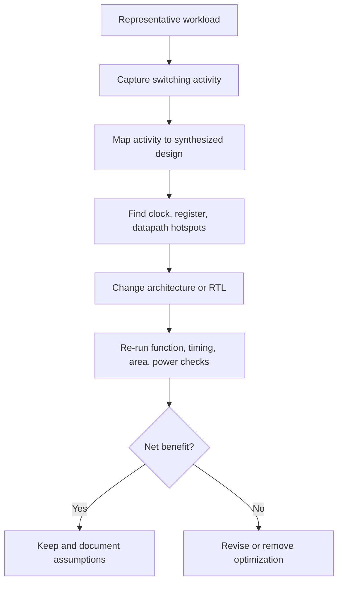

# Low-Power RTL Design

저전력 RTL 설계의 출발점은 특정 코딩 패턴이 아니라 한 가지 질문이다.

> 지금 이 logic이 움직일 필요가 있는가?

RTL이 기능적으로 정확해도, 결과가 사용되지 않는 동안 register와 combinational logic이 계속 바뀐다면 불필요한 동적 전력(dynamic power)을 소비할 수 있다. 따라서 저전력 설계는 먼저 불필요한 연산과 상태 변경을 제거하고, 남은 logic의 활동을 필요한 시간에만 허용하며, 실제 구현 결과로 효과와 비용을 확인하는 과정이어야 한다.

이 문서는 RTL 설계자가 제어하기 쉬운 switching activity와 capacitance의 관점에서 저전력 판단 방법을 설명한다. 전압 선택, cell library, power grid와 같은 구현 요소도 전체 전력에 중요하지만, 일반적으로 RTL 단계의 직접적인 결정 범위를 벗어난다.

## 1. Dynamic Power의 기본 관점

CMOS logic의 동적 전력은 흔히 다음과 같이 근사한다.

`P_dynamic ∝ α × C × V² × f`

- `α`: switching activity factor. 한 clock 주기 동안 node가 얼마나 자주 전환되는지를 나타낸다.
- `C`: switched capacitance. cell input, output load, 배선과 fanout 등이 기여한다.
- `V`: supply voltage. 전력에 제곱으로 영향을 준다.
- `f`: operating frequency. 같은 활동이 더 자주 반복될수록 동적 전력이 증가한다.

RTL 설계자가 주로 영향을 줄 수 있는 항목은 `α`, 설계 구조에 따른 유효 `C`, 그리고 clock activity다.

- register update를 멈추면 해당 register의 Q와 downstream logic의 전환을 줄일 수 있다.
- 불필요한 datapath를 제거하거나 width와 fanout을 줄이면 전환되는 capacitance도 줄어들 수 있다.
- clock gating이 실제로 구현되면 gated branch의 clock pin과 clock tree 활동을 줄일 수 있다.
- operand isolation을 적용하면 결과가 필요하지 않은 동안 큰 combinational block 내부의 전환을 억제할 수 있다.

이 식은 설계 방향을 이해하기 위한 모델이지, RTL만 보고 전력을 정확히 계산하는 공식은 아니다. 실제 전력은 cell, transition slew, glitch, routing, clock-tree 구조, 입력 activity와 분석 조건에 따라 달라진다. Leakage power와 short-circuit power도 별도로 존재한다.

## 2. 왜 RTL 단계에서 보아야 하는가

기능 simulation은 대개 “결과가 맞는가”를 확인한다. 하지만 사용되지 않는 값이 매 cycle 바뀌는 것과 안정적으로 유지되는 것은 기능적으로 동일해 보일 수 있다. 전력 관점에서는 동일하지 않다.

예를 들어 free-running counter의 값이 1,000 cycle 중 마지막 10 cycle에만 사용된다고 하자. 결과가 필요하지 않은 990 cycle 동안에도 counter의 낮은 bit는 빈번하게 toggle하고, incrementer와 비교 logic까지 움직일 수 있다. 이 활동은 기능 오류가 아니므로 일반적인 scoreboard가 잡아내지 않는다. 전력 낭비는 architecture와 RTL review에서 별도로 찾아야 한다.

또한 switching은 한 node에 국한되지 않는다.

```text
Control transition
       ↓
Register update
       ↓
Adder / Comparator / Decode
       ↓
Wide bus and high-fanout loads
       ↓
Additional internal glitches and routing activity
```

작은 제어 결정 하나가 큰 capacitance를 구동하는 cone 전체의 활동을 바꿀 수 있다. 반대로 enable 조건을 만들기 위해 복잡한 decode와 high-fanout net을 추가하면 절감 효과보다 overhead가 커질 수도 있다.

## 3. Low-Power 최적화 순서

이 가이드의 전체 최적화 흐름을 저전력 관점에 적용하면 다음과 같다.

```text
Remove
  ↓
Disable
  ↓
Simplify
  ↓
Share / Duplicate as appropriate
  ↓
Pipeline or Multi-Cycle Path, when functionally justified
  ↓
Physical optimization
```

저전력 설계에서 특히 중요한 앞부분은 다음과 같다.

1. **Remove:** 그 값이나 연산 자체가 필요한지 확인한다. 제거된 logic은 data와 clock 모두에서 추가 제어가 필요 없다.
2. **Disable:** logic은 필요하지만 현재 구간에서 결과를 사용하지 않는다면 register enable, operand isolation 또는 적절한 clock gating을 검토한다.
3. **Simplify:** width, decode 조건, state와 control dependency를 줄여 전환되는 logic과 capacitance를 낮춘다.
4. **Measure:** 절감한 switching과 추가된 mux, enable generation, clock-gating cell 및 routing 비용을 구현 결과에서 함께 확인한다.

`enable`을 추가하는 것은 첫 단계가 아니다. 예를 들어 두 번 clear되는 counter라면 첫 clear 이후 두 번째 clear 전까지의 count가 버려지는지 먼저 본다. 버려진다면 그 구간의 count를 멈추는 것은 단순 gating보다 architecture를 더 정확히 표현하는 일이다. 자세한 사례는 [Counter Optimization](counter_optimization.md)에서 다룬다.

## 4. Unnecessary Switching 찾기

각 상태 값과 연산 결과를 다음 세 종류로 나누어 보면 유용하다.

| 분류 | 질문 | 우선 검토 |
|---|---|---|
| 항상 필요 | 매 cycle 새 값이 기능적으로 필요한가? | width, logic depth, fanout 단순화 |
| 조건부 필요 | 특정 state, valid 또는 transaction 구간에서만 필요한가? | enable, operand isolation, clock gating |
| 불필요 | 어느 관찰 지점에서도 사용되지 않는가? | logic 및 update 제거 |

“사용되지 않는다”는 단지 datapath의 최종 결과에 연결되지 않는다는 뜻만은 아니다. 다음 관찰 가능성을 함께 확인해야 한다.

- downstream logic이 중간 값을 읽는가?
- status, interrupt 또는 protocol condition을 만드는가?
- assertion, safety monitor 또는 error detection에 사용되는가?
- scan, debug 또는 architectural state로 관찰되어야 하는가?
- reset 이후 software-visible 또는 interface-visible 값이 정의되어야 하는가?

이 계약이 명확해야 값을 hold하거나 연산을 제거해도 기능이 유지된다. 최적화 전후 RTL이 모든 cycle에서 bit-for-bit 동일할 필요는 없을 수 있지만, 명세가 정의한 모든 관찰 지점에서는 동일해야 한다.

## 5. Register Enable

가장 기본적인 data activity 제어는 register enable이다.

```systemverilog
always_ff @(posedge clk or negedge rst_n) begin
    if (!rst_n)
        q <= '0;
    else if (en)
        q <= d;
end
```

### Hardware view

개념적으로는 다음과 같은 feedback mux로 볼 수 있다.

```text
               ┌───────────┐
        d ─────┤1          │
               │    MUX    ├──── D ┌─────┐
Q feedback ────┤0          │       │ FF  ├─── q
               └─────┬─────┘       └─────┘
                     en                ↑
                                      clk
```

구현에서는 library의 clock-enable 기능이 있는 sequential cell, feedback mux, 또는 합성 및 low-power flow가 허용하는 clock gating 구조 등으로 mapping될 수 있다. 어떤 형태가 선택되는지는 target library, coding context, gating 정책, fanout과 도구 설정에 따라 달라지므로 RTL 패턴만 보고 단정해서는 안 된다.

### 기대 효과

- `en == 0`인 동안 Q가 유지되므로 register update에서 시작되는 downstream combinational switching을 줄일 수 있다.
- Register enable만으로 `d`를 생성하는 upstream datapath가 자동으로 멈추는 것은 아니다. 그 logic의 결과가 필요하지 않을 때도 operand가 바뀐다면 operand isolation이나 별도의 functional gating을 검토한다.
- 여러 register가 같은 enable을 공유하면 synthesis flow가 local clock gating을 추론할 여지가 있다.

### 비용과 주의점

- feedback mux 또는 enable-capable cell의 data path 비용이 생길 수 있다.
- enable generation logic 자체가 area와 power를 소비한다.
- enable이 많은 load를 구동하면 fanout, routing과 enable arrival timing이 문제가 될 수 있다.
- enable 조건이 data path의 critical timing에 들어오면 setup 여유가 줄 수 있다.
- enable을 위한 새 state bit나 register를 추가하면 그 register의 clock power와 reset 비용까지 생긴다.
- data register의 clock pin은 계속 toggle할 수 있다. RTL enable이 있다고 해서 clock power가 자동으로 줄었다고 가정하면 안 된다.

따라서 “모든 register에 enable 추가”는 일반적인 저전력 규칙이 아니다. 큰 register bank가 오랫동안 idle이고 enable 조건이 이미 존재할 때는 유리할 수 있지만, 자주 update하는 작은 register에 복잡한 enable decode를 추가하면 순효과가 작거나 나빠질 수 있다.

## 6. Clock Gating과의 관계

register enable과 clock gating은 목적이 겹치지만 hardware 의미가 다르다.

```systemverilog
if (en)
    q <= d;
```

위 코드는 synchronous data update 조건이다. STA는 `en`을 포함한 data-side timing을 검증할 수 있다. synthesis flow가 이 패턴으로부터 clock gating을 추론할 수는 있지만, 그것은 별도의 구현 결정이다.

반면 다음과 같이 clock을 일반 combinational logic으로 직접 만들면 glitch, runt pulse 또는 unintended edge 위험이 있다.

```systemverilog
// 피해야 할 raw combinational clock gating
assign gclk = clk & en;
```

clock activity를 줄여야 한다면 승인된 integrated clock-gating(ICG) 구조와 flow를 사용해야 한다. clock enable을 다시 생성하는 always-on control까지 같은 gated clock 아래에 넣어 self-deadlock을 만들지 않는지도 확인해야 한다. 자세한 내용은 [Clock Gating](../06_clock/clock_gating.md)을 참고한다.

## 7. Operand Isolation

register update를 막아도 그 앞의 combinational operand가 계속 바뀌면 block 내부 switching은 남을 수 있다. 결과를 사용하지 않는 동안 expensive datapath의 입력 활동을 차단하는 기법이 operand isolation이다.

```systemverilog
logic [31:0] isolated_a;
logic [31:0] isolated_b;
logic [32:0] sum;

assign isolated_a = calc_en ? a : '0;
assign isolated_b = calc_en ? b : '0;
assign sum        = isolated_a + isolated_b;
```

```text
a ── isolation MUX ─┐
                    ├─ ADDER ─ result
b ── isolation MUX ─┘
        ↑
      calc_en
```

`calc_en == 0`인 동안 `a`와 `b`가 바뀌어도 adder 입력은 고정되므로 adder 내부의 activity를 줄일 수 있다. multiplier, wide comparator, barrel shifter와 같이 내부 capacitance와 switching이 큰 block에서 후보가 될 수 있다.

하지만 isolation mux와 control net은 공짜가 아니다.

- mux가 active data path에 추가되어 timing을 악화할 수 있다.
- `calc_en` 생성과 distribution에 area, power와 routing 비용이 든다.
- block이 작거나 거의 항상 active라면 절감보다 overhead가 클 수 있다.
- isolation value가 `0`이어야 한다는 법은 없다. 기능과 downstream switching을 고려해 안전한 stable value를 선택한다.
- control 전환 순간의 glitch와 실제 gate-level activity는 RTL simulation만으로 충분히 보이지 않을 수 있다.

또한 synthesis가 사용되지 않는 결과를 이미 제거할 수 있는 구조라면 사람이 isolation logic을 추가해 RTL을 복잡하게 만들 이유가 없다. 먼저 synthesis 결과와 cone의 실제 존재 여부를 확인한다.

## 8. 대표적인 Toggle Hotspot

### Free-running counter

binary counter의 least significant bit(LSB)는 active cycle마다 바뀌고, 상위 bit로 carry가 전파된다. 값이 사용되지 않는 구간이 길다면 register와 incrementer 모두 좋은 최적화 후보가 된다.

### Clock network

clock은 매 cycle 큰 fanout의 sequential pin과 clock-tree capacitance를 구동한다. data Q가 hold되어도 clock pin activity는 남는다. 효과적인 clock gating은 큰 절감 가능성이 있지만, gating cell, test enable, clock-tree 구조와 enable safety를 함께 검토해야 한다.

### Address generator와 pointer

순차 주소나 FIFO pointer는 반복적으로 arithmetic logic과 여러 bit를 전환한다. transaction이 없을 때도 update되는지, speculative update 결과가 실제로 사용되는지 확인한다.

### Wide bus

wide datapath가 먼 거리와 많은 load를 구동하면 작은 activity factor도 큰 switched capacitance로 이어질 수 있다. source register의 enable뿐 아니라 bus encoding, locality, operand isolation과 destination의 실제 사용 조건을 본다.

### High-fanout control

`valid`, `mode`, `enable`, `clear` 같은 control은 bit 수가 작아도 많은 load와 routing capacitance를 가질 수 있다. 불필요한 pulse나 combinational glitch가 있는지, registered control로 단순화할 수 있는지 확인한다.

## 9. Measure First, Measure Again

저전력 최적화는 activity 가정만으로 완료되지 않는다. 대표 workload와 구현 단계에 맞는 분석을 통해 전후를 비교해야 한다.



### Activity 품질 확인

- idle과 active 구간의 비율이 실제 사용 조건을 대표하는가?
- mode, back-to-back transaction, burst와 error path가 포함되어 있는가?
- 초기화 직후의 비현실적인 X-to-known 전환을 정상 활동으로 해석하지 않았는가?
- clock gating, reset과 test-related mode를 어떤 조건으로 분석했는가?
- activity가 없는 net에 도구가 적용한 default toggle assumption을 알고 있는가?

RTL activity는 architecture 후보를 찾는 데 유용하지만, internal cell glitch와 실제 routing capacitance를 충분히 반영하지 못한다. 합성 후 또는 physical 정보가 반영된 분석에서 hotspot 순서가 바뀔 수 있다. 반대로 late-stage report만 보고 기능 계약을 모른 채 gating을 추가해서도 안 된다. architecture 지식과 구현 feedback을 반복해서 연결한다.

### 함께 비교할 지표

전력만 낮아졌는지 보지 말고 다음을 함께 확인한다.

| 항목 | 확인할 변화 |
|---|---|
| Function | invalid 구간의 값 변경이 외부에서 관찰되지 않는가? |
| Timing | enable/isolation mux와 control fanout이 critical path를 만들지 않는가? |
| Power | data, clock, combinational switching이 실제로 얼마나 줄었는가? |
| Area | 추가 mux, ICG, control FF와 routing 비용은 얼마인가? |
| Robustness | reset, simultaneous event, mode transition에서 조건이 안전한가? |
| Maintainability | optimization assumption이 RTL과 문서, assertion에 드러나는가? |

## 10. Trade-offs

| 기법 | 주요 이점 | 가능한 비용 | 적합한 상황 |
|---|---|---|---|
| Logic/update 제거 | data와 control activity 자체 제거 | 관찰 가능성 계약 확인 필요 | 값이나 중간 연산이 실제로 불필요할 때 |
| Register enable | Q와 downstream activity 감소 | feedback mux, enable timing/fanout | idle 구간이 길고 update 조건이 명확할 때 |
| Inferred clock gating | clock branch activity 감소 가능 | ICG 및 enable-check 비용, flow 의존성 | 같은 enable을 공유하는 충분한 register group |
| Explicit/manual ICG insertion | clock boundary와 implementation ownership 명확화 | wrapper, DFT/STA/CDC와 enable 책임 | architecture가 gating boundary를 직접 소유해야 할 때 |
| Coarse/function-level granularity | 큰 function의 clock tree와 FF activity 감소 | always-on control, wake-up, verification 복잡도 | function 단위 idle이 길고 activity가 함께 멈출 때 |
| Operand isolation | 큰 combinational block activity 감소 | input mux와 control overhead | expensive block 결과가 자주 버려질 때 |
| Width 축소 | FF, arithmetic, mux와 routing 감소 가능 | range/overflow 검증 필요 | 값의 최대 범위가 명확할 때 |

`Inferred`와 `explicit/manual`은 **gating을 누가 삽입하고 소유하는가**를 나타내고, `fine-grain`과 `coarse-grain/function-level`은 **어느 범위의 clock load를 함께 멈추는가**를 나타낸다. 두 분류 축은 독립적이므로 하나의 선택지처럼 혼동하지 않는다.

어떤 기법도 항상 유리하지 않다. 예를 들어 logic sharing은 area를 줄일 수 있지만 공유 mux와 fanout을 늘려 timing과 switching을 악화할 수 있다. 반대로 timing을 위해 logic을 duplicate하면 area와 leakage가 증가할 수 있다. 목표 workload와 PPA 우선순위에 따라 결정한다.

## 11. Common Mistakes

### 결과가 사용되지 않는데 매 cycle update한다

기능적으로 문제없다는 이유로 free-running counter, predictor 또는 debug-related state를 계속 갱신한다. 먼저 유효 구간을 정의하고 update 제거 가능성을 본다.

### 사용하지 않는 값을 매번 clear한다

invalid 구간의 값이 don't-care라면 `0`으로 만드는 것도 switching이다. 다음 valid 시점에 반드시 초기화된다면 그 전에는 hold하는 편이 나을 수 있다.

### 모든 register에 enable을 추가한다

enable decode, mux, fanout과 timing 비용을 평가하지 않은 채 일괄 적용한다. hotspot과 idle residency를 먼저 측정한다.

### RTL enable을 clock gating으로 간주한다

Q가 hold된다는 사실과 clock pin이 멈춘다는 사실을 혼동한다. 구현된 netlist와 clock-gating report에서 실제 mapping을 확인한다.

### raw gated clock을 만든다

일반 combinational `AND` 또는 `OR`로 clock을 생성한다. clock은 data와 달리 edge 자체가 state transition을 일으키므로 검증된 ICG와 clock flow를 사용한다.

### 전력만 보고 timing을 악화시킨다

operand isolation 또는 enable mux가 critical path에 들어갈 수 있다. 전력, timing, area를 같은 변경에서 다시 확인한다.

### 비대표 activity로 절감률을 단정한다

긴 idle test 하나만으로 정상 workload의 효과를 판단하거나, activity annotation이 빠진 net의 추정치를 실제 수치처럼 해석한다. 분석 조건과 coverage를 함께 기록한다.

## 12. Design Checklist

### Requirement와 관찰 가능성

- [ ] 이 값은 어느 cycle과 어느 interface에서 실제로 사용되는가?
- [ ] invalid 구간의 값은 truly don't-care인가?
- [ ] debug, safety, assertion 또는 status logic이 중간 값을 관찰하는가?
- [ ] update를 제거해도 protocol과 architectural state가 유지되는가?

### Switching과 clock

- [ ] free-running counter, pointer 또는 address generator가 있는가?
- [ ] 큰 datapath가 결과를 사용하지 않을 때도 toggle하는가?
- [ ] 같은 enable을 공유하는 register group이 있는가?
- [ ] clock gating을 적용한다면 ICG, always-on control과 wake-up dependency가 안전한가?
- [ ] high-fanout control에 불필요한 glitch나 pulse가 없는가?

### PPA와 검증

- [ ] enable 또는 isolation logic의 area/timing/power 비용을 포함했는가?
- [ ] 대표 workload로 activity를 수집했는가?
- [ ] synthesis 또는 physical 정보를 반영해 절감 효과를 다시 확인했는가?
- [ ] reset, mode transition, simultaneous event와 back-to-back event를 검증했는가?
- [ ] 최적화의 functional assumption을 문서와 assertion으로 남겼는가?

## 다음 문서

- [Register Enable](register_enable.md): update/hold semantics와 enable generation cost
- [Counter Optimization](counter_optimization.md): 사용되지 않는 count 구간을 제거하는 대표적인 low-power architecture 사례
- [Operand Isolation](operand_isolation.md): 결과가 필요하지 않을 때 combinational activity를 막는 방법
- [Clock Gating](../06_clock/clock_gating.md): inferred gating, ICG와 안전한 clock control
