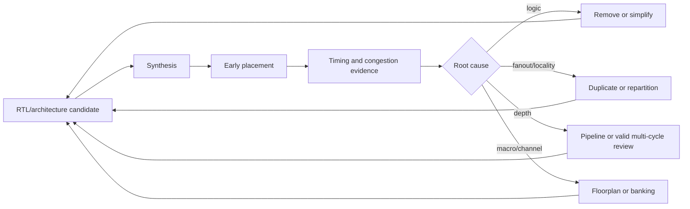

# Physical Area and Congestion

RTL area optimization은 mapped cell area에서 끝나지 않는다. 실제 block footprint에는 placement whitespace, routing channel, clock/reset tree, high-fanout buffers, timing/hold fixes, macro halo와 power-grid 제약이 포함된다. 논리 cell을 줄였는데 배치 면적이나 timing closure 비용이 늘 수도 있다.

> “합성 area가 작으므로 physical area도 작다”는 결론은 early proxy일 뿐이다. Placement와 routing 단계의 utilization, congestion, buffer/upsizing, wire length와 timing evidence로 확인한다.

Architecture 후보와 PPA evidence 기록은 [Microarchitecture Decision Record](../02_architecture/microarchitecture_decision_record.md), timing 경로 판단은 [Timing Overview](../03_timing/overview.md), memory macro 구조는 [Memory and Register Array](memory_and_register_array.md)가 담당한다.

## 1. Area의 서로 다른 의미

| 지표 | 포함하는 것 | 놓칠 수 있는 것 |
|---|---|---|
| RTL object count | register, operator, array | mapping/library/route |
| Synthesis cell area | mapped standard cells/macros | placement whitespace, wires |
| Placed cell area | legalization/optimization cells | detailed-route detour/final fixes |
| Core/block footprint | cells, whitespace, macros, channels | chip-level shared infrastructure |
| Routed implementation | final buffers, upsizing, hold fixes | signoff ECO 이후 변화 |

비교할 때 같은 경계와 같은 stage의 숫자를 사용한다. 한 후보는 macro core area만, 다른 후보는 standard-cell footprint 전체를 비교하면 의미가 없다.

## 2. Utilization과 Routability

Nominal utilization은 대략 다음처럼 보일 수 있다.

```text
utilization = placed standard-cell area / placeable standard-cell area
```

하지만 평균 utilization이 같아도 local congestion은 다를 수 있다.

```text
low average utilization

┌─────────────────────────────────────┐
│ sparse logic     ████████████████   │
│                  █ pin-dense    █   │
│                  █ hotspot      █   │
│                  ████████████████   │
└─────────────────────────────────────┘
```

Macro corner, narrow channel, pin-dense MUX, wide bus crossing이나 central control fanout이 local overflow를 만든다. Routability를 위해 whitespace를 늘리면 footprint가 커진다. 따라서 target utilization은 design/technology/floorplan에 종속적이며 고정된 보편값이 아니다.

## 3. Congestion이 Area를 되돌려 늘리는 경로

Congestion은 단순 wire 문제로 끝나지 않는다.

```text
logical compaction
    ↓
pin density / long nets / route detours
    ↓
slew and timing degradation
    ↓
buffer insertion / cell upsizing / replication
    ↓
placed area and power increase
```

또한 detailed route를 통과시키기 위해 spreading, cell padding, blockage 조정 또는 floorplan 확대가 필요할 수 있다. Synthesis에서 절약한 작은 combinational cell 수보다 후속 fix가 더 클 수 있다.

## 4. Sharing과 Duplication의 Physical 경계

논리적으로는 resource 하나를 공유하면 operator count가 줄어든다. 물리적으로는 여러 producer/consumer가 중앙 resource로 모이면서 MUX, arbitration, long route와 fanout이 생긴다.

```text
shared

producer A ─┐
producer B ─┼─> request MUX ─> operator ─> result distribution
producer C ─┘

duplicated/local

producer A ─> operator A ─> consumer A
producer B ─> operator B ─> consumer B
producer C ─> operator C ─> consumer C
```

Sharing이 유리한 조건:

- 동시 사용이 없고 arbitration이 작다.
- Producer/consumer가 물리적으로 가깝다.
- Added latency/backpressure가 허용된다.
- Operator 자체가 MUX/routing보다 충분히 비싸다.

Duplication이 유리할 수 있는 조건:

- Consumer cluster가 멀리 분리되어 있다.
- Central result/control net의 fanout이 높다.
- Critical path에서 request/result MUX를 제거해야 한다.
- Locality가 power와 routing을 줄인다.

자세한 기능 판단은 [Resource Sharing vs Duplication](../02_architecture/resource_sharing_vs_duplication.md)을 따른다. Physical synthesis가 logic/register를 자동 복제할 수도 있지만 constraints와 tool option에 의존한다.

## 5. High-fanout Control과 Replication

Enable, clear, mode, valid와 select는 작은 논리식이어도 많은 sinks를 구동한다.

```text
central control ─────┬──── distant cluster 0
                     ├──── distant cluster 1
                     ├──── distant cluster 2
                     └──── distant cluster 3
```

Potential implementation cost:

- Buffer tree and transition repair
- Route length and metal usage
- Consumer input pin capacitance
- Skew between control arrival and data
- Placement attraction around the driver

Control decode를 consumer 근처에서 복제하면 source logic은 늘지만 long global net를 줄일 수 있다. 반대로 동일 replica가 합성에서 merge될 수 있고, RTL hierarchy를 억지로 고정하면 다른 최적화를 막을 수 있다. Flow-supported physical guidance와 post-place evidence가 필요하다.

## 6. Pipeline/Replication은 기능 계약을 가진다

다음 RTL은 control을 한 cycle pipeline한 뒤 여러 local state bits로 복제하려는 architecture intent를 보여준다. `REGIONS >= 1`만 지원하며 integration/elaboration check가 그 밖의 값을 거부해야 한다. Portable RTL만으로 physical placement나 replica 보존을 보장하지는 않는다.

```systemverilog
module registered_control_regions #(
    parameter int unsigned REGIONS = 4
) (
    input  logic               clk,
    input  logic               rst_n,
    input  logic               control_next,
    output logic [REGIONS-1:0] control_local
);
    // Event priority: reset > capture.
    always_ff @(posedge clk or negedge rst_n) begin
        if (!rst_n) begin
            control_local <= '0;
        end else begin
            control_local <= {REGIONS{control_next}};
        end
    end
endmodule
```

이 구조는 다음 cycle부터 모든 region에 같은 control 값을 제공한다. Zero-latency broadcast와는 기능적으로 다르므로 related data/valid도 같은 stage로 정렬해야 한다. Tool이 bits를 merge하거나 하나의 driver tree로 구현할 수 있으므로 mapped/post-place netlist에서 replica와 route를 확인한다. Flow-specific preservation directive를 공용 가이드의 기본 해법으로 사용하지 않는다.

## 7. Wide Bus와 MUX Topology

Bit width는 FF/operator뿐 아니라 pin과 wire 수를 늘린다.

- Wide crossbar: many inputs × many outputs × data width
- Central select: high fanout plus reconvergent MUX
- Long pipeline bus: repeated buffers and hold fixes
- Sparse field usage: unused bits still routed through generic interface

폭 축소는 [Bit Width Minimization](bit_width_minimization.md)을 따른다. 그러나 serializing/narrowing으로 cycle 수와 control/queue를 늘리면 총 area/energy가 악화될 수 있다.

MUX를 source 쪽에 둘지 destination 쪽에 둘지도 물리 topology를 바꾼다.

```text
source-side MUX: many short inputs -> one long wide bus
sink-side MUX:   many long buses -> local MUX
```

어느 쪽이 좋은지는 source/sink 수, floorplan, select timing과 route layers에 달려 있다.

## 8. Hierarchy와 Boundary Cost

Hierarchy는 ownership과 integration을 명확하게 하지만 optimization boundary가 될 수 있다.

- Boundary crossing bus와 feedthrough
- Repeated protocol adapters
- Separate synthesis preventing constant propagation
- Hard placement bounds creating narrow channels
- Excessive flattening losing locality and reuse intent

무조건 flatten하거나 보존하지 않는다. Stable physical partition, macro ownership, timing boundary와 compile scalability를 보고 결정한다. 논리적 owner는 명확하게 유지하되 tool이 필요한 최적화를 할 수 있는 flow를 선택한다.

## 9. Macro와 Pin-access Area

Memory, analog/IP macro는 core area 외에도 halo, keepout, routing blockage와 pin access channel을 요구한다.

```text
┌──────────────────────── block ────────────────────────┐
│ logic cluster   channel   ┌──── memory macro ────┐   │
│ ===== wide bus ==========>│ pins                 │   │
│                            └───────────────────────┘   │
│                 halo / power / route constraints      │
└────────────────────────────────────────────────────────┘
```

작은 macro 여러 개로 banking하면 parallel access는 좋아질 수 있지만 peripheral overhead, channels와 pin density가 늘 수 있다. 큰 macro 하나는 density가 좋지만 long bus와 access bottleneck을 만들 수 있다.

## 10. Clock, Reset과 Power Intent

Clock/reset는 block 전체에 분포되므로 logical control bit보다 물리 비용이 크다.

- More FFs increase clock sinks even if data logic shrinks.
- Resettable payload increases reset span and buffer tree.
- Clock gating adds ICG placement, enable timing and test control.
- Voltage islands add isolation, level shifters and boundary channels.

[Clock Design Overview](../06_clock/overview.md), [Reset Area Cost](reset_area_cost.md), [Low-Power RTL Design](../04_low_power/overview.md)의 기능/방법론 계약을 우선한다. Isolation/level-shifting의 상세 페이지는 아직 roadmap 범위이며, 현재는 low-power overview와 project methodology를 따른다. Area만을 위해 clock/reset/power safety를 약화하지 않는다.

## 11. Timing Closure가 만드는 Hidden Area

Timing optimization은 다음 cell을 추가하거나 키울 수 있다.

- Setup fix: upsized cells, low-Vt cells, buffers, logic replication
- Hold fix: delay cells and buffers
- Slew/capacitance fix: buffer trees
- Clock fix: CTS buffers/inverters and useful-skew structures
- ECO fix: spare/patch cells and route detours

합성 후보 A가 nominal cell area는 작아도 wire-sensitive path가 많으면 placed 후보 B보다 큰 fix cost를 가질 수 있다. Setup slack만 보지 말고 hold, transition, capacitance와 route DRC도 함께 본다.

## 12. Evidence-driven Optimization Loop



한 번에 여러 변수를 바꾸지 않는다. Candidate마다 constraint, floorplan seed/effort, corners와 report boundary를 최대한 맞추고 delta를 기록한다.

Pipeline은 register와 latency를 추가하는 hardware 변경이다. MCP는 이미 기능적으로 여러 cycle 뒤 capture하도록 설계된 source stability, destination enable과 setup/hold relationship을 STA에 표현하는 constraint이며 logic depth나 physical area를 줄이지 않는다. 따라서 single-cycle violation이나 congestion을 숨기기 위해 MCP를 적용해서는 안 된다. 상세 계약은 [Multi-Cycle Path](../03_timing/multi_cycle_path.md)를 따른다.

## 13. 비교할 Report와 Metric

### Synthesis

- Hierarchical cell area by sequential/combinational/buffer/macro
- Operator, MUX, FF, latch, clock-gating and resettable-cell counts
- High-fanout nets and replicated logic
- Timing paths and fanout estimates

### Placement/route

- Core/block dimensions and effective utilization
- Global/local congestion overflow and hotspot location
- Total/long wire length and via demand
- Buffer/inverter, upsizing and replica deltas
- Setup/hold/transition/capacitance violations
- Macro halo/channel and pin-access problems
- Clock/reset tree cell and route cost

### Candidate ledger

| Candidate | Synth cell area | Footprint | Buffers/fixes | WNS/TNS | Congestion | Functional change |
|---|---:|---:|---:|---|---|---|
| Baseline | baseline | baseline | baseline | baseline | hotspot map | none |
| Shared | delta | delta | delta | delta | map | arbitration/latency |
| Local duplicate | delta | delta | delta | delta | map | none or staged |

숫자만 아니라 hotspot 위치와 net/path identity를 보존한다. 평균 metric은 local failure를 숨길 수 있다.

## 14. PPA Trade-off

| Physical choice | Timing | Power | Area/footprint | 주요 위험 |
|---|---|---|---|---|
| Central sharing | MUX/long route 증가 가능 | fewer operators, global switching | logical cells 감소 가능 | hotspot/fanout |
| Local duplication | short local paths 가능 | duplicate activity 증가 가능 | cells 증가, route 감소 가능 | coherency/clock load |
| Pipeline | stage delay 감소 가능 | FF/clock power 증가 | registers/controls 증가 | latency/alignment |
| Width/bus 축소 | wire/load 감소 가능 | capacitance 감소 가능 | cells/routes 감소 가능 | serialization/control |
| Macro banking | parallel/local access 가능 | active-bank 제어 가능 | peripheral/channel 증가 | conflict/pin density |
| Higher utilization | wire/footprint 감소 후보 | capacitance 감소 가능 | core 축소 가능 | congestion/fix explosion |

각 행은 방향성일 뿐이다. Representative activity와 동일한 floorplan/constraint 조건에서 synthesis, placement와 route 결과를 함께 비교한다.

## 15. Optimization Order

Physical area에서도 저장소의 기본 순서를 유지한다.

1. **Remove**: unused feature/state/observer/conversion 제거
2. **Disable**: inactive block의 toggle/clocking 방지
3. **Simplify**: width, decode, protocol와 topology 단순화
4. **Share or duplicate**: 논리 count와 locality를 함께 판단
5. **Pipeline or valid multi-cycle review**: 필요하면 hardware를 pipeline하고, MCP는 이미 존재하는 기능적 multi-cycle capture만 표현
6. **Physical optimization**: placement, buffering, sizing, floorplan 조정

마지막 단계의 buffer/sizing으로 구조 문제를 계속 가리지 않는다. 반대로 physical evidence 없이 RTL을 무작정 복제하거나 pipeline하지 않는다.

## 16. 적용하면 안 되는 경우

- 기능 latency와 control alignment를 바꿀 수 없는데 physical 이유만으로 pipeline하는 경우
- Coherency/ordering을 증명하지 못한 채 state나 operator를 지역별로 복제하는 경우
- Clock/reset/power/CDC domain boundary를 넘겨 logic을 합치거나 share하는 경우
- Local congestion 원인을 확인하지 않고 utilization target만 올려 footprint를 줄이는 경우
- Macro halo, power grid 또는 pin-access requirement를 무시하고 floorplan을 압축하는 경우
- Functional multi-cycle capture가 없는데 timing/physical violation을 숨기려고 MCP를 적용하는 경우

## 17. Common Mistakes

- Synthesis cell area를 최종 footprint로 보고한다.
- 평균 utilization만 보고 local congestion을 무시한다.
- Shared operator의 MUX/arbitration/result distribution을 제외한다.
- Replica를 중복 logic이라고 모두 제거한다.
- Macro core area만 세고 halo, channel, pin access를 제외한다.
- Timing fix buffer와 hold cells를 다른 팀의 문제로 분리한다.
- RTL hierarchy가 physical locality를 자동 보장한다고 생각한다.
- 다른 constraint/floorplan/effort의 결과를 직접 비교한다.
- Area 개선을 위해 reset, CDC 또는 safety contract를 약화한다.

## 18. Verification and Signoff Strategy

- Architecture 후보 간 functional/sequential equivalence
- Pipeline/replication latency와 event priority assertion
- Synthesis netlist에서 intended sharing/replication/memory mapping 확인
- Early placement congestion and timing correlation
- Post-route setup/hold, transition, capacitance and DRC review
- Clock/reset/power-domain methodology checks
- Representative activity를 이용한 power comparison
- ECO 이후 area/timing/congestion regression

Physical optimization은 tool-specific 결과가 크므로 report path, constraint revision, library/corner와 tool version을 실험 기록에 남긴다. 공개 문서나 예제에는 회사 내부 floorplan이나 실제 제품 수치를 넣지 않는다.

## 19. Design Review Checklist

- [ ] 비교하는 area metric의 stage와 boundary가 같은가?
- [ ] Standard cells, macros, whitespace, channels와 physical fixes를 포함했는가?
- [ ] Local congestion hotspot과 원인 net/pin을 확인했는가?
- [ ] Sharing/duplication을 logic count와 locality 양쪽에서 평가했는가?
- [ ] Wide bus, MUX, high-fanout control의 route cost를 확인했는가?
- [ ] Macro halo, pin access와 power/clock/reset 구조를 포함했는가?
- [ ] Setup뿐 아니라 hold/slew/capacitance fix area를 확인했는가?
- [ ] 동일 constraint/floorplan 조건에서 후보를 비교했는가?
- [ ] 기능 변경이 있다면 latency, ordering와 verification을 갱신했는가?
- [ ] RTL 수정 전 root cause가 physical evidence로 확인됐는가?

## 관련 문서

- [Area Overview](overview.md)
- [Memory and Register Array](memory_and_register_array.md)
- [Resource Sharing vs Duplication](../02_architecture/resource_sharing_vs_duplication.md)
- [Latency, Throughput and II](../02_architecture/latency_throughput_ii.md)
- [Pipeline Design](../03_timing/pipeline.md)
- [Multi-Cycle Path](../03_timing/multi_cycle_path.md)
- [Timing Overview](../03_timing/overview.md)
- [Clock Design Overview](../06_clock/overview.md)
- [Fanout and Locality](../12_physical_aware/fanout_and_locality.md)
- [Congestion-Aware Structure](../12_physical_aware/congestion_aware_structure.md)
