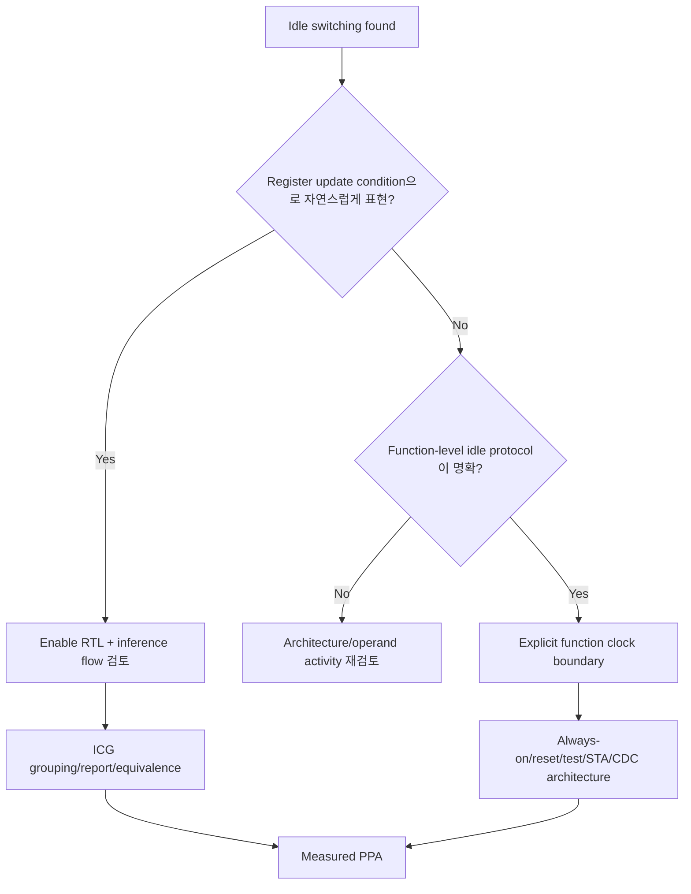

# Inferred vs Explicit Clock Gating

Inferred clock gating과 explicit clock gating은 둘 다 clock activity를 줄일 수 있지만, RTL intent와 구현 책임의 위치가 다르다.

> 어느 방식이 더 “고급”인지를 고르는 것이 아니라, functional boundary를 누가 정의하고 ICG insertion·검증을 어느 flow가 책임지는지 결정하는 문제다.

ICG의 안전한 동작 원리는 [Clock Gating](clock_gating.md)을 먼저 참고한다.

## 1. Definitions

### Inferred clock gating

RTL은 register enable semantics를 표현하고, synthesis/low-power flow가 공통 enable을 가진 register group을 찾아 ICG로 변환한다.

```systemverilog
always_ff @(posedge clk) begin
    if (en) begin
        q0 <= d0;
        q1 <= d1;
    end
end
```

RTL에는 functional enable이 있고, 실제 ICG insertion은 flow가 결정한다.

### Explicit clock gating

Architecture가 function-level clock boundary를 정의하고, technology wrapper나 approved clock-control interface를 RTL/hierarchy에 명시한다.

```text
root_clk ── approved ICG wrapper ── function_clk ── function registers
                         ▲
                  function_enable
```

Generic guide에서 raw library cell instance나 vendor-specific attribute를 정답으로 고정하지 않는다.

## 2. Responsibility Comparison

| 항목 | Inferred | Explicit/function-level |
|---|---|---|
| RTL의 중심 표현 | register update condition | clock architecture boundary |
| Grouping | tool threshold/analysis에 의존 | designer가 hierarchy/load를 의도 |
| Portability | 상대적으로 높음 | wrapper/flow dependency 증가 |
| Fine/coarse grain | fine/medium grain에 흔함 | coarse/function grain에 적합 |
| Wake-up ownership | 기존 clock 아래에 남는 경우가 많음 | always-on partition을 직접 설계 |
| 검증 핵심 | inference 결과와 equivalence | clock on/off protocol 전체 |

## 3. Inferred Gating이 적합한 경우

- 동일하거나 compatible한 enable을 가진 register가 충분히 많다.
- Functional semantics는 register enable로 자연스럽게 표현된다.
- Project synthesis flow가 clock gating insertion과 equivalence 검증을 지원한다.
- Hierarchy boundary를 새 clock interface로 노출할 필요가 없다.
- Tool이 grouping/threshold를 physical condition에 맞춰 선택하는 편이 유리하다.

확인할 report:

- inserted ICG 수와 gated register 수
- enable condition과 source
- ungated register reason
- test enable connection
- clock-gating check
- area/power before-after

## 4. Explicit Gating이 적합한 경우

- Function 전체가 긴 시간 명확한 idle state에 들어간다.
- Clock-on/off handshake가 architecture interface다.
- Always-on controller와 gated function 경계가 명확하다.
- Clock tree partition을 early planning해야 한다.
- IP integration contract가 function clock을 요구한다.

Explicit gating은 다음 책임을 동반한다.

- enable safe-phase behavior
- wake-up source와 self-deadlock 방지
- reset/interrupt/status behavior
- scan/test override
- clock relationship constraints
- CDC/RDC와 physical verification

## 5. Fine-Grain vs Coarse-Grain

```text
Fine grain
root ─┬─ ICG ─ small FF group
      ├─ ICG ─ small FF group
      └─ ICG ─ small FF group

Coarse grain
root ── ICG ─ function clock ─ FSM + counters + datapath
```

Fine grain은 activity opportunity를 세밀하게 잡지만 ICG 수, enable routing과 local clock-tree overhead가 늘 수 있다. Coarse grain은 큰 clock load를 한 번에 멈출 수 있지만 idle/wake protocol과 always-on partition이 복잡해진다.

## 6. Functional Equivalence Boundary

Register enable과 gated clock은 ideal functional condition에서 같은 state update를 만들 수 있다.

```text
Data-enable model: every clock edge arrives, FF holds when en=0
Gated-clock model: en=0 interval에는 FF에 active edge가 도달하지 않음
```

하지만 reset, test, clock stop/restart, X behavior와 timing check까지 자동으로 동일한 것은 아니다. Clock-gating conversion flow는 equivalence와 implementation checks를 사용해야 한다.

## 7. Common Failure Modes

### Inference를 가정하고 측정하지 않음

Enable RTL이 data MUX로 남을 수 있다. Clock power 절감을 주장하려면 actual implementation을 확인한다.

### 너무 작은 group을 gating

ICG/enable overhead가 load 절감보다 커질 수 있다.

### Function-level enable을 combinational decode로 직접 생성

Safe-phase stability, glitch와 late gating check 문제가 생길 수 있다. Approved control strategy를 따른다.

### Test enable 누락

Scan에서 gated branch가 controllable하지 않을 수 있다.

### Wake controller를 gated region 안에 배치

Clock이 꺼진 뒤 enable을 갱신할 수 없는 self-deadlock이 생긴다.

## 8. Selection Flow



## 9. Design Review Checklist

- [ ] Functional intent가 register enable인지 clock boundary인지 구분했는가?
- [ ] Inference를 사용할 경우 actual ICG insertion report를 확인했는가?
- [ ] Group size와 idle duty cycle이 ICG overhead를 정당화하는가?
- [ ] Explicit gating의 always-on/wake-up partition이 명확한가?
- [ ] Functional/test enable priority가 정의됐는가?
- [ ] Clock-gating setup/hold check와 generated clock modeling이 적용됐는가?
- [ ] Clock off 중 reset, interrupt와 input 변화가 정의됐는가?
- [ ] Equivalence, CDC/RDC와 post-route PPA를 확인했는가?

## 관련 문서

- [Clock Design Overview](overview.md)
- [Clock Gating](clock_gating.md)
- [Root Clock vs Function Clock](root_vs_function_clock.md)
- [Register Enable](../04_low_power/register_enable.md)
