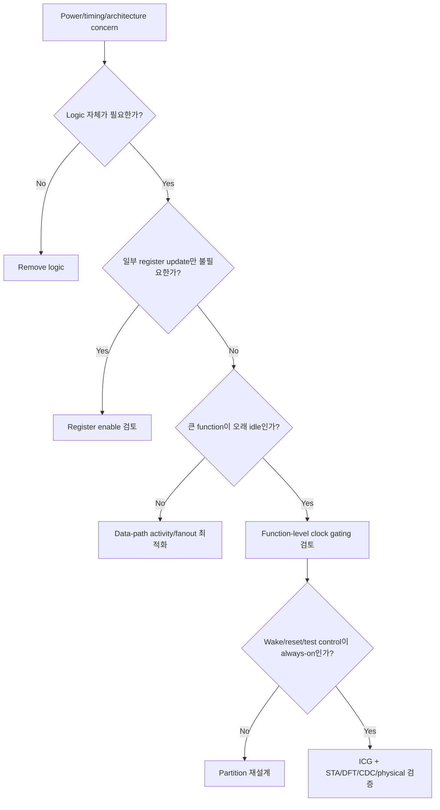

# Clock Design Overview

Clock network는 chip의 state transition을 일으키고 많은 sequential load를 반복해서 구동한다. RTL designer에게 clock 설계는 단순히 `posedge clk`를 쓰는 문제가 아니라, clock source·domain·gating·reset·test·wake-up 관계를 architecture로 정의하는 일이다.

> Clock edge를 제어하는 변경은 data 값을 제어하는 변경보다 더 넓은 functional·timing·physical 책임을 만든다.

공통 용어는 [Canonical RTL Design Terminology](../01_fundamentals/terminology.md)를 따른다.

## 1. Clock Architecture를 먼저 그린다

```text
clock source / PLL
        │
    root clock
        │
   ┌────┴───────────────┐
   │                    │
always-on logic      safe ICG
                        │
                  function clock
                  ┌─────┼─────┐
                 FSM  counter datapath
```

그림에는 다음을 표시한다.

- clock source와 frequency/phase 관계
- mux, divider와 gate
- always-on logic
- stopped-clock behavior
- reset assertion/deassertion sequence
- test/scan override
- crossing과 handshake

## 2. Clock는 일반 Data가 아니다

Clock waveform의 짧은 glitch도 sequential cell에는 의도하지 않은 edge가 될 수 있다.

```systemverilog
// 일반적인 RTL에서 피해야 하는 raw clock generation
assign gclk = clk & en;
```

`en`이 clock high phase에서 바뀌면 truncated pulse, delayed edge 또는 extra transition이 생길 수 있다. 안전한 gating은 target flow가 제공하는 ICG 또는 검증된 equivalent structure를 사용한다. 자세한 내용은 [Clock Gating](clock_gating.md)을 참고한다.

## 3. Clock Design Decision Flow



Clock gating 전에 removal과 register enable을 먼저 보는 이유는 gating이 clock architecture 책임을 늘리기 때문이다.

## 4. 주요 선택

| 선택 | 적합한 상황 | 주요 비용 |
|---|---|---|
| No gating | activity가 높거나 clock load가 작음 | clock switching 유지 |
| Register enable | 일부 state update만 조건부 | data MUX/enable fanout |
| Inferred clock gating | 반복되는 enable pattern을 flow가 ICG로 묶을 수 있음 | inference quality와 report 검증 |
| Explicit/function-level gating | architecture boundary와 idle protocol이 명확함 | always-on, wake-up, reset, DFT 책임 |

구현 경계는 [Inferred vs Explicit Clock Gating](inferred_vs_explicit.md)을 참고한다.

## 5. Root와 Function Partition

Function clock이 off일 때도 다음 logic은 살아 있어야 할 수 있다.

- wake-up request 수신
- clock enable state
- reset release sequencing
- interrupt/status capture
- power/clock handshake
- test override

이 logic을 같은 gated clock 아래에 두면 function이 스스로 clock을 다시 켤 수 없는 self-deadlock이 생길 수 있다. 자세한 partition 기준은 [Root Clock vs Function Clock](root_vs_function_clock.md)을 참고한다.

## 6. STA 관점

Clock architecture가 바뀌면 다음 분석이 달라질 수 있다.

- generated/gated clock relationship
- clock-gating setup/hold check
- skew와 insertion delay
- mode별 active clock
- clock mux exclusivity
- stopped-clock path와 handshake

Clock gating은 data path setup violation을 숨기는 방법이 아니다. Data path와 gating control path를 각각 분석한다.

## 7. Reset와 Test

Synchronous reset은 active clock edge가 있어야 적용된다. Clock이 off인 상태에서 reset을 요구한다면 clock-on sequence, asynchronous assertion 또는 별도 reset architecture가 필요하다.

Reset source, domain-local release와 reset-done sequencing은 [Reset Architecture Overview](../07_reset/overview.md), gated/stopped clock의 구체적인 sequence는 [Reset with Clock Gating](../07_reset/reset_with_clock_gating.md)을 따른다.

Scan/test mode에서는 gated branch에 controllable clock이 필요할 수 있다. Functional enable과 test enable의 결합·priority는 library와 DFT methodology에 맞춰야 한다.

## 8. Physical and Power View

Clock gating의 절감은 gated load의 clock pin과 하위 clock tree activity가 줄 때 발생한다. 반면 다음 overhead가 생긴다.

- ICG cell internal power/area
- enable routing과 buffer
- clock tree partition
- placement 제약과 local skew
- test/reset/wake control

Gated register 수, idle duty cycle, switching activity와 physical clock load를 포함해 평가한다.

## 9. Verification View

- Clock on/off boundary에서 transaction이 손실되지 않는가?
- Enable이 safe phase requirement를 만족하는가?
- Reset이 clock off 중 들어오거나 풀리는 경우가 정의됐는가?
- Back-to-back sleep/wake 요청이 안전한가?
- Function output이 off 상태에서 stable/isolated한가?
- CDC/RDC tool이 clock 관계와 구조를 인식하는가?
- Gate-level/clock-aware verification이 필요한 위험이 있는가?

## 10. Design Review Checklist

- [ ] Clock tree와 domain/gating boundary diagram이 있는가?
- [ ] Raw combinational clock generation이 없는가?
- [ ] Register enable로 충분한 문제인지 먼저 검토했는가?
- [ ] Gated function의 idle entry/exit protocol이 정의됐는가?
- [ ] Wake-up과 clock-enable logic이 always-on인가?
- [ ] Reset과 test clock behavior가 정의됐는가?
- [ ] Gating check, generated clock와 mode constraint가 검증됐는가?
- [ ] Gated load와 idle duty cycle을 이용해 PPA 이익을 측정했는가?
- [ ] Clock stop/restart를 포함한 functional verification을 수행했는가?

## 다음 문서

- [Clock Gating](clock_gating.md)
- [Inferred vs Explicit Clock Gating](inferred_vs_explicit.md)
- [Root Clock vs Function Clock](root_vs_function_clock.md)
- [Register Enable](../04_low_power/register_enable.md)
- [Reset Architecture Overview](../07_reset/overview.md)
- [Reset with Clock Gating](../07_reset/reset_with_clock_gating.md)
- [Reset Area Cost](../05_area/reset_area_cost.md)
