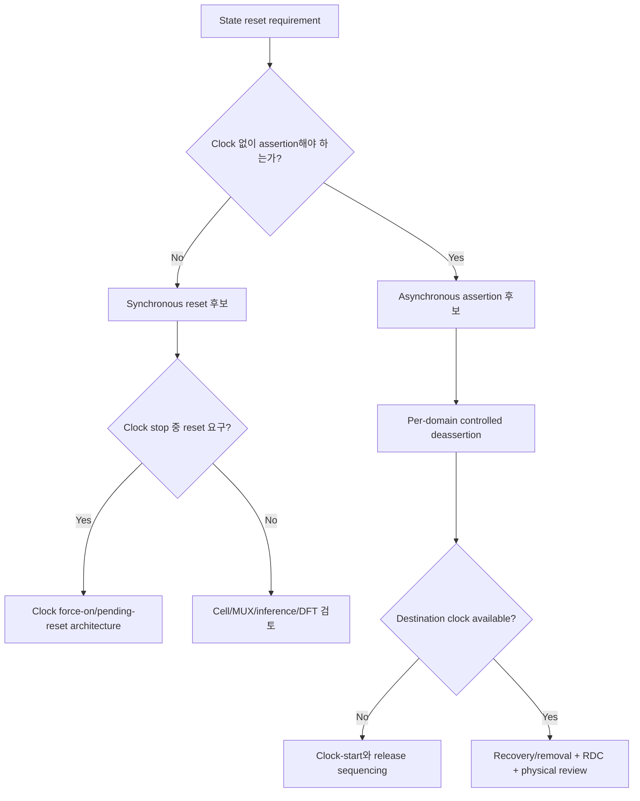

# Reset Architecture Overview

Reset은 register에 초기값을 쓰는 문법이 아니다. 어떤 state를 폐기하고 어떤 state를 보존하며, clock과 power가 어떤 상태일 때 reset을 적용하고, 언제 interface를 다시 사용할 수 있는지를 정의하는 **functional initialization and recovery protocol**이다.

> 이 장에서 `*_rst_n`은 active-low reset이다. `0`이 assertion, `1`이 deassertion이다. Active-high reset을 사용하는 설계에서는 polarity를 바꾸되 assertion/release 의미와 domain contract를 동일하게 명시한다.

Reset의 cell/tree/memory inference 비용은 [Reset Area Cost](../05_area/reset_area_cost.md), clock gate와 root/function partition은 [Clock Design Overview](../06_clock/overview.md), data/event crossing은 [CDC Overview](../08_cdc/overview.md)가 canonical하게 다룬다. 이 장은 reset requirement, reset style, release sequencing, resetless state와 gated-clock interaction을 연결한다.

## 1. 왜 Reset이 필요한가

Reset requirement는 보통 다음 중 하나에서 온다.

- Power-up 뒤 externally visible state를 known value로 만든다.
- Protocol valid, pointer, FSM과 credit를 legal idle phase로 만든다.
- Error, timeout, abort 또는 software request 뒤 recovery point를 제공한다.
- Reset domain 사이의 stale transaction과 phantom event를 차단한다.
- Test, scan, debug 또는 safety requirement가 정한 상태로 진입한다.
- Clock/power transition 뒤 block이 다시 사용할 수 있음을 증명한다.

“Simulation에서 X를 없애기 위해”만 reset을 추가하면 functional requirement 없이 reset fanout과 release risk를 늘릴 수 있다. 반대로 protocol state를 reset하지 않으면 hardware power-up value가 우연히 benign하다는 가정에 의존하게 된다.

## 2. Reset 후 무엇을 관찰할 수 있는가

Reset contract는 register 값 목록보다 observer를 먼저 정의한다.

| Observer | Reset assertion 중 | Release 뒤 | Ready 전 허용 동작 |
|---|---|---|---|
| Input producer | request 유지/취소 정책 | `ready`를 기다림 | acceptance 없음 |
| Output consumer | `valid=0` 또는 safe value | reset-done 뒤 정상 관찰 | invalid payload 사용 금지 |
| Software/debug | reset status 관찰 가능성 | defined default/readiness | partial state 노출 여부 |
| Peer domain | request/ack invalidation | re-initialization handshake | stale event 무시 |
| Test/safety | required safe state | release sequence 확인 | methodology-defined |

Reset request가 들어온 순간과 block이 다시 ready가 되는 순간은 같지 않을 수 있다.

```text
reset request
    ↓
stop acceptance / quiesce
    ↓
assert reset in required domains
    ↓
hold for pulse/edge/clock-stability requirement
    ↓
release each domain safely
    ↓
initialize protocol representations
    ↓
reset_done / ready
```

`ready`가 false인 동안 raw `valid`를 accepted transaction으로 세지 않는다. Interface가 request/accept를 구분한다면 `accept = valid && ready`를 architecture와 verification에서 동일하게 사용한다.

## 3. State Inventory로 Reset 범위를 정한다

모든 FF에 같은 reset policy를 적용하지 않는다.

| State 종류 | Reset 질문 | 일반적인 방향 |
|---|---|---|
| Architectural config/status | Reset default가 software/interface contract인가? | Required value가 있으면 reset/init |
| Protocol/FSM/valid | Illegal phase나 phantom transaction을 막아야 하는가? | 대개 known idle state 필요 |
| Datapath payload | Corresponding valid가 0이면 모든 observer가 무시하는가? | 조건을 증명하면 resetless 후보 |
| Cache/derived/replica | Source/version valid로 invalidate 가능한가? | Value보다 validity reset 가능 |
| Memory/array | Unread-before-write를 막는 bitmap/init가 있는가? | Whole-array reset을 피할 후보 |
| Debug/test/safety | Methodology가 known state를 요구하는가? | Requirement 우선 |
| Wake/clock/reset controller | Function clock off 중에도 동작해야 하는가? | Root/always-on reset domain 후보 |

State lifetime, owner와 observation point는 [State Partitioning and Ownership](../02_architecture/state_partitioning_and_ownership.md)을 따른다. Reset Chapter는 inventory에서 결정된 state를 어떻게 assert/release할지 다룬다.

## 4. 반드시 Reset해야 하는 State

다음 중 하나라도 참이면 explicit reset 또는 동등한 initialization protocol이 필요할 가능성이 높다.

- Reset 직후 외부가 값 자체를 읽는다.
- Valid 없이 state가 control decision, error, clock/power enable에 사용된다.
- Unknown/old value가 request, interrupt, write 또는 side effect를 만들 수 있다.
- Illegal FSM/pointer state에서 자율 recovery가 보장되지 않는다.
- Safety/test/debug requirement가 deterministic state를 요구한다.
- Reset domain boundary에서 old phase/version이 new event로 해석될 수 있다.
- Clock을 다시 켜거나 reset release를 진행하는 always-on state다.

Reset을 생략하는 대안이 “power-up 값이 우연히 0일 것”이면 대안이 아니다. Validity, initialization sweep, epoch/version 또는 explicit boot sequence처럼 검증 가능한 contract가 있어야 한다.

## 5. 모든 FF를 Reset하면 안 되는 이유

Wide payload, pipeline data와 memory contents를 무조건 reset하면 다음 비용이나 제약이 생길 수 있다.

- Resettable cell 또는 reset MUX 선택
- High-fanout reset tree, routing, buffering와 congestion
- Reset switching and clock/reset interaction
- Retiming, register packing 또는 memory inference 제한 가능성
- Recovery/removal와 RDC verification 대상 증가
- Reset release 때 동시에 활성화되는 큰 capacitance

그러나 cost만으로 reset을 제거하지 않는다. Observer와 validity proof가 먼저다. 상세 조건은 [Resetless Datapath](resetless_datapath.md), 정량 PPA boundary는 [Reset Area Cost](../05_area/reset_area_cost.md)를 따른다.

## 6. Reset Architecture를 그린다

```text
system reset source / recovery request
                │
        root/always-on controller
        ├─ clock request / availability
        ├─ domain ordering
        └─ reset status aggregation
                │
      ┌─────────┴─────────┐
      │                   │
  domain A request    domain B request
      │                   │
 local release sync    local release sync
      │                   │
 local_rst_a_n        local_rst_b_n
      │                   │
 state + valid         state + valid
      └──── reset_done / ready ────┘
```

Diagram에는 다음을 표시한다.

- Reset source와 active polarity
- Assertion이 asynchronous인지 clock edge를 요구하는지
- 각 destination clock/reset domain
- Clock availability와 stop 가능성
- Domain-local release structure와 latency
- Reset ordering, dependency와 timeout/error policy
- Reset 중 transaction abort/retry/retention semantics
- `reset_done`, `ready`와 외부 observation point
- Test/scan/power-intent override와 owner

Global raw reset 하나를 모든 FF에 연결하는 그림만으로는 release, clock stop와 partial-domain behavior를 설명할 수 없다.

## 7. Reset Source, Domain과 Distribution

Reset source는 external pin, power-on controller, watchdog, software request, safety mechanism 또는 local recovery event일 수 있다. 여러 source를 결합할 때 combinational pulse/glitch, priority와 minimum width를 검토한다. Reset tree synthesis와 approved reset controller 구조는 project flow를 따른다.

Reset domain은 같은 assertion/release와 ordering contract를 공유하는 state 집합이다. Clock domain과 항상 일치하지 않는다.

- 같은 clock에서도 서로 독립 reset되는 partitions가 있을 수 있다.
- 다른 clocks가 한 reset source를 공유해도 release는 domain별이어야 할 수 있다.
- Power domain 경계에는 isolation/retention와 reset ordering이 함께 존재한다.
- Function clock이 멈출 수 있으면 root control과 function state의 reset 책임이 다르다.

Reset domain을 합치면 control은 단순해질 수 있지만 fanout과 dependency가 커진다. 나누면 local recovery가 가능하지만 stale state와 RDC reconvergence를 다뤄야 한다.

## 8. Assertion과 Deassertion은 다른 문제다

Assertion은 state를 reset 상태로 보내는 동작이고 deassertion은 normal state transition을 다시 허용하는 동작이다.

- Synchronous reset assertion은 active clock edge가 필요하다.
- Asynchronous reset assertion은 supported cell async control을 통해 clock 없이 state를 바꿀 수 있다.
- Asynchronous control의 raw deassertion은 recovery/removal, skew와 partial release 위험이 있다.
- Async-assert/sync-deassert 구조는 assertion은 비동기, release만 destination clock에 정렬한다.

“Async reset”과 “async-assert/sync-deassert reset”을 같은 말로 쓰지 않는다. Reset source가 deassert되어도 local reset은 synchronizer를 채우는 동안 asserted 상태를 유지할 수 있다. 자세한 구조는 [Reset Deassertion and RDC](reset_deassertion.md)를 따른다.

## 9. Synchronous와 Asynchronous Reset 선택



선택 기준은 [Synchronous vs Asynchronous Reset](sync_vs_async_reset.md)에서 같은 functional contract로 비교한다. “Asynchronous가 항상 빠르거나 작다”, “Synchronous가 항상 안전하다”는 target-independent 규칙이 아니다.

## 10. Resetless Datapath Decision

```text
Can payload be observed while valid=0?
       ├─ YES / unknown ─> reset or redesign observer
       └─ NO, proven
             ↓
Are debug/test/safety/security requirements compatible?
       ├─ NO ─> keep required initialization
       └─ YES
             ↓
Use reset valid/control; leave payload resetless candidate
             ↓
Verify X behavior, first use, back-to-back, flush and PPA
```

Architecturally invalid와 simulation X는 같은 개념이 아니다. Invalid payload가 X여도 consumer가 사용하지 않아야 하며, X가 compare/error/clock-enable 같은 hidden observer로 전파되지 않음을 확인한다.

## 11. Gated/Stopped Clock Decision

Synchronous reset은 stopped function clock에서 적용되지 않는다. Asynchronous assertion이 가능해도 synchronized release에는 clean function edges가 필요하다.

안전한 방향:

1. Always-on/root control이 reset request를 보존한다.
2. Approved clock architecture에 clock force-on을 요청한다.
3. Clock availability를 확인한다.
4. Chosen reset style의 assertion와 hold requirement를 만족한다.
5. Domain-local release를 진행한다.
6. `reset_done/ready` 뒤 normal acceptance를 허용한다.
7. 필요하면 clock을 다시 gate한다.

Self-deadlock과 detailed protocol은 [Reset with Clock Gating](reset_with_clock_gating.md), clock ownership은 [Root Clock vs Function Clock](../06_clock/root_vs_function_clock.md)을 따른다.

## 12. RDC와 Independent Reset Domains

Reset Domain Crossing은 한 domain의 state가 reset되거나 release되는 동안 다른 domain의 state가 유지되어 생기는 문제를 포함한다.

Potential failures:

- Stale valid or payload consumption
- Toggle phase mismatch and phantom event
- Request만 남거나 acknowledge만 사라진 deadlock
- Related controls의 서로 다른 release cycle과 reconvergence
- Reset release 근처의 metastability
- Reset ordering dependency의 circular wait

Data CDC synchronizer는 reset protocol을 자동으로 복구하지 않는다. 각 side의 reset policy, outstanding transaction 처리, epoch/baseline, isolation과 re-initialization handshake를 정의한다. CDC protocol 자체는 [CDC Overview](../08_cdc/overview.md)를 따른다.

## 13. Synthesis, STA, RDC와 Physical View

### Synthesis

- Synchronous reset MUX/control mapping
- Asynchronous reset-capable sequential cell mapping
- Reset polarity conversion and sharing
- Resettable versus resetless state count
- Retiming/packing/memory inference 영향
- Reset synchronizer chain preservation

Mapping은 RTL 모양만으로 단정하지 않고 library와 synthesis report로 확인한다.

### STA

- Synchronous reset path setup/hold
- Async control recovery/removal
- Minimum pulse width and clock stability requirement
- Reset synchronizer stage timing/resolution opportunity
- Gated clock enable and reset-mode paths
- Mode별 active clocks and constraints

### RDC/CDC

- Raw async deassertion reaching multiple state elements
- Independent reset domains and reconvergence
- Reset synchronizer recognition
- Data/event protocol reset asymmetry
- Waiver assumptions, owner와 change trigger

### Physical

- Reset fanout, buffer tree and route span
- Skew and local release distribution
- Clock/reset tree interaction
- Congestion near dense resettable banks
- Synchronizer placement and first-stage fanout

## 14. Timing, Power, Area Trade-off

| Choice | Timing | Power | Area | 주요 위험 |
|---|---|---|---|---|
| Reset every FF | Reset network/constraints 증가 | reset switching 증가 | tree/cell 증가 가능 | simple visibility, large fanout |
| Reset control only | payload path freedom 가능 | reset activity 감소 | area 감소 가능 | valid/X discipline |
| Synchronous reset | D-path/reset control timing | clock edge 필요 | MUX/cell mapping 의존 | stopped clock |
| Async assertion + local release | recovery/removal/RDC | reset-tree activity | sync state/tree 추가 | partial release |
| Independent reset domains | local recovery 가능 | inactive domain 유지 | control/handshake 증가 | stale/reconvergence |

실제 결과는 target cell library, DFT, reset tree, constraints와 physical implementation에 따라 달라진다.

## 15. 적용하면 안 되는 경우

- Area 또는 X cleanup만을 이유로 functional reset architecture를 바꾸는 경우
- Clock stop 가능성을 검토하지 않고 synchronous reset만 배포하는 경우
- Raw asynchronous deassertion을 여러 FF/domain에 직접 배포하는 경우
- Valid 없는 observer가 있는데 payload reset을 제거하는 경우
- Independent reset 뒤 outstanding transaction 정책이 없는 경우
- Test/safety/security requirement를 일반 functional assumption으로 덮는 경우
- `reset_done` 없이 source deassertion 순간부터 block이 usable하다고 가정하는 경우

## 16. Common Mistakes

- Reset을 power-up 초기값 문법으로만 본다.
- 모든 register를 편의상 reset하거나 반대로 PPA 때문에 모두 제거한다.
- Active-low 이름을 쓰면서 assertion/deassertion level을 문서화하지 않는다.
- Asynchronous assertion과 raw asynchronous release를 같은 선택으로 묶는다.
- Reset 중 raw valid를 accepted event로 센다.
- Reset synchronizer를 data 2FF synchronizer의 만능 대체로 본다.
- Clock manager, reset controller와 function block 사이 ready/ack를 생략한다.
- RDC waiver에 one-sided reset과 reconvergence assumption을 남기지 않는다.

## 17. Verification Strategy

### Functional scenarios

- Power-up, software/local recovery와 error reset
- Idle, in-flight, back-to-back transaction 중 reset
- Reset과 flush/load-valid/complete 동시 발생
- First accepted transaction after `reset_done`
- Independent domain reset and rejoin
- Clock stop/restart, missing clock와 reset overlap
- Short reset pulse and repeated reset request

### Properties and scoreboards

- Reset/flush 동안 `ready=0`, `accept=0`
- Reset 뒤 protocol valid/FSM/pointer가 legal state
- `reset_done` 전 side effect와 output-valid 없음
- Accepted transaction만 state/payload를 갱신
- Reset으로 abort된 transaction이 나중에 나타나지 않음
- Independent reset 뒤 stale/phantom event 없음
- Environment clock availability를 포함한 liveness assumption

Clocked SVA는 preponed sampling과 NBA update 때문에 “같은 edge의 reset 결과”를 직접 비교하면 모호할 수 있다. Reset edge 자체, 다음 sampling edge, 또는 `$past` 기반 post-state 중 무엇을 검증하는지 property 설명에 명시한다.

### Sign-off evidence

- Lint and structural reset checks
- CDC/RDC analysis and justified waivers
- Reset-mode STA, recovery/removal and pulse checks
- Gate-level/reset-aware simulation where required
- Synthesis and post-route reset tree/PPA review
- DFT/test and safety methodology review

## 18. Design Review Checklist

### Requirement and observation

- [ ] Reset source, polarity, assertion value와 release meaning이 정의됐는가?
- [ ] Reset 중/후 각 interface output, ready와 valid가 정의됐는가?
- [ ] Reset request, reset application과 reset completion을 구분했는가?
- [ ] State inventory별 reset 또는 initialization 이유가 있는가?

### Architecture and domains

- [ ] Clock/reset/power domain diagram과 ordering이 있는가?
- [ ] Synchronous/asynchronous 선택이 clock availability와 맞는가?
- [ ] Async deassertion이 destination별로 controlled되는가?
- [ ] Root/always-on state와 function-clock state가 분리됐는가?
- [ ] Independent reset domain의 stale state/rejoin policy가 있는가?

### RTL and verification

- [ ] Reset/flush/request/accept priority가 명시됐는가?
- [ ] Reset 중 acceptance와 side effect가 차단되는가?
- [ ] Resetless payload의 모든 observer가 valid로 mask되는가?
- [ ] Release latency와 first active cycle을 cycle table/property로 확인했는가?
- [ ] Clock stop, back-to-back reset와 one-sided reset을 검증했는가?

### Implementation

- [ ] Cell/MUX/inference 결과를 report로 확인했는가?
- [ ] STA recovery/removal, reset path와 clock-gating check가 적용됐는가?
- [ ] RDC tool이 reset domains, synchronizers와 reconvergence를 인식하는가?
- [ ] Reset fanout/tree/routing과 PPA를 physical evidence로 확인했는가?
- [ ] DFT/test/safety requirement와 override priority가 검토됐는가?

## 관련 문서

- [Synchronous vs Asynchronous Reset](sync_vs_async_reset.md)
- [Reset Deassertion and RDC](reset_deassertion.md)
- [Resetless Datapath](resetless_datapath.md)
- [Reset with Clock Gating](reset_with_clock_gating.md)
- [Reset Area Cost](../05_area/reset_area_cost.md)
- [State Partitioning and Ownership](../02_architecture/state_partitioning_and_ownership.md)
- [Clock Design Overview](../06_clock/overview.md)
- [CDC Overview](../08_cdc/overview.md)
- [RTL Design Review Checklist](../15_checklist/rtl_design_review_checklist.md)
