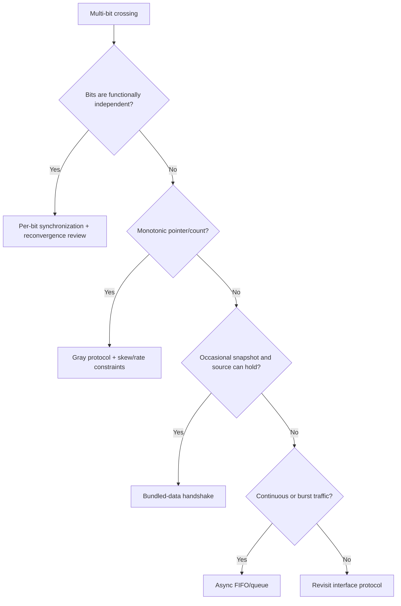

# Multi-Bit CDC

Multi-bit CDC는 여러 bit를 destination에서 하나의 coherent value 또는 transaction으로 관찰해야 하는 crossing이다. 각 bit에 2FF synchronizer를 독립적으로 붙이는 것은 일반적인 payload transfer 해법이 아니다.

> Metastability probability를 bit별로 낮추는 것과 word coherency를 보장하는 것은 다른 문제다.

공통 용어는 [Canonical RTL Design Terminology](../01_fundamentals/terminology.md), 전체 구조 선택은 [CDC Overview](overview.md)를 참고한다.

## 1. Why Independent 2FF Can Fail

Source bus가 `0111`에서 `1000`으로 바뀌는 동안 여러 bit가 transition한다.

```text
source word: 0111 ─────────> 1000
              multiple bits change

independent sync chains may observe:
              0000, 1111, 1010, ...
```

Bit별 transition phase, metastability resolution과 route delay가 다르므로 destination에서 서로 다른 source state의 bit가 섞인 word를 볼 수 있다.

## 2. Requirement Classification

먼저 data semantics를 분류한다.

| Data type | 필요한 성질 | 대표 구조 |
|---|---|---|
| Infrequent configuration word | atomic snapshot | bundled-data handshake |
| Continuous sample stream | ordered lossless transfer | async FIFO |
| Monotonic pointer/count | safe state progression | Gray-encoded pointer + protocol |
| Independent status bits | bit별 의미 독립 | 개별 synchronizer 가능 |
| One-hot control | legal-state 보존 필요 | encoded event/handshake, 구조별 검토 |

“Bus width가 작다”는 protocol 선택 근거가 아니다.

## 3. Bundled-Data Snapshot

Payload를 source에서 안정적으로 유지하고 synchronized control이 destination capture를 지시한다.

```text
source payload ================= stable =================
source request       ___/‾‾‾‾‾‾‾‾‾‾
                           │ synchronize
destination capture                    ↑
```

적합한 경우:

- Transfer가 드물다.
- Source가 acknowledge/capture까지 payload를 hold할 수 있다.
- Latency가 몇 cycle 늘어도 된다.
- 한 번에 한 transaction 또는 명확한 outstanding policy가 있다.

자세한 contract는 [Bundled Data](bundled_data.md)를 참고한다.

## 4. Asynchronous FIFO

Source와 destination이 독립적으로 연속 traffic을 처리해야 하면 async FIFO가 일반적인 architecture다.

```text
source domain                        destination domain
write data -> dual-port storage -> read data
write pointer --CDC--> read side
read pointer  <--CDC-- write side
```

FIFO가 해결하는 것:

- payload coherency
- ordering
- bounded burst buffering
- independent read/write rate

추가 책임:

- full/empty correctness
- pointer encoding/synchronization
- overflow/underflow prevention
- reset asymmetry
- depth sizing과 latency
- memory implementation semantics

검증된 reusable implementation을 사용하는 편이 직접 새로 만드는 것보다 안전한 경우가 많다.

## 5. Gray Code

Gray encoding은 인접 count 값 사이에 한 bit만 바뀌도록 한다. Async FIFO pointer처럼 monotonic counter state를 건널 때 simultaneous multi-bit transition risk를 줄인다.

```text
binary:  00 → 01 → 10 → 11
gray:    00 → 01 → 11 → 10
               one bit per adjacent step
```

Gray code만으로 모든 multi-bit CDC가 안전해지는 것은 아니다.

필요한 assumption:

- source에서 Gray value가 register됨
- 값이 인접 state로만 이동
- destination이 skipped state를 보더라도 protocol이 안전
- physical bit skew가 protocol requirement 안에 있음
- synchronized pointer를 직접 arbitrary payload로 해석하지 않음

Arbitrary data word를 Gray encoding한다고 snapshot coherency 문제가 자동 해결되지 않는다.

## 6. One-Hot and Encoded Control

One-hot vector의 state transition은 old bit deassert와 new bit assert로 두 bit가 바뀌는 경우가 많다. Independent synchronization 후 temporarily zero-hot 또는 two-hot을 볼 수 있다.

```text
0010 -> 0100
  two physical transitions
```

Destination이 intermediate illegal state를 허용할 수 있는지, transition event를 별도 handshake로 보낼지, binary/Gray state를 사용할지 검토한다.

Encoding 이름만으로 CDC safety를 주장하지 않는다.

## 7. Consolidation Before Crossing

여러 related status bit가 destination에서 하나의 decision만 만든다면 source에서 decision을 먼저 register해 single-bit로 crossing할 수 있다.

```text
Bad candidate:
status_a --2FF--┐
status_b --2FF--┼-> destination decision
status_c --2FF--┘

Better when semantics allow:
source decision = f(status_a,b,c), register it
source decision --2FF--> destination
```

이 변경은 source-side decision latency와 semantics가 requirement에 맞을 때만 가능하다.

## 8. Reconvergence

각각 안전하게 synchronized된 signal도 destination에서 reconverge하면 cycle uncertainty 차이로 invalid combination을 만들 수 있다.

```text
related A ── sync ──┐
                    ├─ destination logic
related B ── sync ──┘
```

Source가 동시에 바꾼 A/B가 destination에서 서로 다른 cycle에 도착할 수 있다. Multi-cycle temporal coherency가 필요하면 하나의 protocol event로 묶는다.

## 9. Data Stability and Physical Timing

Bundled data나 Gray pointer는 functional protocol 외에도 implementation condition이 필요할 수 있다.

- Payload가 capture control보다 충분히 먼저 안정되는가?
- Capture까지 source가 hold하는가?
- Gray bits의 relative skew가 destination observation에서 multi-bit transition처럼 보이지 않는가?
- Source register부터 destination capture까지 route variation이 assumption을 깨지 않는가?

이 조건을 단순 STA false-path로 숨기지 않고 project methodology가 지원하는 max-delay/skew 또는 physical constraint로 검증한다.

## 10. Reset and Mode Change

Multi-bit protocol reset에서는 data 값보다 pointer/request/valid state가 중요할 수 있다.

- FIFO pointer가 양쪽에서 compatible state로 초기화되는가?
- One side reset 시 outstanding data를 폐기하는가?
- Bundled-data request가 reset 중 남는가?
- Gray pointer sync pipeline이 stale state를 보이는 기간은 안전한가?
- Mode/frequency change 중 transaction을 drain하는가?

Independent reset behavior를 architecture contract로 만든다.

## 11. Verification Strategy

### Structural

- Multi-bit bus에 independent 2FF가 사용된 이유가 정당한가?
- FIFO/handshake/Gray structure를 CDC tool이 인식하는가?
- Reconvergence와 encoded control violation이 보고되는가?

### Functional

- Destination word가 실제 source transaction 중 하나와 일치하는가?
- Ordering, no-loss, no-duplicate가 유지되는가?
- FIFO full/empty boundary와 wrap-around가 안전한가?
- Reset asymmetry에서 phantom transaction이 없는가?
- Rate mismatch와 clock stop에서 overflow가 방지되는가?

### Assertion concept

Destination capture 시 payload가 source가 commit한 snapshot과 일치하는지 tag/scoreboard로 비교한다. RTL assertion 하나로 analog metastability를 증명하려 하지 않는다.

## 12. Common Mistakes

- Bus 각 bit에 2FF를 붙이고 coherent word라고 가정한다.
- Gray code를 arbitrary payload에 적용한다.
- One-hot은 한 bit만 바뀐다고 가정한다.
- Synchronized related control이 같은 cycle에 도착한다고 가정한다.
- Async FIFO의 full/empty와 reset을 검증하지 않는다.
- Bundled payload stability를 SDC/문서 없이 암묵적으로 둔다.
- CDC waiver에 protocol 근거와 owner를 남기지 않는다.

## 13. Decision Flow



## 14. Design Review Checklist

- [ ] Destination에서 요구하는 coherency 단위가 정의됐는가?
- [ ] Bits가 실제로 독립인지 관련 state인지 구분했는가?
- [ ] Independent synchronizer reconvergence를 검토했는가?
- [ ] Bundled-data/Gray/FIFO 선택이 traffic model과 맞는가?
- [ ] Gray 값이 registered이고 인접 state로 이동하는가?
- [ ] FIFO depth, full/empty, overflow/underflow가 검증됐는가?
- [ ] Payload stability 또는 bit skew의 physical condition이 검증됐는가?
- [ ] Reset asymmetry와 mode/frequency change가 정의됐는가?
- [ ] End-to-end no-loss/no-duplicate/order/coherency를 검증했는가?

## 관련 문서

- [CDC Overview](overview.md)
- [Bundled Data](bundled_data.md)
- [Pulse Crossing](pulse_crossing.md)
- [2FF Synchronizer](synchronizer.md)
