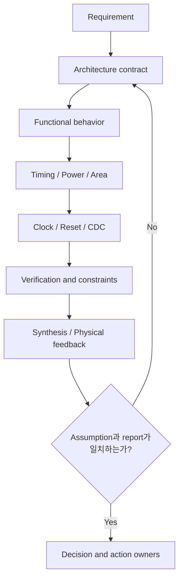

# RTL Design Review Checklist

이 문서는 RTL의 syntax나 style만 확인하는 목록이 아닙니다. Requirement에서 시작해 합성될 hardware, PPA, Clock/Reset/CDC, verification evidence까지 추적하기 위한 review worksheet입니다.

모든 항목에 무조건 “Yes”가 나와야 하는 것은 아닙니다. 적용되지 않는 항목은 `N/A`로 표시하고 이유를 남깁니다. 중요한 것은 선택한 architecture와 exception을 reviewer가 재현할 수 있게 만드는 것입니다.

## 1. Review Header

리뷰를 시작하기 전에 다음 정보를 채웁니다.

| Item | Record |
|---|---|
| Block / feature | Generic block or feature name |
| Owner / reviewers | Responsible roles |
| Review scope | Architecture / RTL / CDC / timing / low power / change set |
| Clock and reset domains | Domain list and relationships |
| Target latency / throughput | Cycle-level contract |
| Key assumptions | Stable window, mutual exclusion, ordering, idle behavior |
| Evidence | Spec, diagram, simulation, assertion, synthesis/STA/CDC reports |
| Out of scope | Explicitly deferred items and owner |

!!! tip "체크보다 근거가 중요하다"
    `Done` 표시 옆에는 가능한 경우 specification section, diagram, RTL location, assertion, report path 중 하나를 연결하세요. 근거 없는 체크는 다음 변경에서 유지되지 않습니다.

## 2. Fast Review Flow



막연하게 gate 수를 줄이기 전에 다음 최적화 순서를 적용합니다.

```text
Remove → Disable → Simplify → Share / Duplicate as appropriate
       → Pipeline or MCP → Physical optimization
```

## 3. Requirement & Interface Contract

- [ ] Input과 output의 의미, 유효 조건, sampling edge가 정의되어 있는가?
- [ ] 결과가 필요한 정확한 cycle 또는 허용 가능한 latency 범위가 정의되어 있는가?
- [ ] 새로운 input을 받아야 하는 주기, 즉 throughput requirement가 정의되어 있는가?
- [ ] Backpressure, retry, cancel, flush가 필요한지 정의되어 있는가?
- [ ] Idle, disabled, reset, error 상태의 output behavior가 정의되어 있는가?
- [ ] Source가 data/control을 유지해야 하는 기간이 정의되어 있는가?
- [ ] 동시에 발생할 수 있는 event와 금지되는 조합이 정의되어 있는가?
- [ ] Clock frequency나 ratio에 의존하는 assumption이 명시되어 있는가?
- [ ] Error recovery와 illegal input 처리 방식이 정의되어 있는가?

**Review evidence**

- [ ] Cycle-level timing diagram 또는 transaction table이 있는가?
- [ ] Assumption과 guarantee의 owner가 구분되어 있는가?
- [ ] Interface 변경이 downstream block과 constraint에 전달되었는가?

## 4. Architecture & Microarchitecture

- [ ] 결과가 언제 필요한가?
- [ ] Latency requirement와 throughput requirement를 분리해 설명할 수 있는가?
- [ ] 결과가 반드시 next cycle에 필요한가?
- [ ] 매 cycle 새로운 input을 받아야 하는가?
- [ ] Pipeline stage가 필요한가, 허용되는가?
- [ ] Stage를 추가하면 control/data/valid가 함께 정렬되는가?
- [ ] Feedback dependency 때문에 initiation interval이 제한되는가?
- [ ] Architecture 자체가 multi-cycle인가?
- [ ] MCP를 검토한다면 destination capture cycle과 source stable window가 functional contract에 있는가?
- [ ] Parallel architecture와 serial/resource-shared architecture의 PPA 및 throughput을 비교했는가?
- [ ] Pre-computation으로 critical logic을 앞당길 수 있는가?
- [ ] Logic sharing이 MUX/fanout/timing을 악화시키지 않는가?
- [ ] 반대로 timing과 locality를 위해 logic duplication이 필요한가?
- [ ] 불필요한 function, state, calculation 자체를 제거할 수 있는가?
- [ ] Block diagram에 register boundary, feedback, clock/reset domain이 표시되어 있는가?

관련 문서: [Introduction](../00_introduction/overview.md), [Timing Overview](../03_timing/overview.md), [Multi-Cycle Path](../03_timing/multi_cycle_path.md)

## 5. Functional RTL & Control Semantics

- [ ] Combinational logic과 sequential state의 경계가 명확한가?
- [ ] `if` / `else if` / `case` priority가 실제 specification인가?
- [ ] Clear / load / update / hold의 우선순위가 정의되어 있는가?
- [ ] `b && c`처럼 control event가 동시에 발생하는 경우를 의도적으로 처리하는가?
- [ ] Pulse와 level을 구분했는가?
- [ ] Back-to-back event를 놓치거나 합치지 않는가?
- [ ] Blocking/nonblocking assignment 사용이 해당 process의 의미와 맞는가?
- [ ] Combinational block의 default assignment가 있어 unintended latch를 피하는가?
- [ ] `case`의 default/illegal encoding behavior가 정의되어 있는가?
- [ ] State transition이 unreachable/illegal state에서 회복하거나 안전하게 fail하는가?
- [ ] Counter overflow/underflow와 wrap/saturate behavior가 정의되어 있는가?
- [ ] Parameter 경계값(0, 1, minimum width)이 elaboration과 동작에서 안전한가?
- [ ] Signed/unsigned conversion, truncation, extension이 명시적인가?
- [ ] `X`를 정상 control flow를 만드는 값처럼 의존하지 않는가?

### Simultaneous-event matrix

중요한 control 조합마다 다음과 같은 matrix를 작성했는지 확인합니다.

| clear | load | count | Expected | Verified by |
|---:|---:|---:|---|---|
| 0 | 0 | 0 | Hold | Test / assertion |
| 0 | 0 | 1 | Count | Test / assertion |
| 0 | 1 | 1 | Explicit priority | Test / assertion |
| 1 | 1 | 1 | Explicit priority | Test / assertion |

관련 상세 가이드: [FSM Design](../09_control_logic/fsm_design.md), [Priority and Simultaneous Events](../09_control_logic/priority_and_simultaneous_events.md), [Pulse, Level, and Event](../09_control_logic/pulse_level_event.md), [Counter Boundary Design](../09_control_logic/counter_boundary.md), [Illegal State Recovery](../09_control_logic/illegal_state_recovery.md)

## 6. Timing

- [ ] 주요 register-to-register, input-to-register, register-to-output path를 식별했는가?
- [ ] Launch clock와 capture clock의 관계가 정확한가?
- [ ] Deep combinational path가 있는가?
- [ ] Priority chain이 깊은가?
- [ ] Large MUX 또는 cascaded MUX가 있는가?
- [ ] Wide comparator, adder, shifter, multiplier가 있는가?
- [ ] Decode와 select가 늦게 도착하는 구조가 있는가?
- [ ] High-fanout control이 여러 critical endpoint를 구동하는가?
- [ ] Bit width와 range를 줄여 logic depth/capacitance를 낮출 수 있는가?
- [ ] Boolean/condition simplification이 가능한가?
- [ ] Parallelization 또는 pre-computation이 가능한가?
- [ ] Resource sharing이 input/output MUX와 arbitration path를 만들지 않는가?
- [ ] Pipeline을 넣을 경우 latency, valid alignment, feedback가 함께 해결되는가?
- [ ] Physical report에서 wire delay, congestion, placement distance가 지배적인가?
- [ ] Setup을 고친 변경이 hold나 다른 path group을 악화시키지 않았는가?
- [ ] Worst path 한 개가 아니라 path distribution과 margin을 확인했는가?

### Timing exception

- [ ] False path 또는 MCP에 functional justification이 있는가?
- [ ] MCP가 단순히 timing failure를 숨기기 위해 추가되지 않았는가?
- [ ] MCP source data가 capture까지 안정적인가?
- [ ] Destination이 중간 cycle에 data를 관측하거나 capture하지 않는가?
- [ ] Setup MCP와 그에 대응하는 hold 분석 관계를 flow 기준으로 확인했는가?
- [ ] Exception의 `from` / `to` / `through` 범위가 과도하게 넓지 않은가?
- [ ] Generated clock, clock ratio, mode 변경 시에도 exception이 유효한가?
- [ ] RTL 변경 시 exception assumption을 깨뜨리는지 검출할 assertion/review owner가 있는가?

관련 문서: [Timing Design & Optimization](../03_timing/overview.md), [Multi-Cycle Path](../03_timing/multi_cycle_path.md)

## 7. Low Power

- [ ] 현재 logic이 해당 cycle에 움직일 필요가 있는가?
- [ ] 결과가 사용되지 않는 free-running counter가 있는가?
- [ ] 사용되지 않는 값을 습관적으로 clear 또는 update하고 있지 않은가?
- [ ] Register enable을 적용하면 data switching을 실질적으로 줄일 수 있는가?
- [ ] 기존 state/control signal을 enable로 안전하게 재사용할 수 있는가?
- [ ] 새 enable generation logic/FF의 area, timing, switching cost를 고려했는가?
- [ ] Enable path가 feedback MUX 또는 critical control path를 만들 수 있는가?
- [ ] Synthesis flow에서 clock-gating inference 대상과 threshold를 확인했는가?
- [ ] Inferred gating과 explicit/manual ICG insertion 중 implementation ownership에 맞는 방식을 선택했는가?
- [ ] Fine-grain과 coarse-grain/function-level 중 실제 idle correlation과 clock load에 맞는 granularity인가?
- [ ] Function clock 아래로 이동할 수 있는 FF와 always-on이어야 하는 FF를 구분했는가?
- [ ] 결과를 사용하지 않을 때 wide combinational logic에 operand isolation을 적용할 수 있는가?
- [ ] Operand isolation control 자체가 glitch/timing 문제나 추가 switching을 만들지 않는가?
- [ ] Counter LSB, address generator, wide bus, high-fanout control, clock 같은 hotspot을 측정했는가?
- [ ] Representative workload와 idle ratio로 activity를 비교했는가?
- [ ] Power 변경 후 area와 timing도 함께 비교했는가?

관련 문서: [Low-Power Overview](../04_low_power/overview.md), [Counter Optimization](../04_low_power/counter_optimization.md), [Clock Gating](../06_clock/clock_gating.md)

## 8. Area

- [ ] Register와 signal width가 값의 range와 arithmetic growth에 맞는 최소 크기인가?
- [ ] 최대값이 작은 counter/comparator에 관성적인 32-bit width를 사용하지 않는가?
- [ ] 사용되지 않는 register bit, state, output, debug logic이 있는가?
- [ ] Constant와 parameter가 dead logic removal을 가능하게 하는가?
- [ ] FSM state 수와 encoding 선택을 timing/power/safety 요구와 함께 검토했는가?
- [ ] 모든 datapath register에 reset이 실제로 필요한가?
- [ ] Logic/resource sharing이 area를 줄이는 대신 MUX/fanout을 과도하게 늘리지 않는가?
- [ ] Timing을 위한 duplication이 실제 critical path/locality 개선으로 이어졌는가?
- [ ] Pipeline/retiming으로 늘어난 FF와 clock load를 계산했는가?
- [ ] Synthesis area report에서 예상하지 못한 operator, MUX, buffer, reset cell을 확인했는가?

## 9. Clock & Clock Gating

- [ ] Raw combinational gated clock(`clk & en`)이 없는가?
- [ ] Clock gating에는 flow가 인정하는 ICG 또는 공식 clock-control structure를 사용하는가?
- [ ] Enable이 clock의 safe phase에서 안정되도록 보장되는가?
- [ ] Inferred, explicit/manual, fine-grain, coarse-grain gating 용어와 의도가 구분되는가?
- [ ] Clock enable의 functional owner와 test/scan override가 정의되어 있는가?
- [ ] Gated clock의 generated-clock/STA 처리가 methodology와 일치하는가?
- [ ] Always-on logic과 function-clock logic의 경계가 명확한가?
- [ ] Function clock을 다시 켜는 control이 같은 gated clock 아래에 갇혀 있지 않은가?
- [ ] Self-deadlock 또는 wake-up loss 가능성이 없는가?
- [ ] Gating 중 reset assertion/deassertion과 state recovery가 안전한가?
- [ ] Gating boundary를 넘는 signal의 CDC/clock relationship을 분석했는가?
- [ ] 작은 FF group에 ICG를 추가하는 overhead가 절감보다 크지 않은가?
- [ ] Clock gating 검증에 enable transition, stop/start, test mode, reset overlap이 포함되는가?

관련 문서: [Clock Gating](../06_clock/clock_gating.md)

## 10. Reset

- [ ] 각 register가 reset을 필요로 하는 functional/safety 이유가 있는가?
- [ ] Valid 이후에만 사용하는 datapath register는 don't-care 초기값을 허용할 수 있는가?
- [ ] Synchronous/asynchronous reset 선택의 이유가 methodology와 architecture에 맞는가?
- [ ] Asynchronous assertion과 deassertion synchronization requirement가 정의되어 있는가?
- [ ] Reset deassertion이 clock이 멈춘/gated 상태에서 어떻게 처리되는가?
- [ ] Reset fanout, routing, recovery/removal timing 영향을 검토했는가?
- [ ] Reset value가 실제 idle/protocol state와 일치하는가?
- [ ] Partial reset domain 사이의 stale/invalid data 사용을 막는가?
- [ ] Reset과 request/clear/capture가 겹칠 때 priority를 검증했는가?

관련 문서: [Reset Architecture Overview](../07_reset/overview.md), [Synchronous vs Asynchronous Reset](../07_reset/sync_vs_async_reset.md), [Reset Deassertion and RDC](../07_reset/reset_deassertion.md), [Resetless Datapath](../07_reset/resetless_datapath.md), [Reset with Clock Gating](../07_reset/reset_with_clock_gating.md)

## 11. Clock Domain Crossing

- [ ] 모든 clock/reset domain과 crossing을 식별했는가?
- [ ] Clock들이 truly asynchronous인지, mesochronous/related/generated인지 정확히 constraint했는가?
- [ ] Crossing을 single-bit level, pulse, multi-bit control/data, stream으로 분류했는가?
- [ ] Single-bit asynchronous level에 2FF synchronizer가 적합한가?
- [ ] Source signal이 destination에서 level로 관측될 만큼 충분히 오래 유지되는가?
- [ ] 짧은 pulse를 plain 2FF가 놓칠 가능성이 없는가?
- [ ] Pulse stretch, toggle synchronizer, handshake 중 event rate와 loss requirement에 맞는가?
- [ ] Multi-bit bus 각 bit에 independent 2FF를 붙이지 않았는가?
- [ ] Multi-bit coherent transfer에 handshake, bundled data, Gray code, async FIFO 중 맞는 protocol을 사용했는가?
- [ ] Bundled data가 synchronized control 전후로 충분히 안정적인가?
- [ ] Reconvergence된 independently synchronized signal이 incoherent control을 만들지 않는가?
- [ ] Synchronizer first stage를 일반 functional logic이 직접 사용하지 않는가?
- [ ] Synchronizer latency가 destination protocol에 반영되어 있는가?
- [ ] Reset release 자체가 domain별로 안전하게 처리되는가?
- [ ] CDC tool이 구조를 recognize하고, violation/waiver에 functional justification과 owner가 있는가?
- [ ] Simulation만으로 metastability 안전성을 주장하지 않는가?

관련 문서: [CDC Overview](../08_cdc/overview.md), [2FF Synchronizer](../08_cdc/synchronizer.md)

## 12. Datapath & Numeric Behavior

- [ ] 모든 operand/result의 width와 signedness가 명확한가?
- [ ] Add/subtract/multiply의 carry와 growth bit를 의도적으로 보존 또는 제거하는가?
- [ ] Truncation, rounding, saturation, wrap behavior가 specification에 있는가?
- [ ] Shift amount의 range와 arithmetic/logical shift가 명확한가?
- [ ] Constant multiply/divide가 구현 가능한 단순 구조로 최적화될 여지가 있는가?
- [ ] Expensive calculation 뒤 select 구조와 parallel pre-compute 뒤 final select 구조를 비교했는가?
- [ ] Parallelization의 timing 개선과 operator area/switching 증가를 함께 봤는가?
- [ ] Unused branch의 wide datapath가 계속 toggle하지 않는가?
- [ ] Boundary value, minimum/maximum, sign transition을 검증했는가?

관련 상세 가이드: [Datapath Width and Signedness](../10_datapath/width_signedness.md), [Overflow, Saturation, and Rounding](../10_datapath/overflow_saturation_rounding.md), [Datapath MUX and Select](../10_datapath/mux_and_select.md), [Datapath Parallel Pre-computation](../10_datapath/parallel_precomputation.md)

## 13. Synthesis-Aware RTL

- [ ] 작성한 `if`/`case`/ternary가 어떤 MUX/priority 구조가 될지 설명할 수 있는가?
- [ ] Register hold가 feedback MUX 또는 enable cell로 어떻게 구현될지 확인했는가?
- [ ] Arithmetic operator가 의도한 width와 signedness로 inference되는가?
- [ ] Constant propagation과 dead logic removal을 방해하는 구조가 없는가?
- [ ] 사람의 micro-optimization이 tool optimization을 방해하거나 RTL을 불필요하게 복잡하게 만들지 않는가?
- [ ] Synthesis warning, inferred latch, undriven/unreachable logic을 검토했는가?
- [ ] 예상한 register, MUX, operator 수와 실제 report/netlist가 일치하는가?
- [ ] Tool/library/setting에 의존하는 결과를 RTL 규칙처럼 단정하지 않는가?

## 14. Physical-Aware Review

- [ ] High-fanout net과 buffer tree를 확인했는가?
- [ ] Long route 또는 hierarchy crossing이 critical delay를 지배하는가?
- [ ] Wide bus와 large MUX가 congestion hotspot을 만드는가?
- [ ] Logic replication이 endpoint 가까이에 배치될 수 있는 구조인가?
- [ ] Register/pipeline boundary가 floorplan과 major block boundary에 맞는가?
- [ ] Clock tree load와 gated-clock region의 물리적 범위를 고려했는가?
- [ ] Synthesis timing만이 아니라 post-place/post-route feedback을 반영했는가?
- [ ] 한 path를 고친 뒤 다른 corner/mode/path group이 새 bottleneck이 되지 않았는가?

## 15. Verification & Robustness

- [ ] Normal case만이 아니라 simultaneous event를 검증했는가?
- [ ] Minimum/maximum/boundary value를 검증했는가?
- [ ] Overflow/underflow/wrap/saturation을 검증했는가?
- [ ] Reset assertion/deassertion과 transaction이 겹치는 경우를 검증했는가?
- [ ] Back-to-back event와 maximum-rate traffic을 검증했는가?
- [ ] Mode/clock-gating transition 중 request와 data가 보존되는가?
- [ ] Illegal state와 protocol violation의 behavior를 검증했는가?
- [ ] Mutual exclusivity, stability, ordering, valid-before-use를 assertion으로 표현했는가?
- [ ] Lint, CDC/RDC, simulation, formal의 역할과 waiver가 구분되는가?
- [ ] Constraint assumption을 깨는 negative test 또는 property가 있는가?
- [ ] Parameter와 configuration 조합별 coverage가 있는가?
- [ ] Optimization 전후 functional/equivalence 비교가 필요한가?

### 권장 invariant 예시

다음은 그대로 복사할 code가 아니라 review에서 property 후보를 찾기 위한 문장입니다.

- `valid`가 0이면 consumer는 data를 사용하지 않는다.
- Request가 acceptance되면 cancel/reset이 없는 한 정해진 latency 안에 response가 온다.
- Counter update가 disable된 동안 counter는 stable하다.
- Bundled data는 request 전부터 destination capture까지 stable하다.
- Function clock을 끈 동안 gated region의 state는 architecture가 정의한 방식으로 유지된다.
- FIFO pointer가 full/empty protocol을 위반하지 않는다.

## 16. Documentation, Constraint & Ownership

- [ ] RTL comment가 “무엇”보다 중요한 “왜/assumption”을 설명하는가?
- [ ] Architecture diagram과 실제 register boundary가 일치하는가?
- [ ] Interface timing diagram과 RTL latency가 일치하는가?
- [ ] Clock, generated clock, uncertainty, I/O delay가 현재 integration과 일치하는가?
- [ ] MCP/false-path/CDC waiver에 이유, 정확한 범위, 검증 evidence, owner가 있는가?
- [ ] Hidden assumption이 SDC에만 존재하지 않는가?
- [ ] RTL 변경 시 관련 constraint/assertion/document를 찾을 수 있는가?
- [ ] 예제, 이름, 수치, diagram이 public repository에 공개 가능한 generic material인가?
- [ ] 특정 vendor/tool behavior를 근거 없이 보편적인 사실로 표현하지 않는가?

## 17. Review Exit Criteria

다음 조건을 만족할 때 review를 종료합니다.

- [ ] Requirement, architecture, RTL behavior에 unresolved contradiction이 없다.
- [ ] Priority와 corner case가 specification 및 verification에 반영되었다.
- [ ] Timing/Power/Area 판단에 report 또는 측정 계획이 있다.
- [ ] Clock/Reset/CDC 구조와 exception이 검토되었다.
- [ ] High-risk assumption에 assertion 또는 다른 executable check가 있다.
- [ ] Open issue마다 owner, due condition, 영향 범위가 있다.
- [ ] 변경으로 영향을 받는 downstream interface와 artifact가 식별되었다.

### Decision record

후보 비교, evidence와 change trigger를 남기는 형식은 [Microarchitecture Decision Record](../02_architecture/microarchitecture_decision_record.md)를 참고합니다.

| Decision / issue | Evidence | Trade-off | Owner | Status / follow-up |
|---|---|---|---|---|
| Example: retain shared operator | Area and timing comparison | Area saved; timing margin reduced | Role | Re-check after P&R |

리뷰의 목표는 모든 설계를 같은 형태로 만드는 것이 아닙니다. **Requirement에 맞는 hardware를 선택하고, 그 선택의 assumption과 trade-off를 검증 가능한 형태로 남기는 것**입니다.
