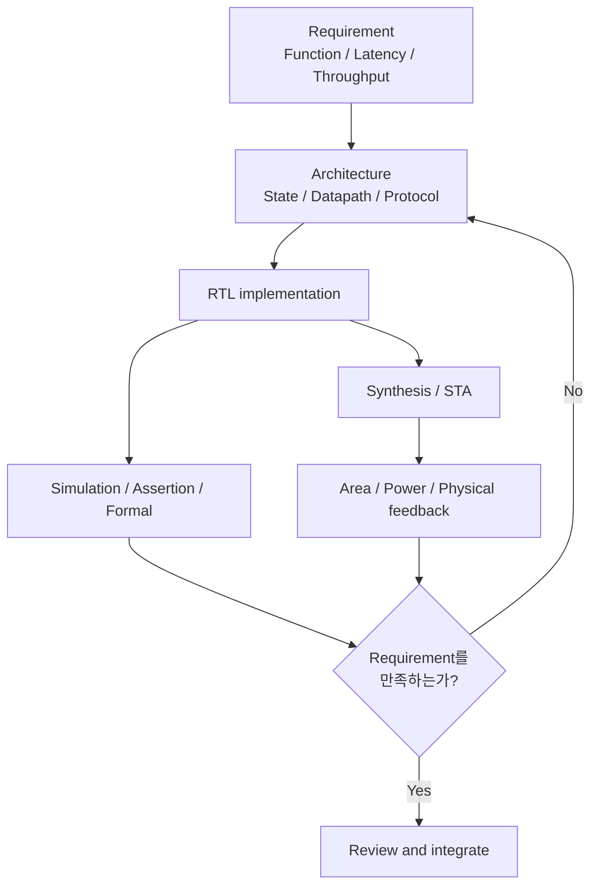

<div class="rtl-hero" markdown>

<span class="rtl-kicker">PRACTICAL RTL ENGINEERING GUIDE</span>

# RTL Design & Optimization Guide

**RTL은 code가 아니라 hardware architecture의 기술이다.**

같은 기능을 수행하는 RTL이라도 architecture, state, calculation schedule과 activity control에 따라 합성되는 hardware의 Timing, Power, Area(PPA)와 robustness가 달라집니다. 이 가이드는 그 차이를 설계하고 검증하는 방법을 다룹니다.

[처음부터 읽기](00_introduction/overview.md){ .md-button .md-button--primary }
[설계 리뷰 시작](15_checklist/rtl_design_review_checklist.md){ .md-button }
[GitHub 저장소](https://github.com/2nnovation/RTL-design-guide){ .md-button }

</div>

## 어디서 시작할까

<div class="grid cards rtl-start-grid" markdown>

-   **개념부터 체계적으로 읽기**

    좋은 RTL의 기준부터 hardware 관점, architecture와 timing으로 이어지는 권장 학습 경로입니다.

    [Introduction에서 시작 →](00_introduction/overview.md)

-   **현재 설계 문제 해결하기**

    Timing, power, clock, reset과 CDC처럼 지금 검토 중인 문제에서 바로 시작합니다.

    [Timing](03_timing/overview.md) · [Low Power](04_low_power/overview.md) · [CDC](08_cdc/overview.md)

-   **Design Review 진행하기**

    Architecture부터 verification까지 빠뜨리기 쉬운 질문을 실무 체크리스트로 확인합니다.

    [Review Checklist 열기 →](15_checklist/rtl_design_review_checklist.md)

</div>

## 이 가이드가 말하는 좋은 RTL

<div class="grid cards" markdown>

-   **Function & Robustness**

    정상 동작뿐 아니라 boundary, simultaneous event, illegal state와 protocol violation에서도 specification을 만족합니다.

-   **Architecture & Timing**

    Latency와 throughput 요구를 register boundary, datapath와 control schedule로 구현하고 STA evidence로 확인합니다.

-   **Power & Area**

    불필요한 state와 switching을 제거하고 width, sharing, duplication과 routing 비용을 함께 평가합니다.

-   **Clock · Reset · CDC**

    State transition과 domain crossing의 assumption, ownership과 safe release 조건을 명시합니다.

-   **Verification**

    RTL의 priority와 interface contract를 assertion, formal, lint와 corner-case test로 검증합니다.

-   **Maintainability**

    RTL, constraint, assertion과 document가 같은 architecture contract를 설명하고 변경 시 함께 갱신됩니다.

</div>

한 항목만 줄여 얻은 숫자를 최적화의 결론으로 삼지 않습니다. Logic sharing은 area를 줄이는 대신 MUX와 fanout를 늘릴 수 있고, pipeline은 timing을 개선하는 대신 latency, FF area와 clock power를 늘릴 수 있습니다. 설계 판단에는 요구사항과 trade-off가 함께 있어야 합니다.

## Requirement에서 Implementation Feedback까지



??? question "RTL을 작성하기 전에 확인할 질문"
    1. 결과가 유효해야 하는 cycle은 언제인가?
    2. Latency와 throughput 요구는 각각 무엇인가?
    3. Input이나 intermediate value가 안정적으로 유지되는 기간은 얼마인가?
    4. Block이 idle일 때도 유지되어야 하는 state는 무엇인가?
    5. Clock domain을 넘는 signal은 level, pulse, multi-bit data 중 무엇인가?
    6. 이 contract를 assertion, constraint와 CDC check로 어떻게 검증할 것인가?

## Optimization Order

> **Remove → Disable → Simplify → Share / Duplicate as appropriate → Pipeline or MCP → Physical optimization**

| 단계 | 먼저 물을 질문 | 대표적인 결과 |
|---|---|---|
| Remove | 이 기능, state, bit와 calculation이 정말 필요한가? | Logic과 register 자체 제거 |
| Disable | 값이 필요하지 않을 때 움직여야 하는가? | Register enable, operand isolation |
| Simplify | 같은 요구를 더 짧은 depth나 작은 width로 표현할 수 있는가? | Compare, decode와 arithmetic 단순화 |
| Share / Duplicate | 현재 bottleneck에는 공유와 복제 중 무엇이 맞는가? | Area 절감 또는 fanout·timing 개선 |
| Pipeline or MCP | 결과가 정말 next cycle에 필요한가? | Hardware stage 추가 또는 기존 multi-cycle contract 명시 |
| Physical optimization | Wire, congestion, placement와 clock 영향인가? | Hierarchy, replication과 placement feedback |

!!! warning "MCP는 timing violation을 숨기는 수단이 아니다"
    Multi-Cycle Path는 hardware를 빠르게 만들지 않습니다. Destination이 여러 cycle 뒤에만 capture한다는 functional requirement가 architecture와 RTL에 이미 존재할 때, 그 edge relationship을 STA에 표현합니다. 자세한 판단 기준은 [Multi-Cycle Path](03_timing/multi_cycle_path.md)를 참고하세요.

## Chapter Map

<div class="grid cards rtl-chapter-map" markdown>

-   **01–02 · Fundamentals & Architecture**

    RTL 문법을 hardware로 해석하고 requirement를 state, cycle contract와 microarchitecture로 내립니다.

    [Fundamentals](01_fundamentals/think_hardware_not_code.md) · [Architecture](02_architecture/requirement_to_microarchitecture.md)

-   **03–05 · Timing, Power & Area**

    Critical path, pipeline, switching, bit width와 resource 비용을 PPA trade-off로 비교합니다.

    [Timing](03_timing/overview.md) · [Low Power](04_low_power/overview.md) · [Area](05_area/overview.md)

-   **06–08 · Clock, Reset & CDC**

    Clock control, reset release와 domain crossing을 state-transition 안전성 관점에서 다룹니다.

    [Clock](06_clock/overview.md) · [Reset](07_reset/overview.md) · [CDC](08_cdc/overview.md)

-   **09–10 · Control & Datapath**

    Priority, event, counter boundary와 arithmetic, width, select 구조를 실제 hardware 비용에 연결합니다.

    [Control Logic](09_control_logic/fsm_design.md) · [Datapath](10_datapath/width_signedness.md)

-   **11–13 · Synthesis, Physical & Verification**

    RTL 가설을 synthesis, STA, P&R과 verification evidence로 확인하고 다시 설계에 반영합니다.

    [Synthesis](11_synthesis/rtl_to_hardware_mapping.md) · [Physical](12_physical_aware/rtl_to_post_route_feedback.md) · [Verification](13_verification/assertion_driven_rtl.md)

-   **14–15 · Anti-Patterns & Review**

    반복되는 실패 구조를 빠르게 식별하고 review 질문으로 설계 의도와 evidence를 확인합니다.

    [Anti-Patterns](14_anti_patterns/raw_clock_gating.md) · [Review Checklist](15_checklist/rtl_design_review_checklist.md)

</div>

## 대표 가이드

| 판단이 필요한 상황 | 먼저 읽을 문서 |
|---|---|
| 결과가 정말 next cycle에 필요한가? | [Latency, Throughput and II](02_architecture/latency_throughput_ii.md), [Pipeline](03_timing/pipeline.md), [MCP](03_timing/multi_cycle_path.md) |
| 사용하지 않는 logic이 계속 움직이는가? | [Counter Optimization](04_low_power/counter_optimization.md), [Register Enable](04_low_power/register_enable.md), [Operand Isolation](04_low_power/operand_isolation.md) |
| Clock gating boundary가 안전한가? | [Clock Gating](06_clock/clock_gating.md), [Root vs Function Clock](06_clock/root_vs_function_clock.md) |
| Reset이 모든 FF에 필요한가? | [Resetless Datapath](07_reset/resetless_datapath.md), [Reset Area Cost](05_area/reset_area_cost.md) |
| Crossing에 2FF가 적합한가? | [CDC Overview](08_cdc/overview.md), [2FF Synchronizer](08_cdc/synchronizer.md), [Multi-Bit CDC](08_cdc/multi_bit_cdc.md) |
| RTL이 의도한 hardware로 합성됐는가? | [RTL to Hardware Mapping](11_synthesis/rtl_to_hardware_mapping.md), [Reading Synthesis Reports](11_synthesis/read_synthesis_reports.md) |

## 문서를 읽는 방법

각 technical topic은 가능한 범위에서 다음 흐름을 따릅니다.

```text
Problem → Why it matters → Hardware view → RTL example
        → Synthesis view → Timing / Power / Area
        → Trade-offs → Mistakes → Recommended pattern → Checklist
```

코드 예제는 그대로 복사하는 template이 아니라 hardware inference와 corner case를 논의하기 위한 최소 예제입니다. Reset polarity, protocol, clock-gating style, constraint syntax와 library cell은 적용할 프로젝트의 requirement와 methodology에 맞게 결정해야 합니다.

??? info "공개 문서의 범위"
    이 가이드의 synthesis mapping과 PPA 영향은 일반적인 방향을 설명합니다. 실제 결과는 standard-cell library, target frequency, tool, constraint, hierarchy, placement와 routing에 따라 달라질 수 있습니다.

    모든 diagram, code, 수치와 scenario는 공개 저장소에서 사용할 수 있는 generic example이어야 합니다. 회사, 고객, 제품, 내부 IP와 proprietary flow를 식별하거나 유추할 수 있는 내용은 포함하지 않습니다.

## 다음 단계

[What Makes Good RTL?](00_introduction/overview.md){ .md-button .md-button--primary }
[Canonical Terminology](01_fundamentals/terminology.md){ .md-button }
[RTL Design Review Checklist](15_checklist/rtl_design_review_checklist.md){ .md-button }
