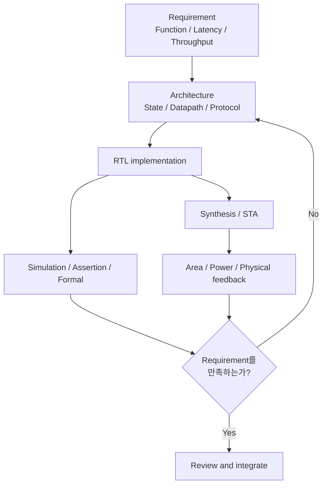

# RTL Design & Optimization Guide

> **RTL은 code가 아니라 hardware architecture의 기술이다.**

이 가이드는 SystemVerilog 문법을 나열하는 문서가 아닙니다. 같은 기능을 수행하는 RTL이라도 어떤 architecture를 선택하고, 어디에 state를 두며, 언제 값을 계산하고, 무엇을 움직이지 않게 할지에 따라 합성되는 hardware의 Timing, Power, Area(PPA)와 robustness가 달라집니다. 이 문서는 그 차이를 질문하고 검증하는 방법을 다룹니다.

## 이 가이드가 말하는 좋은 RTL

좋은 RTL은 다음 조건을 함께 만족하는 설계입니다.

- **Function**: 모든 정상·경계·동시 조건에서 specification과 일치한다.
- **Timing**: 목표 clock과 interface timing을 구현 가능한 architecture로 만족한다.
- **Power**: 사용하지 않는 state와 datapath의 불필요한 switching을 줄인다.
- **Area**: width, register, logic, routing 자원을 목적에 맞게 사용한다.
- **Clock / Reset / CDC**: state transition과 domain crossing의 assumption이 명시적이고 안전하다.
- **Robustness**: illegal state, overflow, pulse loss, protocol violation을 고려한다.
- **Maintainability**: RTL, constraint, assertion, document가 같은 architecture contract를 설명한다.

한 항목만 극단적으로 줄이는 것은 대개 최적화가 아닙니다. Logic sharing으로 area를 줄였지만 MUX와 fanout 때문에 timing이 나빠질 수 있고, pipeline으로 timing을 개선했지만 latency·FF area·clock power가 증가할 수 있습니다. 따라서 설계 판단에는 언제나 요구사항과 trade-off가 함께 있어야 합니다.

## 시작하기: Requirement에서 Feedback까지



RTL을 작성하기 전에 적어도 다음을 답할 수 있어야 합니다.

1. 결과가 유효해야 하는 cycle은 언제인가?
2. latency와 throughput 요구는 각각 무엇인가?
3. input이나 intermediate value가 안정적으로 유지되는 기간은 얼마인가?
4. block이 idle일 때도 유지되어야 하는 state는 무엇인가?
5. clock domain을 넘는 signal은 level, pulse, multi-bit data 중 무엇인가?
6. 이 contract를 assertion, constraint, CDC check로 어떻게 검증할 것인가?

## Optimization Order

이 가이드의 기본 최적화 순서는 다음과 같습니다.

```text
Remove → Disable → Simplify → Share / Duplicate as appropriate
       → Pipeline or MCP → Physical optimization
```

| 단계 | 핵심 질문 | 대표적인 결과 |
|---|---|---|
| Remove | 이 기능, state, bit, calculation이 정말 필요한가? | logic/register 자체 제거 |
| Disable | 값이 필요하지 않을 때 움직여야 하는가? | register enable, operand isolation |
| Simplify | 같은 요구를 더 짧은 logic depth나 작은 width로 표현할 수 있는가? | compare/decode/arithmetic 단순화 |
| Share / Duplicate | 공유와 복제 중 현재 bottleneck에 맞는 쪽은 무엇인가? | area 절감 또는 fanout/timing 개선 |
| Pipeline or MCP | 결과가 정말 next cycle에 필요한가? | hardware stage 추가 또는 기존 multi-cycle contract 명시 |
| Physical optimization | wire, congestion, placement, clock 영향인가? | hierarchy/replication/placement feedback |

!!! warning "MCP는 마지막 순간의 면제 수단이 아니다"
    Multi-Cycle Path는 hardware를 빠르게 만들지 않습니다. Architecture상 destination이 여러 cycle 뒤에만 값을 capture한다는 **이미 존재하는 functional requirement**가 있을 때 그 requirement를 STA에 표현합니다. 자세한 내용은 [Multi-Cycle Path](03_timing/multi_cycle_path.md)를 참고하세요.

## 핵심 문서

### Foundation

- [What Makes Good RTL?](00_introduction/overview.md): RTL, synthesis, gate, physical implementation을 하나의 feedback loop로 이해합니다.
- [Canonical RTL Design Terminology](01_fundamentals/terminology.md): latency, timing, clock, CDC와 PPA 공통 용어를 한 곳에서 정의합니다.
- [Think Hardware, Not Code](01_fundamentals/think_hardware_not_code.md): RTL 문법을 register, combinational cone, priority, parallelism과 cycle contract로 해석합니다.
- [Combinational vs Sequential Logic](01_fundamentals/combinational_vs_sequential.md): 현재 입력의 함수와 state를 구분하고 register boundary, latch와 cycle alignment를 설계합니다.
- [Priority and MUX](01_fundamentals/priority_and_mux.md): simultaneous event의 functional priority와 MUX·decode structure의 비용을 구분합니다.
- [Width and Signedness](01_fundamentals/width_and_signedness.md): range, arithmetic growth, implicit conversion과 four-state simulation을 hardware cost에 연결합니다.
- [Documentation Roadmap](00_introduction/roadmap.md): V0.1 이후 전체 Chapter의 책임과 작성 순서를 관리합니다.

### Architecture & Microarchitecture

- [Requirement to Microarchitecture](02_architecture/requirement_to_microarchitecture.md): 자연어 requirement를 acceptance/completion contract, register boundary, state ownership과 검증 evidence로 내립니다.
- [State Partitioning and Ownership](02_architecture/state_partitioning_and_ownership.md): Persistent·transaction·protocol·derived state의 owner, lifetime, atomic update와 domain boundary를 설계합니다.
- [Latency, Throughput and Initiation Interval](02_architecture/latency_throughput_ii.md): 세 metric을 cycle schedule, resource occupancy, backpressure와 실제 처리율에 연결합니다.
- [Buffering and Backpressure](02_architecture/buffering_and_backpressure.md): Ready/valid storage, burst absorption, occupancy와 no-drop ordering contract를 다룹니다.
- [Feedback Dependency](02_architecture/feedback_dependency.md): Recurrence의 dependency distance, state update latency와 achievable II를 legal schedule로 분석합니다.
- [Resource Sharing vs Duplication](02_architecture/resource_sharing_vs_duplication.md): operator 수뿐 아니라 MUX, arbitration, fanout, locality, switching과 latency/II를 포함해 architecture 후보를 비교합니다.
- [Parallelism and Pre-computation](02_architecture/parallelism_and_precomputation.md): Late select 앞뒤의 계산 배치와 speculative candidate의 PPA·commit 조건을 비교합니다.
- [Architectural Timing Budget](02_architecture/architectural_timing_budget.md): Interface requirement를 stage work와 provisional budget으로 내리고 STA·physical evidence로 보정합니다.
- [Microarchitecture Decision Record](02_architecture/microarchitecture_decision_record.md): 후보, 동일 비교 조건, evidence, owner와 change trigger를 재사용 가능한 기록으로 남깁니다.

### Timing

- [Timing Design & Optimization](03_timing/overview.md): timing path와 critical path를 hardware 구조로 읽고 최적화 순서를 정합니다.
- [Critical Path](03_timing/critical_path.md): report의 cell/net/control 원인을 분리하고 architecture부터 physical feedback까지 연결합니다.
- [Pipeline Design](03_timing/pipeline.md): latency, throughput, stage balancing과 data/control alignment를 다룹니다.
- [Multi-Cycle Path](03_timing/multi_cycle_path.md): valid한 MCP의 functional contract, 검증, setup/hold 관계, pipeline과의 차이를 설명합니다.

### Low Power

- [Low-Power RTL Design](04_low_power/overview.md): switching activity와 capacitance를 RTL에서 어떻게 줄일 수 있는지 살펴봅니다.
- [Register Enable](04_low_power/register_enable.md): update/hold semantics, synthesis mapping과 enable overhead를 설명합니다.
- [Counter Optimization](04_low_power/counter_optimization.md): 사용하지 않는 구간의 counting을 멈추고 event priority와 PPA를 함께 검토합니다.
- [Operand Isolation](04_low_power/operand_isolation.md): destination hold와 combinational activity suppression의 차이를 설명합니다.

### Area

- [Area Design & Optimization](05_area/overview.md): Mapped cells와 physical footprint를 구분하고 removal부터 physical feedback까지 최적화합니다.
- [Bit-Width Minimization](05_area/bit_width_minimization.md): Range, arithmetic growth, parameter corner와 protocol bit를 보존하며 width를 줄입니다.
- [Unused Logic and State Reduction](05_area/unused_logic_and_state_reduction.md): Observer와 authoritative state를 증명한 뒤 불필요한 logic, register와 derived state를 제거합니다.
- [Reset Area Cost](05_area/reset_area_cost.md): Resettable state, tree와 memory inference 비용을 기능·test·RDC 계약과 함께 검토합니다.
- [FSM and Counter Encoding](05_area/fsm_counter_encoding.md): State FF뿐 아니라 decode, fanout, illegal recovery와 physical mapping까지 encoding 후보를 비교합니다.
- [Memory and Register Array](05_area/memory_and_register_array.md): Port, latency, collision, reset과 macro mapping을 포함해 storage architecture를 선택합니다.
- [Physical Area and Congestion](05_area/physical_area_and_congestion.md): Synthesis cell area를 placement, routing, buffering와 실제 block footprint evidence로 연결합니다.

### Clock

- [Clock Design Overview](06_clock/overview.md): clock architecture, gating, reset, test와 physical 책임의 전체 흐름을 설명합니다.
- [Clock Gating](06_clock/clock_gating.md): raw gated clock의 위험, ICG, inferred/explicit gating, root/function clock과 self-deadlock을 다룹니다.
- [Inferred vs Explicit Clock Gating](06_clock/inferred_vs_explicit.md): functional enable과 architecture clock boundary의 책임을 비교합니다.
- [Root Clock vs Function Clock](06_clock/root_vs_function_clock.md): always-on partition, sleep/wake와 self-deadlock을 다룹니다.

### Reset

- [Reset Architecture Overview](07_reset/overview.md): Reset requirement, state inventory, domain architecture, completion과 verification flow를 연결합니다.
- [Synchronous vs Asynchronous Reset](07_reset/sync_vs_async_reset.md): Active-edge와 async-control hardware 차이, clock stop, cell/DFT/RDC trade-off를 비교합니다.
- [Reset Deassertion and RDC](07_reset/reset_deassertion.md): Async assertion과 controlled release, two-stage release latency와 independent reset domain을 다룹니다.
- [Resetless Datapath](07_reset/resetless_datapath.md): Valid가 모든 observer를 mask할 때 payload reset을 생략할 수 있는 조건과 X 검증을 설명합니다.
- [Reset with Clock Gating](07_reset/reset_with_clock_gating.md): Root controller, clock force-on, local release와 reset-done sequence를 설계합니다.

### CDC

- [Clock Domain Crossing Overview](08_cdc/overview.md): crossing을 level, pulse, multi-bit, bundled data로 분류하고 구조를 선택합니다.
- [Metastability](08_cdc/metastability.md): analog failure mechanism, containment, MTBF와 physical responsibility를 설명합니다.
- [2FF Synchronizer](08_cdc/synchronizer.md): single-bit asynchronous level에 적합한 2FF 구조와 한계를 설명합니다.
- [Pulse Crossing](08_cdc/pulse_crossing.md): stretch, toggle, handshake와 event-rate 조건을 비교합니다.
- [Multi-Bit CDC](08_cdc/multi_bit_cdc.md): coherency, Gray pointer, FIFO와 reconvergence를 다룹니다.
- [Bundled Data](08_cdc/bundled_data.md): payload stability와 synchronized control의 functional/physical contract를 설명합니다.

### Control Logic

- [FSM Design](09_control_logic/fsm_design.md): protocol phase, ownership, request/completion/response acceptance와 back-to-back refill을 설계합니다.
- [Priority and Simultaneous Events](09_control_logic/priority_and_simultaneous_events.md): 동시 사건을 priority, merge, reject 또는 queue로 분류하고 acceptance를 검증합니다.
- [Pulse, Level, and Event](09_control_logic/pulse_level_event.md): same-domain edge detection, re-arm, sticky pending과 no-loss 조건을 다룹니다.
- [Counter Boundary Design](09_control_logic/counter_boundary.md): terminal level/event, wrap·saturate·block 정책과 parameter 경계를 정의합니다.
- [Illegal State Recovery](09_control_logic/illegal_state_recovery.md): encoding/protocol fault의 side-effect containment, recovery와 escalation을 설명합니다.

### Review

- [RTL Design Review Checklist](15_checklist/rtl_design_review_checklist.md): Architecture부터 Verification까지 바로 사용할 수 있는 질문을 제공합니다.

## 문서를 읽는 방법

각 technical topic은 가능한 범위에서 다음 흐름을 따릅니다.

```text
Problem → Why it matters → Hardware view → RTL example
        → Synthesis view → Timing / Power / Area
        → Trade-offs → Mistakes → Recommended pattern → Checklist
```

코드 예제는 구현을 그대로 복사하기 위한 template이 아니라 hardware inference와 corner case를 논의하기 위한 최소 예제입니다. Reset polarity, protocol, clock-gating style, constraint syntax, library cell은 프로젝트별 methodology에 맞게 결정해야 합니다.

## 좋은 Design Review의 산출물

좋은 review는 “문제가 없어 보인다”로 끝나지 않습니다. 다음 증거가 서로 연결되어 있어야 합니다.

- Requirement: latency, throughput, valid window, idle behavior
- Architecture: register boundary, state transition, crossing protocol
- RTL: priority와 signedness/width가 명시된 implementation
- Verification: simultaneous event와 boundary를 포함한 test/assertion
- Constraint: clock, I/O timing, CDC/MCP assumption의 정확한 대상
- Report: critical path, area driver, switching hotspot, CDC result
- Ownership: assumption이 변경될 때 함께 갱신할 RTL·SDC·verification·document

## 이 문서의 경계

여기서 설명하는 synthesis mapping과 PPA 영향은 일반적인 방향입니다. 실제 결과는 standard-cell library, target frequency, synthesis/physical tool, constraint, hierarchy, placement와 routing에 따라 달라질 수 있습니다. “좋아질 것이다”라는 추정은 report 비교 전까지 가설로 취급합니다.

이 저장소는 public repository입니다. 모든 diagram, code, 수치, scenario는 generic해야 하며 회사·고객·제품·내부 IP·proprietary flow를 식별하거나 유추할 수 있는 내용을 포함하지 않습니다.

다음 단계로 [Introduction](00_introduction/overview.md)을 읽거나, 현재 설계를 검토해야 한다면 바로 [Design Review Checklist](15_checklist/rtl_design_review_checklist.md)부터 시작하세요.
